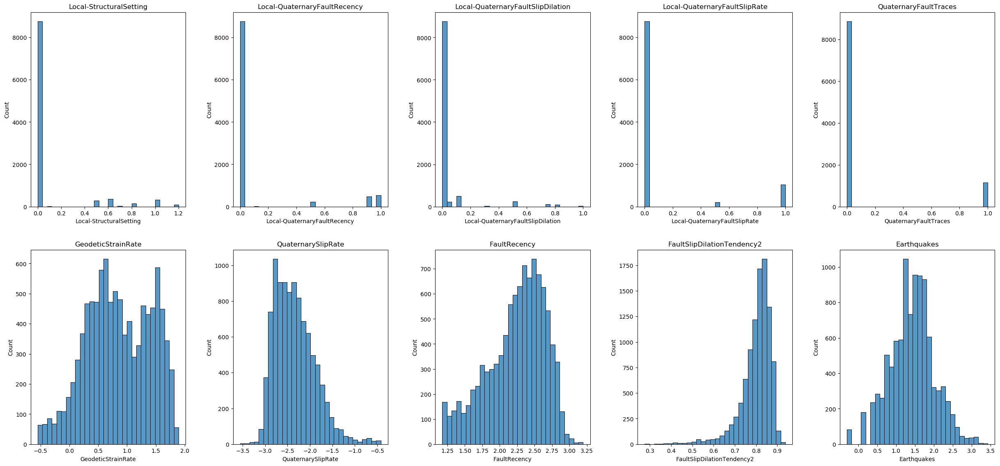
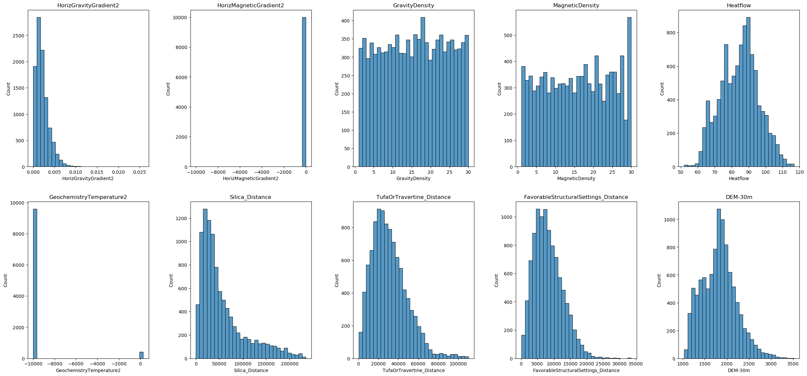
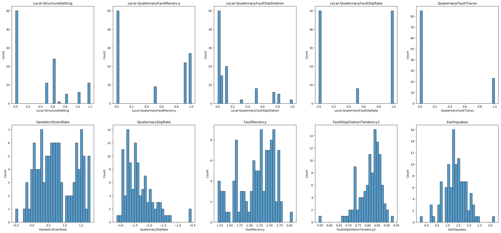
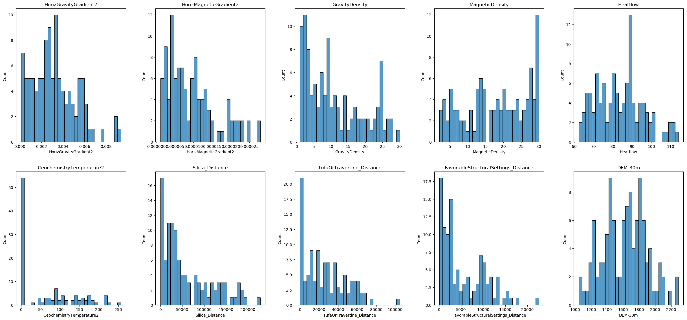
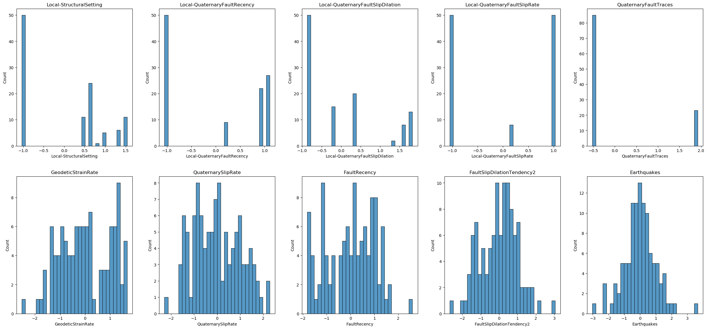
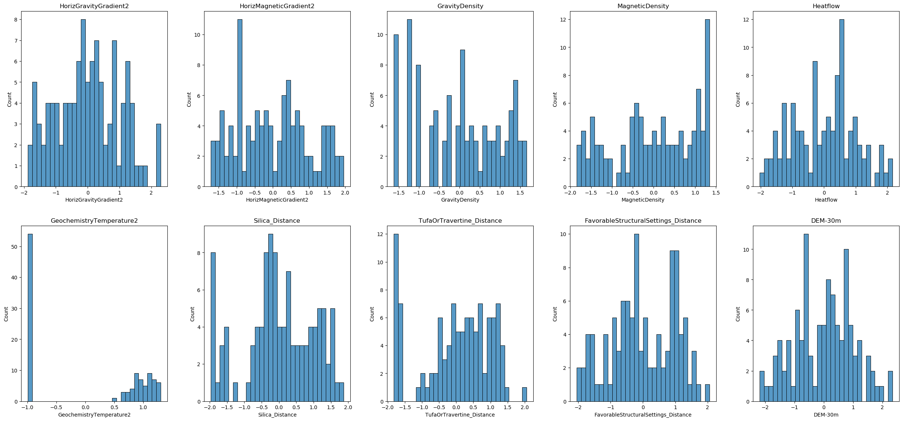
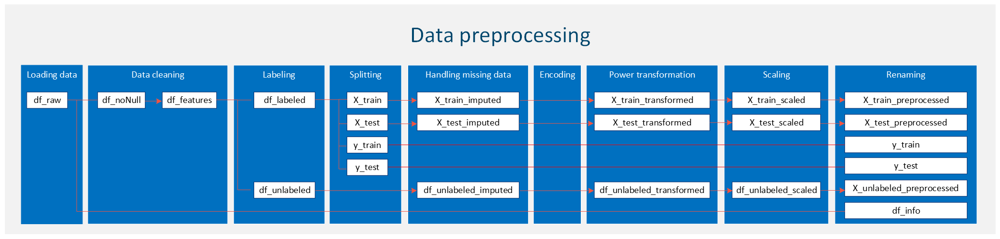

# Data Preprocessing

**Author:** Chao Lu  
**Project title:** INnovative Geothermal Exploration through Novel Investigations Of Undiscovered Systems (INGENIOUS)  
**Affiliation:** University of Nevada, Reno – Nevada Bureau of Mining and Geology (NBMG) and Great Basin Center for Geothermal Energy (GBCGE)  
**Last Modified:** July 3, 2024  
**Program partners:** Aprovechar Lab L3C (L3C) - Stephen Brown; University of Nevada, Reno (UNR) - James Faulds, Maria Richards, Elijah Mlawsky, Cary Lindsey, Nicole Hart-Wagoner

## Introduction


Data preprocessing is a critical step in the machine learning pipeline, ensuring that the dataset is optimized and structured in a way that maximizes the performance of learning algorithms. Before a machine learning model can be trained effectively, the raw data must be cleaned, formatted, and prepared to meet the specific needs of the chosen algorithms. This process not only helps in improving the accuracy of predictions but also in enhancing the efficiency of computational operations.

The primary goal of data preprocessing is to make raw data "machine-readable," addressing any issues that might reduce the effectiveness of a machine learning model. This involves several key steps, each designed to refine the dataset into a more useful form:

1. [**Loading the dataset:**](#loading-the-dataset) The first step involves importing the data from various sources, which could range from flat files like CSVs to databases or even big data storage like HDF5. This stage sets the foundation for all subsequent preprocessing steps.
2. [**Data cleaning and visualization:**](#Data-cleaning-and-visualization) This crucial step involves removing irrelevant data and checking for duplicates to ensure the dataset's integrity. Following this, a preliminary visualization of the dataset is conducted to gain a better understanding of data distributions. Visualization aids in identifying outliers and missing data, which are essential for informing subsequent preprocessing steps. By addressing these issues early, we lay a solid foundation for effective data analysis and model building.
3. [**Labeling the data:**](#labeling-the-data) Before any data manipulation happens, each instance in the dataset is labeled appropriately based on the desired output. This step is crucial for supervised learning models, as it defines the target variable that the model will predict. Labeling ensures that both the training and testing datasets are prepared with clear, definitive outcomes for each entry.
4. [**Splitting the dataset into training and test sets:**](#Splitting-the-dataset-into-training-and-test-sets) To evaluate the performance of a machine learning model reliably, the data are split into training and test sets. The training set is used to train the model, while the test set is used to test its predictive power. This split helps in detecting overfitting and in assessing the generalizability of the model.
5. [**Handling missing data:**](#handling-missing-data) Missing data can significantly distort the predictions of a machine learning model if not addressed appropriately. Depending on the nature and volume of missing data, various techniques may be employed to manage it. These include simple methods such as filling missing values with a constant, mean, median, or mode, as well as more sophisticated techniques like imputation using regression.
6. [**Encoding categorical variables:**](#Encoding-categorical-variables) Machine learning models typically require all input and output variables to be numeric. This necessitates the conversion of categorical data into a numerical format. Common techniques include label encoding, where each category is assigned a unique integer, and one-hot encoding, which converts each categorical value into a new binary column.
7. [**Power transformation:**](#Power-transformation) Power transformations are employed to normalize data distributions, which is advantageous for many machine learning models that require normally distributed features. Common techniques such as the Box-Cox transformation (applicable when all data values are positive) and the Yeo-Johnson transformation help stabilize variance and reduce skewness. These transformations are applied before feature scaling and are essential for improving model performance and convergence in algorithms sensitive to data distribution, like linear regression and neural networks.
8. [**Feature scaling:**](#Feature-scaling) Different features often vary in ranges, and data that are not uniformly scaled can disproportionately influence the model. Feature scaling methods, such as Min-Max scaling or Z-score normalization (standardization), are used to standardize the range of independent variables or features of data.
9. [**Renaming and saving the final data:**](#Renaming-and-saving-the-final-data) After completing all preprocessing steps, it is important to rename the final dataset appropriately and save it for future use. This can involve renaming columns to more meaningful names and saving the final processed data to a file format such as HDF5 (.h5). This step ensures that the data is readily available and properly organized for subsequent analysis or modeling.

<a id="loading-the-dataset"></a>
## 1. Loading the dataset

**Importing libraries**  
At the beginning of this section, we will import the necessary libraries that are essential for our data analysis and visualization tasks. These libraries include:


```python
import pandas as pd
import os
import folium
from pyproj import Transformer
import matplotlib.pyplot as plt
import seaborn as sns
from sklearn.model_selection import train_test_split
import numpy as np
from sklearn.impute import SimpleImputer
from sklearn.preprocessing import OneHotEncoder
from sklearn.preprocessing import PowerTransformer
from sklearn.preprocessing import StandardScaler
# Define random state (User option)
seed = 88
```

**Reading your data file**  
In this section, we will load the dataset required for our analysis. First, specify your custom directory as shown below, adjusting the path to point to the location where your data file is stored. The filename is defined separately, and the path is combined with the filename to facilitate data loading.

For this example, our data file is in the `.h5` format, so we utilize the `read_hdf` function to read the file. The data are then stored in a DataFrame named `df_raw`. To verify that the data has been loaded correctly, we display the first few rows of the DataFrame:


```python
# Uncomment the line below to use the current working directory
# path = '.'

# Uncomment and modify the line below to specify a different directory (user option)
path = r'C:\Users\chaolu\Project folder\INGENIOUS\Playbook\workplace\data preprocessing'
# Specify the name of the data file to be read (user option)
filename1 = 'PFA_grid_202103.h5'
# Construct the full file path
file_path = os.path.join(path, filename1)
# Read the data file into a DataFrame
df_raw = pd.read_hdf(file_path)
# Display the first few rows of the DataFrame to verify it's loaded correctly
df_raw.head()
```


<div>
<style scoped>
    .dataframe tbody tr th:only-of-type {
        vertical-align: middle;
    }

    .dataframe tbody tr th {
        vertical-align: top;
    }

    .dataframe thead th {
        text-align: right;
    }
</style>
<table border="1" class="dataframe">
  <thead>
    <tr style="text-align: right;">
      <th></th>
      <th>row</th>
      <th>column</th>
      <th>id_rc</th>
      <th>X_83UTM11</th>
      <th>Y_83UTM11</th>
      <th>NullInfo</th>
      <th>TrainCodeNeg</th>
      <th>TrainCodePos</th>
      <th>TrainCodePosT130</th>
      <th>PosSite130_Id</th>
      <th>...</th>
      <th>GeodeticStrainRate_Error</th>
      <th>QuaternarySlipRate_Error</th>
      <th>FaultRecency_Error</th>
      <th>Earthquakes_Error</th>
      <th>Heatflow_Error</th>
      <th>HorizGravityGradient2_Confidence</th>
      <th>HorizMagneticGradient2_Confidence</th>
      <th>Hillshade-100m</th>
      <th>DEM-30m</th>
      <th>Fairway</th>
    </tr>
  </thead>
  <tbody>
    <tr>
      <th>0</th>
      <td>0.0</td>
      <td>0.0</td>
      <td>R1C1</td>
      <td>286327.690182</td>
      <td>4.258714e+06</td>
      <td>notNull</td>
      <td>12</td>
      <td>12</td>
      <td>12</td>
      <td>9</td>
      <td>...</td>
      <td>1.37717</td>
      <td>0.466905</td>
      <td>0.235299</td>
      <td>0.297520</td>
      <td>26.295500</td>
      <td>0.216451</td>
      <td>-9999</td>
      <td>218</td>
      <td>2055</td>
      <td>38.837200</td>
    </tr>
    <tr>
      <th>1</th>
      <td>0.0</td>
      <td>1.0</td>
      <td>R1C2</td>
      <td>286577.690182</td>
      <td>4.258714e+06</td>
      <td>notNull</td>
      <td>12</td>
      <td>12</td>
      <td>12</td>
      <td>9</td>
      <td>...</td>
      <td>1.37792</td>
      <td>0.466905</td>
      <td>0.235299</td>
      <td>0.297462</td>
      <td>26.267799</td>
      <td>0.216451</td>
      <td>-9999</td>
      <td>160</td>
      <td>2014</td>
      <td>38.838699</td>
    </tr>
    <tr>
      <th>2</th>
      <td>0.0</td>
      <td>2.0</td>
      <td>R1C3</td>
      <td>286827.690182</td>
      <td>4.258714e+06</td>
      <td>notNull</td>
      <td>12</td>
      <td>12</td>
      <td>12</td>
      <td>9</td>
      <td>...</td>
      <td>1.37867</td>
      <td>0.467120</td>
      <td>0.235412</td>
      <td>0.297228</td>
      <td>26.240801</td>
      <td>0.216451</td>
      <td>-9999</td>
      <td>189</td>
      <td>1934</td>
      <td>38.991001</td>
    </tr>
    <tr>
      <th>3</th>
      <td>0.0</td>
      <td>3.0</td>
      <td>R1C4</td>
      <td>287077.690182</td>
      <td>4.258714e+06</td>
      <td>notNull</td>
      <td>12</td>
      <td>12</td>
      <td>12</td>
      <td>9</td>
      <td>...</td>
      <td>1.37942</td>
      <td>0.467764</td>
      <td>0.235751</td>
      <td>0.297462</td>
      <td>26.214800</td>
      <td>0.216451</td>
      <td>-9999</td>
      <td>164</td>
      <td>1951</td>
      <td>39.106602</td>
    </tr>
    <tr>
      <th>4</th>
      <td>0.0</td>
      <td>4.0</td>
      <td>R1C5</td>
      <td>287327.690182</td>
      <td>4.258714e+06</td>
      <td>notNull</td>
      <td>12</td>
      <td>12</td>
      <td>12</td>
      <td>9</td>
      <td>...</td>
      <td>1.38017</td>
      <td>0.468836</td>
      <td>0.236314</td>
      <td>0.297579</td>
      <td>26.189800</td>
      <td>0.216451</td>
      <td>-9999</td>
      <td>219</td>
      <td>1986</td>
      <td>39.144600</td>
    </tr>
  </tbody>
</table>
<p>5 rows × 54 columns</p>
</div>


**Basic review of the data**  
To begin our data preprocessing, it's essential to first understand the structure of the dataset. This involves examining key aspects such as the dimensions of the data and the types of data contained within it. Understanding the number of rows and columns helps us gauge the volume and complexity of our data, which is crucial for subsequent processing steps. This can be done using:


```python
df_raw.shape
```


    (1728000, 54)


Understanding the types of data we are working with (e.g., integers, floats, strings) is crucial for effective preprocessing. Different data types may necessitate varied treatments, particularly in terms of encoding methods and handling missing values. Most machine learning models accept only *numeric data*; therefore, depending on your raw data types, a data type transformation may be required. We can identify the data types of each column using the following command:


```python
df_raw.info()
```

    <class 'pandas.core.frame.DataFrame'>
    Int64Index: 1728000 entries, 0 to 1727999
    Data columns (total 54 columns):
     #   Column                                   Dtype  
    ---  ------                                   -----  
     0   row                                      float64
     1   column                                   float64
     2   id_rc                                    object 
     3   X_83UTM11                                float64
     4   Y_83UTM11                                float64
     5   NullInfo                                 object 
     6   TrainCodeNeg                             int64  
     7   TrainCodePos                             int64  
     8   TrainCodePosT130                         int64  
     9   PosSite130_Id                            int64  
     10  PosSite130_Distance                      float64
     11  PosSite_Id                               int64  
     12  PosSite_Distance                         float64
     13  NegSite_Id                               int64  
     14  NegSite_Distance                         float64
     15  Local_polygon_Id                         int64  
     16  Local_polygon_overlap_Id                 int64  
     17  Local-StructuralSetting                  float64
     18  Local-QuaternaryFaultRecency             float64
     19  Local-QuaternaryFaultSlipDilation        float64
     20  Local-QuaternaryFaultSlipRate            float64
     21  QuaternaryFaultTraces                    int64  
     22  GeodeticStrainRate                       float64
     23  QuaternarySlipRate                       float64
     24  FaultRecency                             float64
     25  FaultSlipDilationTendency2               float64
     26  Earthquakes                              float64
     27  HorizGravityGradient2                    float64
     28  HorizMagneticGradient2                   float64
     29  GravityDensity                           int64  
     30  MagneticDensity                          int64  
     31  Heatflow                                 float64
     32  GeochemistryTemperature2                 float64
     33  Tufa_Distance                            float64
     34  Travertine_Distance                      float64
     35  Silica_Distance                          float64
     36  TufaOrTravertine_Distance                float64
     37  FavorableStructuralSettings_Distance     float64
     38  Local-StructuralSetting_Error            float64
     39  Local-QuaternaryFaultRecency_Error       float64
     40  Local-QuaternaryFaultSlipDilation_Error  float64
     41  Local-QuaternaryFaultSlipRate_Error      float64
     42  QuaternaryFaultTraces_Error              float64
     43  HorizGravityGradient_Error               float64
     44  GeodeticStrainRate_Error                 float64
     45  QuaternarySlipRate_Error                 float64
     46  FaultRecency_Error                       float64
     47  Earthquakes_Error                        float64
     48  Heatflow_Error                           float64
     49  HorizGravityGradient2_Confidence         float64
     50  HorizMagneticGradient2_Confidence        int64  
     51  Hillshade-100m                           int64  
     52  DEM-30m                                  int64  
     53  Fairway                                  float64
    dtypes: float64(38), int64(14), object(2)
    memory usage: 725.1+ MB
    

<a id="Data-cleaning-and-visualization"></a>
## 2. Data cleaning and visualization
In this step, we will remove irrelevant data and check for duplicates. Additionally, we will briefly visualize the dataset to better understand data distributions. This will help identify outliers and missing data for further processing. Data cleaning and visualization at an early stage are crucial because they ensure the accuracy and quality of the data, providing a solid foundation for any subsequent analysis.

**Check and remove duplicates**  
Based on the initial review of the raw data, we quickly identified that the *'id_rc'*, *'X_83UTM11'*, and *'Y_83UTM11'* columns can be used to identify duplicates. First, we will check if there are any duplicates in the *'id_rc'* column.


```python
# Check for duplicates based on specific columns (user option)
duplicates = df_raw[df_raw.duplicated(subset=['id_rc'], keep=False)]
# Report the number of duplicates found
num_duplicates = duplicates.shape[0] // 2  # Each duplicate pair is counted twice, so divide by 2
# Display the duplicates and the number of duplicates found
print("Duplicates based on 'id_rc':")
print(duplicates)
print(f"\nNumber of duplicate rows found: {num_duplicates}")
```

    Duplicates based on 'id_rc':
    Empty DataFrame
    Columns: [row, column, id_rc, X_83UTM11, Y_83UTM11, NullInfo, TrainCodeNeg, TrainCodePos, TrainCodePosT130, PosSite130_Id, PosSite130_Distance, PosSite_Id, PosSite_Distance, NegSite_Id, NegSite_Distance, Local_polygon_Id, Local_polygon_overlap_Id, Local-StructuralSetting, Local-QuaternaryFaultRecency, Local-QuaternaryFaultSlipDilation, Local-QuaternaryFaultSlipRate, QuaternaryFaultTraces, GeodeticStrainRate, QuaternarySlipRate, FaultRecency, FaultSlipDilationTendency2, Earthquakes, HorizGravityGradient2, HorizMagneticGradient2, GravityDensity, MagneticDensity, Heatflow, GeochemistryTemperature2, Tufa_Distance, Travertine_Distance, Silica_Distance, TufaOrTravertine_Distance, FavorableStructuralSettings_Distance, Local-StructuralSetting_Error, Local-QuaternaryFaultRecency_Error, Local-QuaternaryFaultSlipDilation_Error, Local-QuaternaryFaultSlipRate_Error, QuaternaryFaultTraces_Error, HorizGravityGradient_Error, GeodeticStrainRate_Error, QuaternarySlipRate_Error, FaultRecency_Error, Earthquakes_Error, Heatflow_Error, HorizGravityGradient2_Confidence, HorizMagneticGradient2_Confidence, Hillshade-100m, DEM-30m, Fairway]
    Index: []
    
    [0 rows x 54 columns]
    
    Number of duplicate rows found: 0
    

There are no duplicates in the *'id_rc'* column. Now, let's check the combination of the *'X_83UTM11'* and *'Y_83UTM11'* columns to verify that there are no duplicates. The results, shown below, indicate that there are no duplicates in our dataset.


```python
# Check for duplicates based on specific columns (user option)
duplicates = df_raw[df_raw.duplicated(subset=['X_83UTM11', 'Y_83UTM11'], keep=False)]
# Report the number of duplicates found
num_duplicates = duplicates.shape[0] // 2  # Each duplicate pair is counted twice, so divide by 2
# Display the duplicates and the number of duplicates found
print("Duplicates based on 'X_83UTM11', and 'Y_83UTM11':")
print(duplicates)
print(f"\nNumber of duplicate rows found: {num_duplicates}")
```

    Duplicates based on 'X_83UTM11', and 'Y_83UTM11':
    Empty DataFrame
    Columns: [row, column, id_rc, X_83UTM11, Y_83UTM11, NullInfo, TrainCodeNeg, TrainCodePos, TrainCodePosT130, PosSite130_Id, PosSite130_Distance, PosSite_Id, PosSite_Distance, NegSite_Id, NegSite_Distance, Local_polygon_Id, Local_polygon_overlap_Id, Local-StructuralSetting, Local-QuaternaryFaultRecency, Local-QuaternaryFaultSlipDilation, Local-QuaternaryFaultSlipRate, QuaternaryFaultTraces, GeodeticStrainRate, QuaternarySlipRate, FaultRecency, FaultSlipDilationTendency2, Earthquakes, HorizGravityGradient2, HorizMagneticGradient2, GravityDensity, MagneticDensity, Heatflow, GeochemistryTemperature2, Tufa_Distance, Travertine_Distance, Silica_Distance, TufaOrTravertine_Distance, FavorableStructuralSettings_Distance, Local-StructuralSetting_Error, Local-QuaternaryFaultRecency_Error, Local-QuaternaryFaultSlipDilation_Error, Local-QuaternaryFaultSlipRate_Error, QuaternaryFaultTraces_Error, HorizGravityGradient_Error, GeodeticStrainRate_Error, QuaternarySlipRate_Error, FaultRecency_Error, Earthquakes_Error, Heatflow_Error, HorizGravityGradient2_Confidence, HorizMagneticGradient2_Confidence, Hillshade-100m, DEM-30m, Fairway]
    Index: []
    
    [0 rows x 54 columns]
    
    Number of duplicate rows found: 0
    

**Remove null data**  
In the previous `df_raw` DataFrame, there is a column named *'NullInfo'*. This column indicates the presence of null data. If the value in the *'NullInfo'* column is *nullValue*, we will mark and remove the entire row. Below is the code and results. We identified 30,528 null rows and removed them from `df_raw`. The result is saved in a new DataFrame, `df_noNull`.


```python
# Identify the indices of rows with 'nullValue' in the 'NullInfo' column
null_indices = df_raw[df_raw['NullInfo'] == 'nullValue'].index
# Print the number of null rows
print(f"Number of null rows: {len(null_indices)}")
```

    Number of null rows: 30528
    


```python
# Drop the rows with 'nullValue' and create a new DataFrame without these rows
df_noNull = df_raw.drop(null_indices)
df_noNull.shape
```


    (1697472, 54)


**Remove irrelevant data**  
For our current project, the original dataset comprises 54 columns. However, not all of these columns are pertinent to determine the presence of a geothermal system. We have selected 20 relevant columns that are most likely to effectively influence our model's predictions. These columns provide meaningful and actionable insights, excluding less useful data such as row numbers, column numbers, and coordinates—unless they are directly relevant to the context of the analysis.

In this initial process, we removed irrelevant data, retaining only the relevant features. Moving forward, we may further refine our feature set, potentially reducing the number of features even more based on advanced selection techniques. This process will be detailed in a dedicated chapter `[]` designed to introduce and apply feature selection methods specifically tailored to our machine learning project. Furthermore, to prevent data leakage, feature selection will be performed after splitting the data, using only the training data for this purpose.

The selected features encompass a range of geological, geophysical, and geochemical indicators that are essential for understanding geothermal activity. Below are the features we have selected:


```python
# Define your feature columns (user option)
feature_names = ['Local-StructuralSetting', 'Local-QuaternaryFaultRecency', 'Local-QuaternaryFaultSlipDilation', 'Local-QuaternaryFaultSlipRate', \
                 'QuaternaryFaultTraces', 'GeodeticStrainRate', 'QuaternarySlipRate', 'FaultRecency', \
                 'FaultSlipDilationTendency2', 'Earthquakes', 'HorizGravityGradient2', 'HorizMagneticGradient2', \
                 'GravityDensity', 'MagneticDensity', 'Heatflow', 'GeochemistryTemperature2', \
                 'Silica_Distance', 'TufaOrTravertine_Distance', 'FavorableStructuralSettings_Distance', 'DEM-30m']
# Select the feature columns from the DataFrame
df_features = df_noNull[feature_names]
```

Please note that the selected features have been stored in a new DataFrame named `df_features`. You can view the dimensions of this DataFrame using the following command:


```python
df_features.shape
```


    (1697472, 20)


**Data visualization**  
In this section, we will visualize the distribution of each feature in our dataset. This helps us understand the data better, identify patterns, and detect potential outliers. We will use histograms to display the distributions.
First, we will check the total number of features in the dataset. We will create subplots to accommodate the visualizations, arranging them in rows and columns for better readability.  
While we have a total of 1,697,472 data points (as indicated by `df_features.shape`), creating histograms for the entire dataset can be computationally expensive and result in cluttered visualizations that are difficult to interpret. We will randomly sample 10,000 data points from the dataset to ensure the sample reflects the overall distribution of the data.


```python
# Checking the total number of features
num_features = df_features.shape[1]  # Total number of features
n_figure = 5  # Subfigures in a row
n_rows_first_fig = 2  # Number of rows in the first figure

# Calculate rows for each figure
num_rows_first = n_rows_first_fig * n_figure
num_rows_second = (num_features - num_rows_first)

# Sample data
sample_data = df_features.sample(n=10000, random_state=seed)  

# First Figure
plt.figure(figsize=(25, 12))  # Adjust the figure size as needed
for i, column in enumerate(sample_data.columns[:num_rows_first]):
    plt.subplot(n_rows_first_fig, n_figure, i + 1)
    sns.histplot(sample_data[column], kde=False, bins=30)
    plt.title(column)
plt.tight_layout(pad=3.0)  # 'pad' parameter can be adjusted to fit your needs
plt.show()

# Second Figure (if there are any remaining features)
if num_rows_second > 0:
    plt.figure(figsize=(25, 12))  # Adjust the figure size as needed
    for i, column in enumerate(sample_data.columns[num_rows_first:num_features]):
        plt.subplot((num_rows_second // n_figure) + (num_rows_second % n_figure > 0), n_figure, i + 1)
        sns.histplot(sample_data[column], kde=False, bins=30)
        plt.title(column)
    plt.tight_layout(pad=3.0)
    plt.show()
```


    

    


    

    


From the data distributions and careful inspection of the data values, we can conclude the following:
1. **Handling Missing Values:** Some features contain the value -9999, which represents missing data in this dataset. We will treat these -9999 values as missing and handle them accordingly in the data preprocessing steps.
2. **Skewed Distributions:** The distribution of some features is skewed. To address this, we may need to apply power transformations to normalize the distributions and improve the performance of our machine learning models.
3. **Feature Scaling:** The ranges of the features are not on the same scale. To ensure that all features contribute equally to the model, we will need to apply feature scaling to the dataset.

<a id="labeling-the-data"></a>
## 3. Labeling the data

In data science and machine learning, labeling data is a crucial step that involves assigning meaningful labels or tags to the data points within your dataset. This process is essential for supervised learning tasks, where the model learns to predict outputs based on input features by being trained on labeled examples.

**Labeling based on 'traincode' distance**  
In the previous `df_noNull` DataFrame, there are two columns named *'TrainCodeNeg'* and *'TrainCodePos'*. These columns indicate the negative and positive training sites, respectively, along with their distances from a reference point. A smaller value in these columns signifies a closer proximity to the corresponding training site. The maximum and minimum values of these two columns can be shown as below:


```python
print('Maximum of TrainCodePos:', df_noNull['TrainCodePos'].max())
print('Minimum of TrainCodePos:', df_noNull['TrainCodePos'].min())
print('Maximum of TrainCodeNeg:', df_noNull['TrainCodeNeg'].max())
print('Minimum of TrainCodeNeg:', df_noNull['TrainCodeNeg'].min())
```

    Maximum of TrainCodePos: 12
    Minimum of TrainCodePos: 1
    Maximum of TrainCodeNeg: 12
    Minimum of TrainCodeNeg: 1
    

Here we specify the traincode distance, which determines the proximity threshold for labeling the data. We need to consider the feature-to-sample ratio to prevent overfitting and stabilize the model. Typically, 10 samples per feature are recommended for simpler models, while 20 samples per feature are recommended for more complex models. Therefore, the user may adjust the traincode distance to a larger value to obtain more labeled data; however, this may also decrease the model's accuracy on real-world data. In our case, we have 20 features before feature selection and 145 labeled data points, which may be sufficient.  
Additionally, in our case, we have 83 positive sites and 62 negative sites, leading to a slight imbalance in the dataset. It's crucial to address class imbalance, as it can affect the performance of the model. Techniques such as resampling, using class weights, or employing algorithms that handle imbalanced data can be useful. However, this topic is outside the scope of data preprocessing and will be discussed in a separate chapter.  
In our case, we filter the `df_features` DataFrame to get positive and negative sites based on the traincode distance. We label the filtered datasets, assigning 1 for positive sites and 0 for negative sites. Finally, we save the labeled data to the `df_labeled` DataFrame.


```python
# Specify the traincode distance (User option)
traincode = 1
# Get the TrainCodePos and TrainCodeNeg columns from the noNull DataFrame
TrainCodePos = df_noNull['TrainCodePos']
TrainCodeNeg = df_noNull['TrainCodeNeg']
# Filter the features DataFrame based on the traincode distance
df_features_pos = df_features.loc[TrainCodePos <= traincode].copy()
df_features_neg = df_features.loc[TrainCodeNeg <= traincode].copy()
# Assign labels to the dataset
df_features_pos.loc[:, 'label'] = 1  # Positive site
df_features_neg.loc[:, 'label'] = 0  # Negative site
# Combine the labeled datasets
df_labeled = pd.concat([df_features_pos, df_features_neg])
# Display the lengths
print(f"Total number of labeled data: {len(df_labeled)}")
print(f"Number of positive sites: {len(df_features_pos)}")
print(f"Number of negative sites: {len(df_features_neg)}")
# Display the first and last 5 rows of the labeled DataFrame
pd.concat([df_labeled.head(), df_labeled.tail()])
```

    Total number of labeled data: 145
    Number of positive sites: 83
    Number of negative sites: 62
    


<div>
<style scoped>
    .dataframe tbody tr th:only-of-type {
        vertical-align: middle;
    }

    .dataframe tbody tr th {
        vertical-align: top;
    }

    .dataframe thead th {
        text-align: right;
    }
</style>
<table border="1" class="dataframe">
  <thead>
    <tr style="text-align: right;">
      <th></th>
      <th>Local-StructuralSetting</th>
      <th>Local-QuaternaryFaultRecency</th>
      <th>Local-QuaternaryFaultSlipDilation</th>
      <th>Local-QuaternaryFaultSlipRate</th>
      <th>QuaternaryFaultTraces</th>
      <th>GeodeticStrainRate</th>
      <th>QuaternarySlipRate</th>
      <th>FaultRecency</th>
      <th>FaultSlipDilationTendency2</th>
      <th>Earthquakes</th>
      <th>...</th>
      <th>HorizMagneticGradient2</th>
      <th>GravityDensity</th>
      <th>MagneticDensity</th>
      <th>Heatflow</th>
      <th>GeochemistryTemperature2</th>
      <th>Silica_Distance</th>
      <th>TufaOrTravertine_Distance</th>
      <th>FavorableStructuralSettings_Distance</th>
      <th>DEM-30m</th>
      <th>label</th>
    </tr>
  </thead>
  <tbody>
    <tr>
      <th>17438</th>
      <td>0.0</td>
      <td>0.0</td>
      <td>0.0</td>
      <td>0.0</td>
      <td>0</td>
      <td>1.587110</td>
      <td>-2.733090</td>
      <td>3.07137</td>
      <td>0.808758</td>
      <td>1.537820</td>
      <td>...</td>
      <td>0.000022</td>
      <td>25</td>
      <td>2</td>
      <td>93.449203</td>
      <td>-9999.000000</td>
      <td>77384.705373</td>
      <td>37380.748155</td>
      <td>9394.773490</td>
      <td>1666</td>
      <td>1</td>
    </tr>
    <tr>
      <th>29008</th>
      <td>0.6</td>
      <td>0.9</td>
      <td>0.3</td>
      <td>0.5</td>
      <td>0</td>
      <td>0.879191</td>
      <td>-1.932340</td>
      <td>2.41905</td>
      <td>0.760323</td>
      <td>1.877950</td>
      <td>...</td>
      <td>0.000010</td>
      <td>1</td>
      <td>15</td>
      <td>66.067703</td>
      <td>-9999.000000</td>
      <td>146049.911260</td>
      <td>20027.111743</td>
      <td>4887.676663</td>
      <td>1448</td>
      <td>1</td>
    </tr>
    <tr>
      <th>31384</th>
      <td>1.2</td>
      <td>1.0</td>
      <td>1.0</td>
      <td>0.5</td>
      <td>0</td>
      <td>1.775900</td>
      <td>-1.407640</td>
      <td>1.91912</td>
      <td>0.790286</td>
      <td>3.199890</td>
      <td>...</td>
      <td>0.000023</td>
      <td>9</td>
      <td>26</td>
      <td>89.523697</td>
      <td>138.774994</td>
      <td>78305.024271</td>
      <td>8948.219597</td>
      <td>4059.721939</td>
      <td>1386</td>
      <td>1</td>
    </tr>
    <tr>
      <th>35635</th>
      <td>0.6</td>
      <td>1.0</td>
      <td>0.1</td>
      <td>1.0</td>
      <td>1</td>
      <td>0.703610</td>
      <td>-2.753080</td>
      <td>2.71985</td>
      <td>0.754922</td>
      <td>2.035430</td>
      <td>...</td>
      <td>0.000005</td>
      <td>25</td>
      <td>20</td>
      <td>68.560799</td>
      <td>153.621994</td>
      <td>78060.963547</td>
      <td>39.922875</td>
      <td>2514.491776</td>
      <td>1719</td>
      <td>1</td>
    </tr>
    <tr>
      <th>73944</th>
      <td>0.7</td>
      <td>0.9</td>
      <td>0.3</td>
      <td>1.0</td>
      <td>0</td>
      <td>0.858002</td>
      <td>-2.033240</td>
      <td>2.40689</td>
      <td>0.787630</td>
      <td>1.835690</td>
      <td>...</td>
      <td>0.000002</td>
      <td>1</td>
      <td>30</td>
      <td>66.413002</td>
      <td>52.277698</td>
      <td>146648.322585</td>
      <td>21282.689662</td>
      <td>875.193369</td>
      <td>1458</td>
      <td>1</td>
    </tr>
    <tr>
      <th>1556674</th>
      <td>0.0</td>
      <td>0.0</td>
      <td>0.0</td>
      <td>0.0</td>
      <td>0</td>
      <td>0.242150</td>
      <td>-1.375600</td>
      <td>1.77176</td>
      <td>0.852566</td>
      <td>0.544068</td>
      <td>...</td>
      <td>0.000002</td>
      <td>25</td>
      <td>26</td>
      <td>88.489899</td>
      <td>-9999.000000</td>
      <td>14412.706698</td>
      <td>14412.706698</td>
      <td>15292.812918</td>
      <td>1834</td>
      <td>0</td>
    </tr>
    <tr>
      <th>1563565</th>
      <td>0.0</td>
      <td>0.0</td>
      <td>0.0</td>
      <td>0.0</td>
      <td>0</td>
      <td>0.085131</td>
      <td>-0.529029</td>
      <td>1.21129</td>
      <td>0.860547</td>
      <td>0.740363</td>
      <td>...</td>
      <td>0.000003</td>
      <td>25</td>
      <td>30</td>
      <td>89.616096</td>
      <td>-9999.000000</td>
      <td>10591.119363</td>
      <td>10591.119363</td>
      <td>10228.428445</td>
      <td>1819</td>
      <td>0</td>
    </tr>
    <tr>
      <th>1583968</th>
      <td>0.0</td>
      <td>0.0</td>
      <td>0.0</td>
      <td>0.0</td>
      <td>1</td>
      <td>0.208320</td>
      <td>-1.697380</td>
      <td>2.23398</td>
      <td>0.841017</td>
      <td>1.021190</td>
      <td>...</td>
      <td>0.000003</td>
      <td>24</td>
      <td>20</td>
      <td>79.498901</td>
      <td>-9999.000000</td>
      <td>27958.036715</td>
      <td>37494.086495</td>
      <td>6755.492993</td>
      <td>1857</td>
      <td>0</td>
    </tr>
    <tr>
      <th>1589324</th>
      <td>0.0</td>
      <td>0.0</td>
      <td>0.0</td>
      <td>0.0</td>
      <td>0</td>
      <td>-0.006614</td>
      <td>-1.545970</td>
      <td>1.76926</td>
      <td>0.729364</td>
      <td>0.875061</td>
      <td>...</td>
      <td>0.000004</td>
      <td>22</td>
      <td>30</td>
      <td>69.085701</td>
      <td>-9999.000000</td>
      <td>36160.419098</td>
      <td>36160.419098</td>
      <td>11750.631459</td>
      <td>1662</td>
      <td>0</td>
    </tr>
    <tr>
      <th>1670419</th>
      <td>0.0</td>
      <td>0.0</td>
      <td>0.0</td>
      <td>0.0</td>
      <td>0</td>
      <td>0.462398</td>
      <td>-2.726870</td>
      <td>2.81623</td>
      <td>0.814579</td>
      <td>1.096910</td>
      <td>...</td>
      <td>0.000006</td>
      <td>19</td>
      <td>28</td>
      <td>69.780998</td>
      <td>-9999.000000</td>
      <td>44995.361589</td>
      <td>47712.711938</td>
      <td>7845.540230</td>
      <td>1904</td>
      <td>0</td>
    </tr>
  </tbody>
</table>
<p>10 rows × 21 columns</p>
</div>


**Plotting training sites locations on an interactive base map**  
Now, we are focusing on accurately mapping the locations of data points onto an interactive base map. This script visualizes geographical data points on an interactive map using the Folium library. 

In this script, the coordinates of the data points are originally in the UTM (Universal Transverse Mercator) zone 11N coordinate system, represented by EPSG code 32611. To visualize these points on a Folium map, which requires WGS84 coordinates (latitude and longitude), a transformation is necessary. This is achieved using the `pyproj` library, specifically the `Transformer` class.


```python
# Using Transformer class of pyproj
# UTM zone 11N - EPSG code 32611
# NAD 1983 State Plane Nevada West - EPSG code 32109
transformer = Transformer.from_proj(
    proj_from='epsg:32611',  # EPSG code for UTM zone 11N
    proj_to='epsg:4326',  # EPSG code for WGS84
    always_xy=True
)
# Function to convert input coordinate system to WGS84 using Transformer
def utm_to_wgs84(easting, northing):
    lon, lat = transformer.transform(easting, northing)
    return pd.Series([lat, lon])
# Apply the conversion to the DataFrame
df_raw[['latitude', 'longitude']] = df_raw.apply(
    lambda row: utm_to_wgs84(row['X_83UTM11'], row['Y_83UTM11']), axis=1
)
# Extract coordinates for positive and negative sites
pos_coords = df_raw.loc[df_features_pos.index, ['latitude', 'longitude']]
neg_coords = df_raw.loc[df_features_neg.index, ['latitude', 'longitude']]
all_coords = df_raw[['latitude', 'longitude']]
# Convert coordinates to a list of tuples
pos_coords_list = list(zip(pos_coords['latitude'], pos_coords['longitude']))
neg_coords_list = list(zip(neg_coords['latitude'], neg_coords['longitude']))
all_coords_list = list(zip(all_coords['latitude'], all_coords['longitude']))
```

The goal is to plot locations of positive and negative sites, represented as red and blue dots respectively, on a map centered around the mean coordinates of all data points. Additionally, a bounding box labeled "Study Boundary" is drawn around the area of interest to clearly demarcate the study region.


```python
# Create a Folium map centered around the mean coordinates
map_center = [all_coords['latitude'].mean(), all_coords['longitude'].mean()]
m = folium.Map(location=map_center, zoom_start=7, width='90%', height='90%')
# Add positive sites as red dots
for coord in pos_coords_list:
    folium.CircleMarker(
        location=coord,
        radius=2,  # Adjust radius to make it appear as a dot
        color='red',
        fill=True,
        fill_color='red',
        fill_opacity=1.0
    ).add_to(m)
# Add negative sites as blue dots
for coord in neg_coords_list:
    folium.CircleMarker(
        location=coord,
        radius=2,  # Adjust radius to make it appear as a dot
        color='blue',
        fill=True,
        fill_color='blue',
        fill_opacity=1.0
    ).add_to(m)
# Calculate the bounding box
min_lat, max_lat = all_coords['latitude'].min(), all_coords['latitude'].max()
min_lon, max_lon = all_coords['longitude'].min(), all_coords['longitude'].max()
# Define the corner points of the bounding box
bounding_box = [
    [min_lat, min_lon],
    [min_lat, max_lon],
    [max_lat, max_lon],
    [max_lat, min_lon],
    [min_lat, min_lon]  # Closing the polygon
]
# Add the bounding box as a polygon
folium.PolyLine(locations=bounding_box, color='black').add_to(m)
# Add a legend
legend_html = '''
<div style="position: fixed; 
     top: 10px; right: 10px; width: 150px; height: 120px; 
     border:2px solid grey; z-index:9999; font-size:14px;
     background-color:white;
     ">&nbsp; Legend <br>
     &nbsp; <i class="fa fa-circle fa-1x" style="color:red"></i>&nbsp; Positive Site <br>
     &nbsp; <i class="fa fa-circle fa-1x" style="color:blue"></i>&nbsp; Negative Site <br>
     &nbsp; <i class="fa fa-line fa-1x" style="color:black"></i>&nbsp; Study Boundary <br>
</div>
'''
m.get_root().html.add_child(folium.Element(legend_html))
# Display the map
m.save('PFA Machine Learning Training Data Sites.html')
m
```


<div style="width:100%;"><div style="position:relative;width:100%;height:0;padding-bottom:60%;"><span style="color:#565656">Make this Notebook Trusted to load map: File -> Trust Notebook</span><iframe srcdoc="&lt;!DOCTYPE html&gt;
&lt;html&gt;
&lt;head&gt;

    &lt;meta http-equiv=&quot;content-type&quot; content=&quot;text/html; charset=UTF-8&quot; /&gt;

        &lt;script&gt;
            L_NO_TOUCH = false;
            L_DISABLE_3D = false;
        &lt;/script&gt;

    &lt;style&gt;html, body {width: 100%;height: 100%;margin: 0;padding: 0;}&lt;/style&gt;
    &lt;style&gt;#map {position:absolute;top:0;bottom:0;right:0;left:0;}&lt;/style&gt;
    &lt;script src=&quot;https://cdn.jsdelivr.net/npm/leaflet@1.9.3/dist/leaflet.js&quot;&gt;&lt;/script&gt;
    &lt;script src=&quot;https://code.jquery.com/jquery-3.7.1.min.js&quot;&gt;&lt;/script&gt;
    &lt;script src=&quot;https://cdn.jsdelivr.net/npm/bootstrap@5.2.2/dist/js/bootstrap.bundle.min.js&quot;&gt;&lt;/script&gt;
    &lt;script src=&quot;https://cdnjs.cloudflare.com/ajax/libs/Leaflet.awesome-markers/2.0.2/leaflet.awesome-markers.js&quot;&gt;&lt;/script&gt;
    &lt;link rel=&quot;stylesheet&quot; href=&quot;https://cdn.jsdelivr.net/npm/leaflet@1.9.3/dist/leaflet.css&quot;/&gt;
    &lt;link rel=&quot;stylesheet&quot; href=&quot;https://cdn.jsdelivr.net/npm/bootstrap@5.2.2/dist/css/bootstrap.min.css&quot;/&gt;
    &lt;link rel=&quot;stylesheet&quot; href=&quot;https://netdna.bootstrapcdn.com/bootstrap/3.0.0/css/bootstrap.min.css&quot;/&gt;
    &lt;link rel=&quot;stylesheet&quot; href=&quot;https://cdn.jsdelivr.net/npm/@fortawesome/fontawesome-free@6.2.0/css/all.min.css&quot;/&gt;
    &lt;link rel=&quot;stylesheet&quot; href=&quot;https://cdnjs.cloudflare.com/ajax/libs/Leaflet.awesome-markers/2.0.2/leaflet.awesome-markers.css&quot;/&gt;
    &lt;link rel=&quot;stylesheet&quot; href=&quot;https://cdn.jsdelivr.net/gh/python-visualization/folium/folium/templates/leaflet.awesome.rotate.min.css&quot;/&gt;

            &lt;meta name=&quot;viewport&quot; content=&quot;width=device-width,
                initial-scale=1.0, maximum-scale=1.0, user-scalable=no&quot; /&gt;
            &lt;style&gt;
                #map_756d0ce002c5717eb01a337bb2033c18 {
                    position: relative;
                    width: 90.0%;
                    height: 90.0%;
                    left: 0.0%;
                    top: 0.0%;
                }
                .leaflet-container { font-size: 1rem; }
            &lt;/style&gt;

&lt;/head&gt;
&lt;body&gt;


&lt;div style=&quot;position: fixed; 
     top: 10px; right: 10px; width: 150px; height: 120px; 
     border:2px solid grey; z-index:9999; font-size:14px;
     background-color:white;
     &quot;&gt;&amp;nbsp; Legend &lt;br&gt;
     &amp;nbsp; &lt;i class=&quot;fa fa-circle fa-1x&quot; style=&quot;color:red&quot;&gt;&lt;/i&gt;&amp;nbsp; Positive Site &lt;br&gt;
     &amp;nbsp; &lt;i class=&quot;fa fa-circle fa-1x&quot; style=&quot;color:blue&quot;&gt;&lt;/i&gt;&amp;nbsp; Negative Site &lt;br&gt;
     &amp;nbsp; &lt;i class=&quot;fa fa-line fa-1x&quot; style=&quot;color:black&quot;&gt;&lt;/i&gt;&amp;nbsp; Study Boundary &lt;br&gt;
&lt;/div&gt;

            &lt;div class=&quot;folium-map&quot; id=&quot;map_756d0ce002c5717eb01a337bb2033c18&quot; &gt;&lt;/div&gt;

&lt;/body&gt;
&lt;script&gt;


            var map_756d0ce002c5717eb01a337bb2033c18 = L.map(
                &quot;map_756d0ce002c5717eb01a337bb2033c18&quot;,
                {
                    center: [39.59292000039096, -116.97435124289579],
                    crs: L.CRS.EPSG3857,
                    zoom: 7,
                    zoomControl: true,
                    preferCanvas: false,
                }
            );


            var tile_layer_4f5f2ca8dd90c0c21466d28987329532 = L.tileLayer(
                &quot;https://tile.openstreetmap.org/{z}/{x}/{y}.png&quot;,
                {&quot;attribution&quot;: &quot;\u0026copy; \u003ca href=\&quot;https://www.openstreetmap.org/copyright\&quot;\u003eOpenStreetMap\u003c/a\u003e contributors&quot;, &quot;detectRetina&quot;: false, &quot;maxNativeZoom&quot;: 19, &quot;maxZoom&quot;: 19, &quot;minZoom&quot;: 0, &quot;noWrap&quot;: false, &quot;opacity&quot;: 1, &quot;subdomains&quot;: &quot;abc&quot;, &quot;tms&quot;: false}
            );


            tile_layer_4f5f2ca8dd90c0c21466d28987329532.addTo(map_756d0ce002c5717eb01a337bb2033c18);


            var circle_marker_649a9acaf67df40f169d9427d715f787 = L.circleMarker(
                [38.48225734948011, -118.99685567648511],
                {&quot;bubblingMouseEvents&quot;: true, &quot;color&quot;: &quot;red&quot;, &quot;dashArray&quot;: null, &quot;dashOffset&quot;: null, &quot;fill&quot;: true, &quot;fillColor&quot;: &quot;red&quot;, &quot;fillOpacity&quot;: 1.0, &quot;fillRule&quot;: &quot;evenodd&quot;, &quot;lineCap&quot;: &quot;round&quot;, &quot;lineJoin&quot;: &quot;round&quot;, &quot;opacity&quot;: 1.0, &quot;radius&quot;: 2, &quot;stroke&quot;: true, &quot;weight&quot;: 3}
            ).addTo(map_756d0ce002c5717eb01a337bb2033c18);


            var circle_marker_dc2265964555552319ad4d3177901b9d = L.circleMarker(
                [38.503838038218056, -115.5512108246374],
                {&quot;bubblingMouseEvents&quot;: true, &quot;color&quot;: &quot;red&quot;, &quot;dashArray&quot;: null, &quot;dashOffset&quot;: null, &quot;fill&quot;: true, &quot;fillColor&quot;: &quot;red&quot;, &quot;fillOpacity&quot;: 1.0, &quot;fillRule&quot;: &quot;evenodd&quot;, &quot;lineCap&quot;: &quot;round&quot;, &quot;lineJoin&quot;: &quot;round&quot;, &quot;opacity&quot;: 1.0, &quot;radius&quot;: 2, &quot;stroke&quot;: true, &quot;weight&quot;: 3}
            ).addTo(map_756d0ce002c5717eb01a337bb2033c18);


            var circle_marker_b1f0c30547beda171d04ca00c7162437 = L.circleMarker(
                [38.50571304670474, -118.64773698346198],
                {&quot;bubblingMouseEvents&quot;: true, &quot;color&quot;: &quot;red&quot;, &quot;dashArray&quot;: null, &quot;dashOffset&quot;: null, &quot;fill&quot;: true, &quot;fillColor&quot;: &quot;red&quot;, &quot;fillOpacity&quot;: 1.0, &quot;fillRule&quot;: &quot;evenodd&quot;, &quot;lineCap&quot;: &quot;round&quot;, &quot;lineJoin&quot;: &quot;round&quot;, &quot;opacity&quot;: 1.0, &quot;radius&quot;: 2, &quot;stroke&quot;: true, &quot;weight&quot;: 3}
            ).addTo(map_756d0ce002c5717eb01a337bb2033c18);


            var circle_marker_267c9a5c7df37aa739e7768680458561 = L.circleMarker(
                [38.52010790296338, -116.36818691971717],
                {&quot;bubblingMouseEvents&quot;: true, &quot;color&quot;: &quot;red&quot;, &quot;dashArray&quot;: null, &quot;dashOffset&quot;: null, &quot;fill&quot;: true, &quot;fillColor&quot;: &quot;red&quot;, &quot;fillOpacity&quot;: 1.0, &quot;fillRule&quot;: &quot;evenodd&quot;, &quot;lineCap&quot;: &quot;round&quot;, &quot;lineJoin&quot;: &quot;round&quot;, &quot;opacity&quot;: 1.0, &quot;radius&quot;: 2, &quot;stroke&quot;: true, &quot;weight&quot;: 3}
            ).addTo(map_756d0ce002c5717eb01a337bb2033c18);


            var circle_marker_4f44c1e3c9fe74f528072bf3978cd13c = L.circleMarker(
                [38.56211121004728, -115.52708707379833],
                {&quot;bubblingMouseEvents&quot;: true, &quot;color&quot;: &quot;red&quot;, &quot;dashArray&quot;: null, &quot;dashOffset&quot;: null, &quot;fill&quot;: true, &quot;fillColor&quot;: &quot;red&quot;, &quot;fillOpacity&quot;: 1.0, &quot;fillRule&quot;: &quot;evenodd&quot;, &quot;lineCap&quot;: &quot;round&quot;, &quot;lineJoin&quot;: &quot;round&quot;, &quot;opacity&quot;: 1.0, &quot;radius&quot;: 2, &quot;stroke&quot;: true, &quot;weight&quot;: 3}
            ).addTo(map_756d0ce002c5717eb01a337bb2033c18);


            var circle_marker_ab04701983c5a443b8156e96cc7a7d25 = L.circleMarker(
                [38.59487837856179, -115.1388948879699],
                {&quot;bubblingMouseEvents&quot;: true, &quot;color&quot;: &quot;red&quot;, &quot;dashArray&quot;: null, &quot;dashOffset&quot;: null, &quot;fill&quot;: true, &quot;fillColor&quot;: &quot;red&quot;, &quot;fillOpacity&quot;: 1.0, &quot;fillRule&quot;: &quot;evenodd&quot;, &quot;lineCap&quot;: &quot;round&quot;, &quot;lineJoin&quot;: &quot;round&quot;, &quot;opacity&quot;: 1.0, &quot;radius&quot;: 2, &quot;stroke&quot;: true, &quot;weight&quot;: 3}
            ).addTo(map_756d0ce002c5717eb01a337bb2033c18);


            var circle_marker_8311c4477f9650e3fd16dd45cb8e84f1 = L.circleMarker(
                [38.69618377599775, -116.43563662595832],
                {&quot;bubblingMouseEvents&quot;: true, &quot;color&quot;: &quot;red&quot;, &quot;dashArray&quot;: null, &quot;dashOffset&quot;: null, &quot;fill&quot;: true, &quot;fillColor&quot;: &quot;red&quot;, &quot;fillOpacity&quot;: 1.0, &quot;fillRule&quot;: &quot;evenodd&quot;, &quot;lineCap&quot;: &quot;round&quot;, &quot;lineJoin&quot;: &quot;round&quot;, &quot;opacity&quot;: 1.0, &quot;radius&quot;: 2, &quot;stroke&quot;: true, &quot;weight&quot;: 3}
            ).addTo(map_756d0ce002c5717eb01a337bb2033c18);


            var circle_marker_25c5889c439df1f50553a83660d41c2a = L.circleMarker(
                [38.75444542757911, -119.3783948903976],
                {&quot;bubblingMouseEvents&quot;: true, &quot;color&quot;: &quot;red&quot;, &quot;dashArray&quot;: null, &quot;dashOffset&quot;: null, &quot;fill&quot;: true, &quot;fillColor&quot;: &quot;red&quot;, &quot;fillOpacity&quot;: 1.0, &quot;fillRule&quot;: &quot;evenodd&quot;, &quot;lineCap&quot;: &quot;round&quot;, &quot;lineJoin&quot;: &quot;round&quot;, &quot;opacity&quot;: 1.0, &quot;radius&quot;: 2, &quot;stroke&quot;: true, &quot;weight&quot;: 3}
            ).addTo(map_756d0ce002c5717eb01a337bb2033c18);


            var circle_marker_3af81b2b821c828d97ca61809395f1c1 = L.circleMarker(
                [38.76742795102359, -119.17454360024895],
                {&quot;bubblingMouseEvents&quot;: true, &quot;color&quot;: &quot;red&quot;, &quot;dashArray&quot;: null, &quot;dashOffset&quot;: null, &quot;fill&quot;: true, &quot;fillColor&quot;: &quot;red&quot;, &quot;fillOpacity&quot;: 1.0, &quot;fillRule&quot;: &quot;evenodd&quot;, &quot;lineCap&quot;: &quot;round&quot;, &quot;lineJoin&quot;: &quot;round&quot;, &quot;opacity&quot;: 1.0, &quot;radius&quot;: 2, &quot;stroke&quot;: true, &quot;weight&quot;: 3}
            ).addTo(map_756d0ce002c5717eb01a337bb2033c18);


            var circle_marker_569ea5ea82a8d7c4dce8b0954eb4ff1a = L.circleMarker(
                [38.81681160001778, -117.1805261509546],
                {&quot;bubblingMouseEvents&quot;: true, &quot;color&quot;: &quot;red&quot;, &quot;dashArray&quot;: null, &quot;dashOffset&quot;: null, &quot;fill&quot;: true, &quot;fillColor&quot;: &quot;red&quot;, &quot;fillOpacity&quot;: 1.0, &quot;fillRule&quot;: &quot;evenodd&quot;, &quot;lineCap&quot;: &quot;round&quot;, &quot;lineJoin&quot;: &quot;round&quot;, &quot;opacity&quot;: 1.0, &quot;radius&quot;: 2, &quot;stroke&quot;: true, &quot;weight&quot;: 3}
            ).addTo(map_756d0ce002c5717eb01a337bb2033c18);


            var circle_marker_6232d86ff045d3ccbcfb1057929c7a12 = L.circleMarker(
                [38.823366715692146, -116.71686877515435],
                {&quot;bubblingMouseEvents&quot;: true, &quot;color&quot;: &quot;red&quot;, &quot;dashArray&quot;: null, &quot;dashOffset&quot;: null, &quot;fill&quot;: true, &quot;fillColor&quot;: &quot;red&quot;, &quot;fillOpacity&quot;: 1.0, &quot;fillRule&quot;: &quot;evenodd&quot;, &quot;lineCap&quot;: &quot;round&quot;, &quot;lineJoin&quot;: &quot;round&quot;, &quot;opacity&quot;: 1.0, &quot;radius&quot;: 2, &quot;stroke&quot;: true, &quot;weight&quot;: 3}
            ).addTo(map_756d0ce002c5717eb01a337bb2033c18);


            var circle_marker_7b0132437510d66f3a114e5651b14b10 = L.circleMarker(
                [38.838733127101925, -118.32414778349535],
                {&quot;bubblingMouseEvents&quot;: true, &quot;color&quot;: &quot;red&quot;, &quot;dashArray&quot;: null, &quot;dashOffset&quot;: null, &quot;fill&quot;: true, &quot;fillColor&quot;: &quot;red&quot;, &quot;fillOpacity&quot;: 1.0, &quot;fillRule&quot;: &quot;evenodd&quot;, &quot;lineCap&quot;: &quot;round&quot;, &quot;lineJoin&quot;: &quot;round&quot;, &quot;opacity&quot;: 1.0, &quot;radius&quot;: 2, &quot;stroke&quot;: true, &quot;weight&quot;: 3}
            ).addTo(map_756d0ce002c5717eb01a337bb2033c18);


            var circle_marker_d64b79d9b6b204bc8771dbf809ae6f53 = L.circleMarker(
                [38.897914861454645, -119.41200013236111],
                {&quot;bubblingMouseEvents&quot;: true, &quot;color&quot;: &quot;red&quot;, &quot;dashArray&quot;: null, &quot;dashOffset&quot;: null, &quot;fill&quot;: true, &quot;fillColor&quot;: &quot;red&quot;, &quot;fillOpacity&quot;: 1.0, &quot;fillRule&quot;: &quot;evenodd&quot;, &quot;lineCap&quot;: &quot;round&quot;, &quot;lineJoin&quot;: &quot;round&quot;, &quot;opacity&quot;: 1.0, &quot;radius&quot;: 2, &quot;stroke&quot;: true, &quot;weight&quot;: 3}
            ).addTo(map_756d0ce002c5717eb01a337bb2033c18);


            var circle_marker_63216280ccd8da5b61f42137f235c644 = L.circleMarker(
                [38.91896429697727, -118.1958724323638],
                {&quot;bubblingMouseEvents&quot;: true, &quot;color&quot;: &quot;red&quot;, &quot;dashArray&quot;: null, &quot;dashOffset&quot;: null, &quot;fill&quot;: true, &quot;fillColor&quot;: &quot;red&quot;, &quot;fillOpacity&quot;: 1.0, &quot;fillRule&quot;: &quot;evenodd&quot;, &quot;lineCap&quot;: &quot;round&quot;, &quot;lineJoin&quot;: &quot;round&quot;, &quot;opacity&quot;: 1.0, &quot;radius&quot;: 2, &quot;stroke&quot;: true, &quot;weight&quot;: 3}
            ).addTo(map_756d0ce002c5717eb01a337bb2033c18);


            var circle_marker_433ce6d941fbe167bb8647ea59314ff0 = L.circleMarker(
                [38.952108844857484, -117.05969190850969],
                {&quot;bubblingMouseEvents&quot;: true, &quot;color&quot;: &quot;red&quot;, &quot;dashArray&quot;: null, &quot;dashOffset&quot;: null, &quot;fill&quot;: true, &quot;fillColor&quot;: &quot;red&quot;, &quot;fillOpacity&quot;: 1.0, &quot;fillRule&quot;: &quot;evenodd&quot;, &quot;lineCap&quot;: &quot;round&quot;, &quot;lineJoin&quot;: &quot;round&quot;, &quot;opacity&quot;: 1.0, &quot;radius&quot;: 2, &quot;stroke&quot;: true, &quot;weight&quot;: 3}
            ).addTo(map_756d0ce002c5717eb01a337bb2033c18);


            var circle_marker_ece8f8ee93d4248c9a1aa0a1c573f63a = L.circleMarker(
                [38.9493989378004, -115.70085132034728],
                {&quot;bubblingMouseEvents&quot;: true, &quot;color&quot;: &quot;red&quot;, &quot;dashArray&quot;: null, &quot;dashOffset&quot;: null, &quot;fill&quot;: true, &quot;fillColor&quot;: &quot;red&quot;, &quot;fillOpacity&quot;: 1.0, &quot;fillRule&quot;: &quot;evenodd&quot;, &quot;lineCap&quot;: &quot;round&quot;, &quot;lineJoin&quot;: &quot;round&quot;, &quot;opacity&quot;: 1.0, &quot;radius&quot;: 2, &quot;stroke&quot;: true, &quot;weight&quot;: 3}
            ).addTo(map_756d0ce002c5717eb01a337bb2033c18);


            var circle_marker_846d43f17dfe865a457e856aae73027a = L.circleMarker(
                [38.95001786477136, -115.23349241605797],
                {&quot;bubblingMouseEvents&quot;: true, &quot;color&quot;: &quot;red&quot;, &quot;dashArray&quot;: null, &quot;dashOffset&quot;: null, &quot;fill&quot;: true, &quot;fillColor&quot;: &quot;red&quot;, &quot;fillOpacity&quot;: 1.0, &quot;fillRule&quot;: &quot;evenodd&quot;, &quot;lineCap&quot;: &quot;round&quot;, &quot;lineJoin&quot;: &quot;round&quot;, &quot;opacity&quot;: 1.0, &quot;radius&quot;: 2, &quot;stroke&quot;: true, &quot;weight&quot;: 3}
            ).addTo(map_756d0ce002c5717eb01a337bb2033c18);


            var circle_marker_b03b461764ad94a6463aea19cbc5f389 = L.circleMarker(
                [38.96185725286424, -117.93978768413227],
                {&quot;bubblingMouseEvents&quot;: true, &quot;color&quot;: &quot;red&quot;, &quot;dashArray&quot;: null, &quot;dashOffset&quot;: null, &quot;fill&quot;: true, &quot;fillColor&quot;: &quot;red&quot;, &quot;fillOpacity&quot;: 1.0, &quot;fillRule&quot;: &quot;evenodd&quot;, &quot;lineCap&quot;: &quot;round&quot;, &quot;lineJoin&quot;: &quot;round&quot;, &quot;opacity&quot;: 1.0, &quot;radius&quot;: 2, &quot;stroke&quot;: true, &quot;weight&quot;: 3}
            ).addTo(map_756d0ce002c5717eb01a337bb2033c18);


            var circle_marker_16693994c648cc410f0a43324c84fde6 = L.circleMarker(
                [38.962001574670396, -119.36224210427338],
                {&quot;bubblingMouseEvents&quot;: true, &quot;color&quot;: &quot;red&quot;, &quot;dashArray&quot;: null, &quot;dashOffset&quot;: null, &quot;fill&quot;: true, &quot;fillColor&quot;: &quot;red&quot;, &quot;fillOpacity&quot;: 1.0, &quot;fillRule&quot;: &quot;evenodd&quot;, &quot;lineCap&quot;: &quot;round&quot;, &quot;lineJoin&quot;: &quot;round&quot;, &quot;opacity&quot;: 1.0, &quot;radius&quot;: 2, &quot;stroke&quot;: true, &quot;weight&quot;: 3}
            ).addTo(map_756d0ce002c5717eb01a337bb2033c18);


            var circle_marker_02fa40663fe9d406eb91e97f7f0174ad = L.circleMarker(
                [39.02638662969603, -117.13773526993953],
                {&quot;bubblingMouseEvents&quot;: true, &quot;color&quot;: &quot;red&quot;, &quot;dashArray&quot;: null, &quot;dashOffset&quot;: null, &quot;fill&quot;: true, &quot;fillColor&quot;: &quot;red&quot;, &quot;fillOpacity&quot;: 1.0, &quot;fillRule&quot;: &quot;evenodd&quot;, &quot;lineCap&quot;: &quot;round&quot;, &quot;lineJoin&quot;: &quot;round&quot;, &quot;opacity&quot;: 1.0, &quot;radius&quot;: 2, &quot;stroke&quot;: true, &quot;weight&quot;: 3}
            ).addTo(map_756d0ce002c5717eb01a337bb2033c18);


            var circle_marker_352e531049e45e72ecc8f31306226b40 = L.circleMarker(
                [39.05975072168368, -116.65524688298747],
                {&quot;bubblingMouseEvents&quot;: true, &quot;color&quot;: &quot;red&quot;, &quot;dashArray&quot;: null, &quot;dashOffset&quot;: null, &quot;fill&quot;: true, &quot;fillColor&quot;: &quot;red&quot;, &quot;fillOpacity&quot;: 1.0, &quot;fillRule&quot;: &quot;evenodd&quot;, &quot;lineCap&quot;: &quot;round&quot;, &quot;lineJoin&quot;: &quot;round&quot;, &quot;opacity&quot;: 1.0, &quot;radius&quot;: 2, &quot;stroke&quot;: true, &quot;weight&quot;: 3}
            ).addTo(map_756d0ce002c5717eb01a337bb2033c18);


            var circle_marker_d4e6db1c2c2e02a075cb356947d2de12 = L.circleMarker(
                [39.15924832709922, -119.18077376539657],
                {&quot;bubblingMouseEvents&quot;: true, &quot;color&quot;: &quot;red&quot;, &quot;dashArray&quot;: null, &quot;dashOffset&quot;: null, &quot;fill&quot;: true, &quot;fillColor&quot;: &quot;red&quot;, &quot;fillOpacity&quot;: 1.0, &quot;fillRule&quot;: &quot;evenodd&quot;, &quot;lineCap&quot;: &quot;round&quot;, &quot;lineJoin&quot;: &quot;round&quot;, &quot;opacity&quot;: 1.0, &quot;radius&quot;: 2, &quot;stroke&quot;: true, &quot;weight&quot;: 3}
            ).addTo(map_756d0ce002c5717eb01a337bb2033c18);


            var circle_marker_29901c2a4ad939039fde12d9d02d1801 = L.circleMarker(
                [39.20968938836063, -118.7248709103699],
                {&quot;bubblingMouseEvents&quot;: true, &quot;color&quot;: &quot;red&quot;, &quot;dashArray&quot;: null, &quot;dashOffset&quot;: null, &quot;fill&quot;: true, &quot;fillColor&quot;: &quot;red&quot;, &quot;fillOpacity&quot;: 1.0, &quot;fillRule&quot;: &quot;evenodd&quot;, &quot;lineCap&quot;: &quot;round&quot;, &quot;lineJoin&quot;: &quot;round&quot;, &quot;opacity&quot;: 1.0, &quot;radius&quot;: 2, &quot;stroke&quot;: true, &quot;weight&quot;: 3}
            ).addTo(map_756d0ce002c5717eb01a337bb2033c18);


            var circle_marker_d2db7291430736476c5e9c5eabf9e2c7 = L.circleMarker(
                [39.27704839565309, -116.03682358796847],
                {&quot;bubblingMouseEvents&quot;: true, &quot;color&quot;: &quot;red&quot;, &quot;dashArray&quot;: null, &quot;dashOffset&quot;: null, &quot;fill&quot;: true, &quot;fillColor&quot;: &quot;red&quot;, &quot;fillOpacity&quot;: 1.0, &quot;fillRule&quot;: &quot;evenodd&quot;, &quot;lineCap&quot;: &quot;round&quot;, &quot;lineJoin&quot;: &quot;round&quot;, &quot;opacity&quot;: 1.0, &quot;radius&quot;: 2, &quot;stroke&quot;: true, &quot;weight&quot;: 3}
            ).addTo(map_756d0ce002c5717eb01a337bb2033c18);


            var circle_marker_c9a0379aea0c9fe12919d5770b22ca86 = L.circleMarker(
                [39.299723167279154, -118.5705252579799],
                {&quot;bubblingMouseEvents&quot;: true, &quot;color&quot;: &quot;red&quot;, &quot;dashArray&quot;: null, &quot;dashOffset&quot;: null, &quot;fill&quot;: true, &quot;fillColor&quot;: &quot;red&quot;, &quot;fillOpacity&quot;: 1.0, &quot;fillRule&quot;: &quot;evenodd&quot;, &quot;lineCap&quot;: &quot;round&quot;, &quot;lineJoin&quot;: &quot;round&quot;, &quot;opacity&quot;: 1.0, &quot;radius&quot;: 2, &quot;stroke&quot;: true, &quot;weight&quot;: 3}
            ).addTo(map_756d0ce002c5717eb01a337bb2033c18);


            var circle_marker_afad75a953bd10b210dfa668676abaf9 = L.circleMarker(
                [39.313523259512, -117.55008809882966],
                {&quot;bubblingMouseEvents&quot;: true, &quot;color&quot;: &quot;red&quot;, &quot;dashArray&quot;: null, &quot;dashOffset&quot;: null, &quot;fill&quot;: true, &quot;fillColor&quot;: &quot;red&quot;, &quot;fillOpacity&quot;: 1.0, &quot;fillRule&quot;: &quot;evenodd&quot;, &quot;lineCap&quot;: &quot;round&quot;, &quot;lineJoin&quot;: &quot;round&quot;, &quot;opacity&quot;: 1.0, &quot;radius&quot;: 2, &quot;stroke&quot;: true, &quot;weight&quot;: 3}
            ).addTo(map_756d0ce002c5717eb01a337bb2033c18);


            var circle_marker_85234b2eb1fb3f485868fb40ee5285d9 = L.circleMarker(
                [39.32825132695375, -116.85697117430114],
                {&quot;bubblingMouseEvents&quot;: true, &quot;color&quot;: &quot;red&quot;, &quot;dashArray&quot;: null, &quot;dashOffset&quot;: null, &quot;fill&quot;: true, &quot;fillColor&quot;: &quot;red&quot;, &quot;fillOpacity&quot;: 1.0, &quot;fillRule&quot;: &quot;evenodd&quot;, &quot;lineCap&quot;: &quot;round&quot;, &quot;lineJoin&quot;: &quot;round&quot;, &quot;opacity&quot;: 1.0, &quot;radius&quot;: 2, &quot;stroke&quot;: true, &quot;weight&quot;: 3}
            ).addTo(map_756d0ce002c5717eb01a337bb2033c18);


            var circle_marker_6d30495f58f47fde27d4c86c838d10ed = L.circleMarker(
                [39.40536029885156, -116.34865987319789],
                {&quot;bubblingMouseEvents&quot;: true, &quot;color&quot;: &quot;red&quot;, &quot;dashArray&quot;: null, &quot;dashOffset&quot;: null, &quot;fill&quot;: true, &quot;fillColor&quot;: &quot;red&quot;, &quot;fillOpacity&quot;: 1.0, &quot;fillRule&quot;: &quot;evenodd&quot;, &quot;lineCap&quot;: &quot;round&quot;, &quot;lineJoin&quot;: &quot;round&quot;, &quot;opacity&quot;: 1.0, &quot;radius&quot;: 2, &quot;stroke&quot;: true, &quot;weight&quot;: 3}
            ).addTo(map_756d0ce002c5717eb01a337bb2033c18);


            var circle_marker_5d3f1c2f869f1e055d2678f6fa1887e9 = L.circleMarker(
                [39.41628995014168, -118.24498250957758],
                {&quot;bubblingMouseEvents&quot;: true, &quot;color&quot;: &quot;red&quot;, &quot;dashArray&quot;: null, &quot;dashOffset&quot;: null, &quot;fill&quot;: true, &quot;fillColor&quot;: &quot;red&quot;, &quot;fillOpacity&quot;: 1.0, &quot;fillRule&quot;: &quot;evenodd&quot;, &quot;lineCap&quot;: &quot;round&quot;, &quot;lineJoin&quot;: &quot;round&quot;, &quot;opacity&quot;: 1.0, &quot;radius&quot;: 2, &quot;stroke&quot;: true, &quot;weight&quot;: 3}
            ).addTo(map_756d0ce002c5717eb01a337bb2033c18);


            var circle_marker_79b144f1289cbce88ce83af41fc5733f = L.circleMarker(
                [39.42915914846016, -119.200784319704],
                {&quot;bubblingMouseEvents&quot;: true, &quot;color&quot;: &quot;red&quot;, &quot;dashArray&quot;: null, &quot;dashOffset&quot;: null, &quot;fill&quot;: true, &quot;fillColor&quot;: &quot;red&quot;, &quot;fillOpacity&quot;: 1.0, &quot;fillRule&quot;: &quot;evenodd&quot;, &quot;lineCap&quot;: &quot;round&quot;, &quot;lineJoin&quot;: &quot;round&quot;, &quot;opacity&quot;: 1.0, &quot;radius&quot;: 2, &quot;stroke&quot;: true, &quot;weight&quot;: 3}
            ).addTo(map_756d0ce002c5717eb01a337bb2033c18);


            var circle_marker_85d8f6115f75f48e1e5b143040ef3d62 = L.circleMarker(
                [39.509558747618705, -118.15649884013978],
                {&quot;bubblingMouseEvents&quot;: true, &quot;color&quot;: &quot;red&quot;, &quot;dashArray&quot;: null, &quot;dashOffset&quot;: null, &quot;fill&quot;: true, &quot;fillColor&quot;: &quot;red&quot;, &quot;fillOpacity&quot;: 1.0, &quot;fillRule&quot;: &quot;evenodd&quot;, &quot;lineCap&quot;: &quot;round&quot;, &quot;lineJoin&quot;: &quot;round&quot;, &quot;opacity&quot;: 1.0, &quot;radius&quot;: 2, &quot;stroke&quot;: true, &quot;weight&quot;: 3}
            ).addTo(map_756d0ce002c5717eb01a337bb2033c18);


            var circle_marker_b3f2393c22cad7647fabc0ff46c04b74 = L.circleMarker(
                [39.545446351317864, -118.55568560262172],
                {&quot;bubblingMouseEvents&quot;: true, &quot;color&quot;: &quot;red&quot;, &quot;dashArray&quot;: null, &quot;dashOffset&quot;: null, &quot;fill&quot;: true, &quot;fillColor&quot;: &quot;red&quot;, &quot;fillOpacity&quot;: 1.0, &quot;fillRule&quot;: &quot;evenodd&quot;, &quot;lineCap&quot;: &quot;round&quot;, &quot;lineJoin&quot;: &quot;round&quot;, &quot;opacity&quot;: 1.0, &quot;radius&quot;: 2, &quot;stroke&quot;: true, &quot;weight&quot;: 3}
            ).addTo(map_756d0ce002c5717eb01a337bb2033c18);


            var circle_marker_d3e6e8c195ba99ecf8deca1f2e5fa4fa = L.circleMarker(
                [39.558611526991214, -116.36177925252149],
                {&quot;bubblingMouseEvents&quot;: true, &quot;color&quot;: &quot;red&quot;, &quot;dashArray&quot;: null, &quot;dashOffset&quot;: null, &quot;fill&quot;: true, &quot;fillColor&quot;: &quot;red&quot;, &quot;fillOpacity&quot;: 1.0, &quot;fillRule&quot;: &quot;evenodd&quot;, &quot;lineCap&quot;: &quot;round&quot;, &quot;lineJoin&quot;: &quot;round&quot;, &quot;opacity&quot;: 1.0, &quot;radius&quot;: 2, &quot;stroke&quot;: true, &quot;weight&quot;: 3}
            ).addTo(map_756d0ce002c5717eb01a337bb2033c18);


            var circle_marker_4cfb857d1ffd95b95eac7ea183f6b5c1 = L.circleMarker(
                [39.55915432640203, -118.8498926411449],
                {&quot;bubblingMouseEvents&quot;: true, &quot;color&quot;: &quot;red&quot;, &quot;dashArray&quot;: null, &quot;dashOffset&quot;: null, &quot;fill&quot;: true, &quot;fillColor&quot;: &quot;red&quot;, &quot;fillOpacity&quot;: 1.0, &quot;fillRule&quot;: &quot;evenodd&quot;, &quot;lineCap&quot;: &quot;round&quot;, &quot;lineJoin&quot;: &quot;round&quot;, &quot;opacity&quot;: 1.0, &quot;radius&quot;: 2, &quot;stroke&quot;: true, &quot;weight&quot;: 3}
            ).addTo(map_756d0ce002c5717eb01a337bb2033c18);


            var circle_marker_245b8725bfff60c46e179565326abc37 = L.circleMarker(
                [39.589609828517325, -116.90592954058614],
                {&quot;bubblingMouseEvents&quot;: true, &quot;color&quot;: &quot;red&quot;, &quot;dashArray&quot;: null, &quot;dashOffset&quot;: null, &quot;fill&quot;: true, &quot;fillColor&quot;: &quot;red&quot;, &quot;fillOpacity&quot;: 1.0, &quot;fillRule&quot;: &quot;evenodd&quot;, &quot;lineCap&quot;: &quot;round&quot;, &quot;lineJoin&quot;: &quot;round&quot;, &quot;opacity&quot;: 1.0, &quot;radius&quot;: 2, &quot;stroke&quot;: true, &quot;weight&quot;: 3}
            ).addTo(map_756d0ce002c5717eb01a337bb2033c18);


            var circle_marker_b609311d75f4e465dec71205730d4e00 = L.circleMarker(
                [39.58432440054824, -119.09216492115388],
                {&quot;bubblingMouseEvents&quot;: true, &quot;color&quot;: &quot;red&quot;, &quot;dashArray&quot;: null, &quot;dashOffset&quot;: null, &quot;fill&quot;: true, &quot;fillColor&quot;: &quot;red&quot;, &quot;fillOpacity&quot;: 1.0, &quot;fillRule&quot;: &quot;evenodd&quot;, &quot;lineCap&quot;: &quot;round&quot;, &quot;lineJoin&quot;: &quot;round&quot;, &quot;opacity&quot;: 1.0, &quot;radius&quot;: 2, &quot;stroke&quot;: true, &quot;weight&quot;: 3}
            ).addTo(map_756d0ce002c5717eb01a337bb2033c18);


            var circle_marker_5c22a930d60b69997d4e939d08595861 = L.circleMarker(
                [39.67323158692969, -117.68410099122265],
                {&quot;bubblingMouseEvents&quot;: true, &quot;color&quot;: &quot;red&quot;, &quot;dashArray&quot;: null, &quot;dashOffset&quot;: null, &quot;fill&quot;: true, &quot;fillColor&quot;: &quot;red&quot;, &quot;fillOpacity&quot;: 1.0, &quot;fillRule&quot;: &quot;evenodd&quot;, &quot;lineCap&quot;: &quot;round&quot;, &quot;lineJoin&quot;: &quot;round&quot;, &quot;opacity&quot;: 1.0, &quot;radius&quot;: 2, &quot;stroke&quot;: true, &quot;weight&quot;: 3}
            ).addTo(map_756d0ce002c5717eb01a337bb2033c18);


            var circle_marker_5fa4054f2a0d9ddded23c5800274704b = L.circleMarker(
                [39.67713807763215, -118.0630941441416],
                {&quot;bubblingMouseEvents&quot;: true, &quot;color&quot;: &quot;red&quot;, &quot;dashArray&quot;: null, &quot;dashOffset&quot;: null, &quot;fill&quot;: true, &quot;fillColor&quot;: &quot;red&quot;, &quot;fillOpacity&quot;: 1.0, &quot;fillRule&quot;: &quot;evenodd&quot;, &quot;lineCap&quot;: &quot;round&quot;, &quot;lineJoin&quot;: &quot;round&quot;, &quot;opacity&quot;: 1.0, &quot;radius&quot;: 2, &quot;stroke&quot;: true, &quot;weight&quot;: 3}
            ).addTo(map_756d0ce002c5717eb01a337bb2033c18);


            var circle_marker_ef1db2f5b3c05fd7b8f6ae54fef69cea = L.circleMarker(
                [39.66805735861042, -114.80732632387698],
                {&quot;bubblingMouseEvents&quot;: true, &quot;color&quot;: &quot;red&quot;, &quot;dashArray&quot;: null, &quot;dashOffset&quot;: null, &quot;fill&quot;: true, &quot;fillColor&quot;: &quot;red&quot;, &quot;fillOpacity&quot;: 1.0, &quot;fillRule&quot;: &quot;evenodd&quot;, &quot;lineCap&quot;: &quot;round&quot;, &quot;lineJoin&quot;: &quot;round&quot;, &quot;opacity&quot;: 1.0, &quot;radius&quot;: 2, &quot;stroke&quot;: true, &quot;weight&quot;: 3}
            ).addTo(map_756d0ce002c5717eb01a337bb2033c18);


            var circle_marker_6fafa9707730761e213799c48ca70d12 = L.circleMarker(
                [39.737816881429545, -115.51403794892198],
                {&quot;bubblingMouseEvents&quot;: true, &quot;color&quot;: &quot;red&quot;, &quot;dashArray&quot;: null, &quot;dashOffset&quot;: null, &quot;fill&quot;: true, &quot;fillColor&quot;: &quot;red&quot;, &quot;fillOpacity&quot;: 1.0, &quot;fillRule&quot;: &quot;evenodd&quot;, &quot;lineCap&quot;: &quot;round&quot;, &quot;lineJoin&quot;: &quot;round&quot;, &quot;opacity&quot;: 1.0, &quot;radius&quot;: 2, &quot;stroke&quot;: true, &quot;weight&quot;: 3}
            ).addTo(map_756d0ce002c5717eb01a337bb2033c18);


            var circle_marker_89b0ca041fb889df655efa24273f80ae = L.circleMarker(
                [39.7579992130642, -118.94858585445918],
                {&quot;bubblingMouseEvents&quot;: true, &quot;color&quot;: &quot;red&quot;, &quot;dashArray&quot;: null, &quot;dashOffset&quot;: null, &quot;fill&quot;: true, &quot;fillColor&quot;: &quot;red&quot;, &quot;fillOpacity&quot;: 1.0, &quot;fillRule&quot;: &quot;evenodd&quot;, &quot;lineCap&quot;: &quot;round&quot;, &quot;lineJoin&quot;: &quot;round&quot;, &quot;opacity&quot;: 1.0, &quot;radius&quot;: 2, &quot;stroke&quot;: true, &quot;weight&quot;: 3}
            ).addTo(map_756d0ce002c5717eb01a337bb2033c18);


            var circle_marker_80ef2ea4be1f2ffe17833bba3f89a5ce = L.circleMarker(
                [39.781902412972, -118.86460278015768],
                {&quot;bubblingMouseEvents&quot;: true, &quot;color&quot;: &quot;red&quot;, &quot;dashArray&quot;: null, &quot;dashOffset&quot;: null, &quot;fill&quot;: true, &quot;fillColor&quot;: &quot;red&quot;, &quot;fillOpacity&quot;: 1.0, &quot;fillRule&quot;: &quot;evenodd&quot;, &quot;lineCap&quot;: &quot;round&quot;, &quot;lineJoin&quot;: &quot;round&quot;, &quot;opacity&quot;: 1.0, &quot;radius&quot;: 2, &quot;stroke&quot;: true, &quot;weight&quot;: 3}
            ).addTo(map_756d0ce002c5717eb01a337bb2033c18);


            var circle_marker_3467739b5a4056ed0bd7f3b61f799499 = L.circleMarker(
                [39.79419689147614, -118.0707340801637],
                {&quot;bubblingMouseEvents&quot;: true, &quot;color&quot;: &quot;red&quot;, &quot;dashArray&quot;: null, &quot;dashOffset&quot;: null, &quot;fill&quot;: true, &quot;fillColor&quot;: &quot;red&quot;, &quot;fillOpacity&quot;: 1.0, &quot;fillRule&quot;: &quot;evenodd&quot;, &quot;lineCap&quot;: &quot;round&quot;, &quot;lineJoin&quot;: &quot;round&quot;, &quot;opacity&quot;: 1.0, &quot;radius&quot;: 2, &quot;stroke&quot;: true, &quot;weight&quot;: 3}
            ).addTo(map_756d0ce002c5717eb01a337bb2033c18);


            var circle_marker_90567e888d112855c4eb328b47092229 = L.circleMarker(
                [39.79067100549916, -119.0137381556207],
                {&quot;bubblingMouseEvents&quot;: true, &quot;color&quot;: &quot;red&quot;, &quot;dashArray&quot;: null, &quot;dashOffset&quot;: null, &quot;fill&quot;: true, &quot;fillColor&quot;: &quot;red&quot;, &quot;fillOpacity&quot;: 1.0, &quot;fillRule&quot;: &quot;evenodd&quot;, &quot;lineCap&quot;: &quot;round&quot;, &quot;lineJoin&quot;: &quot;round&quot;, &quot;opacity&quot;: 1.0, &quot;radius&quot;: 2, &quot;stroke&quot;: true, &quot;weight&quot;: 3}
            ).addTo(map_756d0ce002c5717eb01a337bb2033c18);


            var circle_marker_eacbc5dcb0d780645001778bca87baf2 = L.circleMarker(
                [39.81103419030411, -115.60592089731631],
                {&quot;bubblingMouseEvents&quot;: true, &quot;color&quot;: &quot;red&quot;, &quot;dashArray&quot;: null, &quot;dashOffset&quot;: null, &quot;fill&quot;: true, &quot;fillColor&quot;: &quot;red&quot;, &quot;fillOpacity&quot;: 1.0, &quot;fillRule&quot;: &quot;evenodd&quot;, &quot;lineCap&quot;: &quot;round&quot;, &quot;lineJoin&quot;: &quot;round&quot;, &quot;opacity&quot;: 1.0, &quot;radius&quot;: 2, &quot;stroke&quot;: true, &quot;weight&quot;: 3}
            ).addTo(map_756d0ce002c5717eb01a337bb2033c18);


            var circle_marker_d4ab0280281c791097b2f9c78a3e85ea = L.circleMarker(
                [39.82971587841281, -114.55682042462625],
                {&quot;bubblingMouseEvents&quot;: true, &quot;color&quot;: &quot;red&quot;, &quot;dashArray&quot;: null, &quot;dashOffset&quot;: null, &quot;fill&quot;: true, &quot;fillColor&quot;: &quot;red&quot;, &quot;fillOpacity&quot;: 1.0, &quot;fillRule&quot;: &quot;evenodd&quot;, &quot;lineCap&quot;: &quot;round&quot;, &quot;lineJoin&quot;: &quot;round&quot;, &quot;opacity&quot;: 1.0, &quot;radius&quot;: 2, &quot;stroke&quot;: true, &quot;weight&quot;: 3}
            ).addTo(map_756d0ce002c5717eb01a337bb2033c18);


            var circle_marker_4a09befb993f25c2bcb2644bfe0b5163 = L.circleMarker(
                [39.86231145472868, -118.01041264359971],
                {&quot;bubblingMouseEvents&quot;: true, &quot;color&quot;: &quot;red&quot;, &quot;dashArray&quot;: null, &quot;dashOffset&quot;: null, &quot;fill&quot;: true, &quot;fillColor&quot;: &quot;red&quot;, &quot;fillOpacity&quot;: 1.0, &quot;fillRule&quot;: &quot;evenodd&quot;, &quot;lineCap&quot;: &quot;round&quot;, &quot;lineJoin&quot;: &quot;round&quot;, &quot;opacity&quot;: 1.0, &quot;radius&quot;: 2, &quot;stroke&quot;: true, &quot;weight&quot;: 3}
            ).addTo(map_756d0ce002c5717eb01a337bb2033c18);


            var circle_marker_eb1235c856024479535bcf548a769926 = L.circleMarker(
                [39.89815628163084, -117.14531329872831],
                {&quot;bubblingMouseEvents&quot;: true, &quot;color&quot;: &quot;red&quot;, &quot;dashArray&quot;: null, &quot;dashOffset&quot;: null, &quot;fill&quot;: true, &quot;fillColor&quot;: &quot;red&quot;, &quot;fillOpacity&quot;: 1.0, &quot;fillRule&quot;: &quot;evenodd&quot;, &quot;lineCap&quot;: &quot;round&quot;, &quot;lineJoin&quot;: &quot;round&quot;, &quot;opacity&quot;: 1.0, &quot;radius&quot;: 2, &quot;stroke&quot;: true, &quot;weight&quot;: 3}
            ).addTo(map_756d0ce002c5717eb01a337bb2033c18);


            var circle_marker_02863952186cf2f7c9f49001cb629938 = L.circleMarker(
                [39.90202628696297, -116.58964678426275],
                {&quot;bubblingMouseEvents&quot;: true, &quot;color&quot;: &quot;red&quot;, &quot;dashArray&quot;: null, &quot;dashOffset&quot;: null, &quot;fill&quot;: true, &quot;fillColor&quot;: &quot;red&quot;, &quot;fillOpacity&quot;: 1.0, &quot;fillRule&quot;: &quot;evenodd&quot;, &quot;lineCap&quot;: &quot;round&quot;, &quot;lineJoin&quot;: &quot;round&quot;, &quot;opacity&quot;: 1.0, &quot;radius&quot;: 2, &quot;stroke&quot;: true, &quot;weight&quot;: 3}
            ).addTo(map_756d0ce002c5717eb01a337bb2033c18);


            var circle_marker_902d037239f1f1c4cbbf278b9c65296f = L.circleMarker(
                [39.888235076471105, -114.89972877646937],
                {&quot;bubblingMouseEvents&quot;: true, &quot;color&quot;: &quot;red&quot;, &quot;dashArray&quot;: null, &quot;dashOffset&quot;: null, &quot;fill&quot;: true, &quot;fillColor&quot;: &quot;red&quot;, &quot;fillOpacity&quot;: 1.0, &quot;fillRule&quot;: &quot;evenodd&quot;, &quot;lineCap&quot;: &quot;round&quot;, &quot;lineJoin&quot;: &quot;round&quot;, &quot;opacity&quot;: 1.0, &quot;radius&quot;: 2, &quot;stroke&quot;: true, &quot;weight&quot;: 3}
            ).addTo(map_756d0ce002c5717eb01a337bb2033c18);


            var circle_marker_5756c2bef74fa3581cb204bf60ab3980 = L.circleMarker(
                [39.91067486476717, -117.5021855555251],
                {&quot;bubblingMouseEvents&quot;: true, &quot;color&quot;: &quot;red&quot;, &quot;dashArray&quot;: null, &quot;dashOffset&quot;: null, &quot;fill&quot;: true, &quot;fillColor&quot;: &quot;red&quot;, &quot;fillOpacity&quot;: 1.0, &quot;fillRule&quot;: &quot;evenodd&quot;, &quot;lineCap&quot;: &quot;round&quot;, &quot;lineJoin&quot;: &quot;round&quot;, &quot;opacity&quot;: 1.0, &quot;radius&quot;: 2, &quot;stroke&quot;: true, &quot;weight&quot;: 3}
            ).addTo(map_756d0ce002c5717eb01a337bb2033c18);


            var circle_marker_e42c22aa87e040fee608e65f926be7f2 = L.circleMarker(
                [39.908657260648, -119.21313358901413],
                {&quot;bubblingMouseEvents&quot;: true, &quot;color&quot;: &quot;red&quot;, &quot;dashArray&quot;: null, &quot;dashOffset&quot;: null, &quot;fill&quot;: true, &quot;fillColor&quot;: &quot;red&quot;, &quot;fillOpacity&quot;: 1.0, &quot;fillRule&quot;: &quot;evenodd&quot;, &quot;lineCap&quot;: &quot;round&quot;, &quot;lineJoin&quot;: &quot;round&quot;, &quot;opacity&quot;: 1.0, &quot;radius&quot;: 2, &quot;stroke&quot;: true, &quot;weight&quot;: 3}
            ).addTo(map_756d0ce002c5717eb01a337bb2033c18);


            var circle_marker_f3b0c71120d1c1d94a914a2c57ecc794 = L.circleMarker(
                [39.940611273379055, -116.68305602496503],
                {&quot;bubblingMouseEvents&quot;: true, &quot;color&quot;: &quot;red&quot;, &quot;dashArray&quot;: null, &quot;dashOffset&quot;: null, &quot;fill&quot;: true, &quot;fillColor&quot;: &quot;red&quot;, &quot;fillOpacity&quot;: 1.0, &quot;fillRule&quot;: &quot;evenodd&quot;, &quot;lineCap&quot;: &quot;round&quot;, &quot;lineJoin&quot;: &quot;round&quot;, &quot;opacity&quot;: 1.0, &quot;radius&quot;: 2, &quot;stroke&quot;: true, &quot;weight&quot;: 3}
            ).addTo(map_756d0ce002c5717eb01a337bb2033c18);


            var circle_marker_52dedceadcf191236474a06f58e45a64 = L.circleMarker(
                [39.94185443667742, -116.07438634464482],
                {&quot;bubblingMouseEvents&quot;: true, &quot;color&quot;: &quot;red&quot;, &quot;dashArray&quot;: null, &quot;dashOffset&quot;: null, &quot;fill&quot;: true, &quot;fillColor&quot;: &quot;red&quot;, &quot;fillOpacity&quot;: 1.0, &quot;fillRule&quot;: &quot;evenodd&quot;, &quot;lineCap&quot;: &quot;round&quot;, &quot;lineJoin&quot;: &quot;round&quot;, &quot;opacity&quot;: 1.0, &quot;radius&quot;: 2, &quot;stroke&quot;: true, &quot;weight&quot;: 3}
            ).addTo(map_756d0ce002c5717eb01a337bb2033c18);


            var circle_marker_9a383148fe81c7eb4eff619779ed7306 = L.circleMarker(
                [39.95815118400539, -117.8566947256488],
                {&quot;bubblingMouseEvents&quot;: true, &quot;color&quot;: &quot;red&quot;, &quot;dashArray&quot;: null, &quot;dashOffset&quot;: null, &quot;fill&quot;: true, &quot;fillColor&quot;: &quot;red&quot;, &quot;fillOpacity&quot;: 1.0, &quot;fillRule&quot;: &quot;evenodd&quot;, &quot;lineCap&quot;: &quot;round&quot;, &quot;lineJoin&quot;: &quot;round&quot;, &quot;opacity&quot;: 1.0, &quot;radius&quot;: 2, &quot;stroke&quot;: true, &quot;weight&quot;: 3}
            ).addTo(map_756d0ce002c5717eb01a337bb2033c18);


            var circle_marker_3f861ccc94c0d3d373c88c2c70faff1e = L.circleMarker(
                [40.001879473245204, -117.71958676396547],
                {&quot;bubblingMouseEvents&quot;: true, &quot;color&quot;: &quot;red&quot;, &quot;dashArray&quot;: null, &quot;dashOffset&quot;: null, &quot;fill&quot;: true, &quot;fillColor&quot;: &quot;red&quot;, &quot;fillOpacity&quot;: 1.0, &quot;fillRule&quot;: &quot;evenodd&quot;, &quot;lineCap&quot;: &quot;round&quot;, &quot;lineJoin&quot;: &quot;round&quot;, &quot;opacity&quot;: 1.0, &quot;radius&quot;: 2, &quot;stroke&quot;: true, &quot;weight&quot;: 3}
            ).addTo(map_756d0ce002c5717eb01a337bb2033c18);


            var circle_marker_933d34b221dcc122ccf16da5f548b3a2 = L.circleMarker(
                [40.03849192554458, -117.62033809711502],
                {&quot;bubblingMouseEvents&quot;: true, &quot;color&quot;: &quot;red&quot;, &quot;dashArray&quot;: null, &quot;dashOffset&quot;: null, &quot;fill&quot;: true, &quot;fillColor&quot;: &quot;red&quot;, &quot;fillOpacity&quot;: 1.0, &quot;fillRule&quot;: &quot;evenodd&quot;, &quot;lineCap&quot;: &quot;round&quot;, &quot;lineJoin&quot;: &quot;round&quot;, &quot;opacity&quot;: 1.0, &quot;radius&quot;: 2, &quot;stroke&quot;: true, &quot;weight&quot;: 3}
            ).addTo(map_756d0ce002c5717eb01a337bb2033c18);


            var circle_marker_5c6c0f204c151f062c1393a6f6d2e724 = L.circleMarker(
                [40.049313627096595, -118.00437619311472],
                {&quot;bubblingMouseEvents&quot;: true, &quot;color&quot;: &quot;red&quot;, &quot;dashArray&quot;: null, &quot;dashOffset&quot;: null, &quot;fill&quot;: true, &quot;fillColor&quot;: &quot;red&quot;, &quot;fillOpacity&quot;: 1.0, &quot;fillRule&quot;: &quot;evenodd&quot;, &quot;lineCap&quot;: &quot;round&quot;, &quot;lineJoin&quot;: &quot;round&quot;, &quot;opacity&quot;: 1.0, &quot;radius&quot;: 2, &quot;stroke&quot;: true, &quot;weight&quot;: 3}
            ).addTo(map_756d0ce002c5717eb01a337bb2033c18);


            var circle_marker_fcf6d9f804904ff755731c4fd7f62427 = L.circleMarker(
                [40.079110867175984, -117.60604585467699],
                {&quot;bubblingMouseEvents&quot;: true, &quot;color&quot;: &quot;red&quot;, &quot;dashArray&quot;: null, &quot;dashOffset&quot;: null, &quot;fill&quot;: true, &quot;fillColor&quot;: &quot;red&quot;, &quot;fillOpacity&quot;: 1.0, &quot;fillRule&quot;: &quot;evenodd&quot;, &quot;lineCap&quot;: &quot;round&quot;, &quot;lineJoin&quot;: &quot;round&quot;, &quot;opacity&quot;: 1.0, &quot;radius&quot;: 2, &quot;stroke&quot;: true, &quot;weight&quot;: 3}
            ).addTo(map_756d0ce002c5717eb01a337bb2033c18);


            var circle_marker_6aeb812c3b073fbe09db528bb2f5190d = L.circleMarker(
                [40.08742853888392, -117.72635176988852],
                {&quot;bubblingMouseEvents&quot;: true, &quot;color&quot;: &quot;red&quot;, &quot;dashArray&quot;: null, &quot;dashOffset&quot;: null, &quot;fill&quot;: true, &quot;fillColor&quot;: &quot;red&quot;, &quot;fillOpacity&quot;: 1.0, &quot;fillRule&quot;: &quot;evenodd&quot;, &quot;lineCap&quot;: &quot;round&quot;, &quot;lineJoin&quot;: &quot;round&quot;, &quot;opacity&quot;: 1.0, &quot;radius&quot;: 2, &quot;stroke&quot;: true, &quot;weight&quot;: 3}
            ).addTo(map_756d0ce002c5717eb01a337bb2033c18);


            var circle_marker_40b097a03190d9c17abf2bf9df5a7b26 = L.circleMarker(
                [40.178754619003925, -117.49241068923847],
                {&quot;bubblingMouseEvents&quot;: true, &quot;color&quot;: &quot;red&quot;, &quot;dashArray&quot;: null, &quot;dashOffset&quot;: null, &quot;fill&quot;: true, &quot;fillColor&quot;: &quot;red&quot;, &quot;fillOpacity&quot;: 1.0, &quot;fillRule&quot;: &quot;evenodd&quot;, &quot;lineCap&quot;: &quot;round&quot;, &quot;lineJoin&quot;: &quot;round&quot;, &quot;opacity&quot;: 1.0, &quot;radius&quot;: 2, &quot;stroke&quot;: true, &quot;weight&quot;: 3}
            ).addTo(map_756d0ce002c5717eb01a337bb2033c18);


            var circle_marker_bfb1ca0532ac8404f4e71215bb66c62d = L.circleMarker(
                [40.18650133571475, -116.88455264687664],
                {&quot;bubblingMouseEvents&quot;: true, &quot;color&quot;: &quot;red&quot;, &quot;dashArray&quot;: null, &quot;dashOffset&quot;: null, &quot;fill&quot;: true, &quot;fillColor&quot;: &quot;red&quot;, &quot;fillOpacity&quot;: 1.0, &quot;fillRule&quot;: &quot;evenodd&quot;, &quot;lineCap&quot;: &quot;round&quot;, &quot;lineJoin&quot;: &quot;round&quot;, &quot;opacity&quot;: 1.0, &quot;radius&quot;: 2, &quot;stroke&quot;: true, &quot;weight&quot;: 3}
            ).addTo(map_756d0ce002c5717eb01a337bb2033c18);


            var circle_marker_03024c0e2820a7789d9d3ddbc7ff49be = L.circleMarker(
                [40.191013503156036, -117.10775564316798],
                {&quot;bubblingMouseEvents&quot;: true, &quot;color&quot;: &quot;red&quot;, &quot;dashArray&quot;: null, &quot;dashOffset&quot;: null, &quot;fill&quot;: true, &quot;fillColor&quot;: &quot;red&quot;, &quot;fillOpacity&quot;: 1.0, &quot;fillRule&quot;: &quot;evenodd&quot;, &quot;lineCap&quot;: &quot;round&quot;, &quot;lineJoin&quot;: &quot;round&quot;, &quot;opacity&quot;: 1.0, &quot;radius&quot;: 2, &quot;stroke&quot;: true, &quot;weight&quot;: 3}
            ).addTo(map_756d0ce002c5717eb01a337bb2033c18);


            var circle_marker_28a907b599049bae820e45aa762ff198 = L.circleMarker(
                [40.218842012832894, -116.06768961640702],
                {&quot;bubblingMouseEvents&quot;: true, &quot;color&quot;: &quot;red&quot;, &quot;dashArray&quot;: null, &quot;dashOffset&quot;: null, &quot;fill&quot;: true, &quot;fillColor&quot;: &quot;red&quot;, &quot;fillOpacity&quot;: 1.0, &quot;fillRule&quot;: &quot;evenodd&quot;, &quot;lineCap&quot;: &quot;round&quot;, &quot;lineJoin&quot;: &quot;round&quot;, &quot;opacity&quot;: 1.0, &quot;radius&quot;: 2, &quot;stroke&quot;: true, &quot;weight&quot;: 3}
            ).addTo(map_756d0ce002c5717eb01a337bb2033c18);


            var circle_marker_0cbc1377b83a6c17527f513302477a3f = L.circleMarker(
                [40.247638557571484, -117.67809187113214],
                {&quot;bubblingMouseEvents&quot;: true, &quot;color&quot;: &quot;red&quot;, &quot;dashArray&quot;: null, &quot;dashOffset&quot;: null, &quot;fill&quot;: true, &quot;fillColor&quot;: &quot;red&quot;, &quot;fillOpacity&quot;: 1.0, &quot;fillRule&quot;: &quot;evenodd&quot;, &quot;lineCap&quot;: &quot;round&quot;, &quot;lineJoin&quot;: &quot;round&quot;, &quot;opacity&quot;: 1.0, &quot;radius&quot;: 2, &quot;stroke&quot;: true, &quot;weight&quot;: 3}
            ).addTo(map_756d0ce002c5717eb01a337bb2033c18);


            var circle_marker_3f08fde7da2f4158f3bf04b4ed8d95b3 = L.circleMarker(
                [40.24378256001523, -118.36876074080065],
                {&quot;bubblingMouseEvents&quot;: true, &quot;color&quot;: &quot;red&quot;, &quot;dashArray&quot;: null, &quot;dashOffset&quot;: null, &quot;fill&quot;: true, &quot;fillColor&quot;: &quot;red&quot;, &quot;fillOpacity&quot;: 1.0, &quot;fillRule&quot;: &quot;evenodd&quot;, &quot;lineCap&quot;: &quot;round&quot;, &quot;lineJoin&quot;: &quot;round&quot;, &quot;opacity&quot;: 1.0, &quot;radius&quot;: 2, &quot;stroke&quot;: true, &quot;weight&quot;: 3}
            ).addTo(map_756d0ce002c5717eb01a337bb2033c18);


            var circle_marker_417d3ce8b1967695b043ac375228efe1 = L.circleMarker(
                [40.25219827181498, -115.4087831417117],
                {&quot;bubblingMouseEvents&quot;: true, &quot;color&quot;: &quot;red&quot;, &quot;dashArray&quot;: null, &quot;dashOffset&quot;: null, &quot;fill&quot;: true, &quot;fillColor&quot;: &quot;red&quot;, &quot;fillOpacity&quot;: 1.0, &quot;fillRule&quot;: &quot;evenodd&quot;, &quot;lineCap&quot;: &quot;round&quot;, &quot;lineJoin&quot;: &quot;round&quot;, &quot;opacity&quot;: 1.0, &quot;radius&quot;: 2, &quot;stroke&quot;: true, &quot;weight&quot;: 3}
            ).addTo(map_756d0ce002c5717eb01a337bb2033c18);


            var circle_marker_ab42b5e93b1c9c1db3d00cb533244f56 = L.circleMarker(
                [40.293064215149904, -116.05490500754469],
                {&quot;bubblingMouseEvents&quot;: true, &quot;color&quot;: &quot;red&quot;, &quot;dashArray&quot;: null, &quot;dashOffset&quot;: null, &quot;fill&quot;: true, &quot;fillColor&quot;: &quot;red&quot;, &quot;fillOpacity&quot;: 1.0, &quot;fillRule&quot;: &quot;evenodd&quot;, &quot;lineCap&quot;: &quot;round&quot;, &quot;lineJoin&quot;: &quot;round&quot;, &quot;opacity&quot;: 1.0, &quot;radius&quot;: 2, &quot;stroke&quot;: true, &quot;weight&quot;: 3}
            ).addTo(map_756d0ce002c5717eb01a337bb2033c18);


            var circle_marker_286041b2cae17d34fa25b9d90cc91948 = L.circleMarker(
                [40.314925411063165, -117.06381720234505],
                {&quot;bubblingMouseEvents&quot;: true, &quot;color&quot;: &quot;red&quot;, &quot;dashArray&quot;: null, &quot;dashOffset&quot;: null, &quot;fill&quot;: true, &quot;fillColor&quot;: &quot;red&quot;, &quot;fillOpacity&quot;: 1.0, &quot;fillRule&quot;: &quot;evenodd&quot;, &quot;lineCap&quot;: &quot;round&quot;, &quot;lineJoin&quot;: &quot;round&quot;, &quot;opacity&quot;: 1.0, &quot;radius&quot;: 2, &quot;stroke&quot;: true, &quot;weight&quot;: 3}
            ).addTo(map_756d0ce002c5717eb01a337bb2033c18);


            var circle_marker_88a1a267f43159537300927bff1d01ea = L.circleMarker(
                [40.315811467659636, -116.43414969588736],
                {&quot;bubblingMouseEvents&quot;: true, &quot;color&quot;: &quot;red&quot;, &quot;dashArray&quot;: null, &quot;dashOffset&quot;: null, &quot;fill&quot;: true, &quot;fillColor&quot;: &quot;red&quot;, &quot;fillOpacity&quot;: 1.0, &quot;fillRule&quot;: &quot;evenodd&quot;, &quot;lineCap&quot;: &quot;round&quot;, &quot;lineJoin&quot;: &quot;round&quot;, &quot;opacity&quot;: 1.0, &quot;radius&quot;: 2, &quot;stroke&quot;: true, &quot;weight&quot;: 3}
            ).addTo(map_756d0ce002c5717eb01a337bb2033c18);


            var circle_marker_11dd9e13d4499bd43cc01d82f51b11ab = L.circleMarker(
                [40.36853932383885, -117.32594346692414],
                {&quot;bubblingMouseEvents&quot;: true, &quot;color&quot;: &quot;red&quot;, &quot;dashArray&quot;: null, &quot;dashOffset&quot;: null, &quot;fill&quot;: true, &quot;fillColor&quot;: &quot;red&quot;, &quot;fillOpacity&quot;: 1.0, &quot;fillRule&quot;: &quot;evenodd&quot;, &quot;lineCap&quot;: &quot;round&quot;, &quot;lineJoin&quot;: &quot;round&quot;, &quot;opacity&quot;: 1.0, &quot;radius&quot;: 2, &quot;stroke&quot;: true, &quot;weight&quot;: 3}
            ).addTo(map_756d0ce002c5717eb01a337bb2033c18);


            var circle_marker_290dcc1ca2a1ce329015c76762cc14c0 = L.circleMarker(
                [40.406274271070956, -116.51588916693221],
                {&quot;bubblingMouseEvents&quot;: true, &quot;color&quot;: &quot;red&quot;, &quot;dashArray&quot;: null, &quot;dashOffset&quot;: null, &quot;fill&quot;: true, &quot;fillColor&quot;: &quot;red&quot;, &quot;fillOpacity&quot;: 1.0, &quot;fillRule&quot;: &quot;evenodd&quot;, &quot;lineCap&quot;: &quot;round&quot;, &quot;lineJoin&quot;: &quot;round&quot;, &quot;opacity&quot;: 1.0, &quot;radius&quot;: 2, &quot;stroke&quot;: true, &quot;weight&quot;: 3}
            ).addTo(map_756d0ce002c5717eb01a337bb2033c18);


            var circle_marker_976f1030697f8497419c90a0099f6151 = L.circleMarker(
                [40.40614599980044, -117.88591874625641],
                {&quot;bubblingMouseEvents&quot;: true, &quot;color&quot;: &quot;red&quot;, &quot;dashArray&quot;: null, &quot;dashOffset&quot;: null, &quot;fill&quot;: true, &quot;fillColor&quot;: &quot;red&quot;, &quot;fillOpacity&quot;: 1.0, &quot;fillRule&quot;: &quot;evenodd&quot;, &quot;lineCap&quot;: &quot;round&quot;, &quot;lineJoin&quot;: &quot;round&quot;, &quot;opacity&quot;: 1.0, &quot;radius&quot;: 2, &quot;stroke&quot;: true, &quot;weight&quot;: 3}
            ).addTo(map_756d0ce002c5717eb01a337bb2033c18);


            var circle_marker_38b8c936981213f57da6579149060768 = L.circleMarker(
                [40.38670473683079, -119.4083600382719],
                {&quot;bubblingMouseEvents&quot;: true, &quot;color&quot;: &quot;red&quot;, &quot;dashArray&quot;: null, &quot;dashOffset&quot;: null, &quot;fill&quot;: true, &quot;fillColor&quot;: &quot;red&quot;, &quot;fillOpacity&quot;: 1.0, &quot;fillRule&quot;: &quot;evenodd&quot;, &quot;lineCap&quot;: &quot;round&quot;, &quot;lineJoin&quot;: &quot;round&quot;, &quot;opacity&quot;: 1.0, &quot;radius&quot;: 2, &quot;stroke&quot;: true, &quot;weight&quot;: 3}
            ).addTo(map_756d0ce002c5717eb01a337bb2033c18);


            var circle_marker_eecfbf5b30081280180ee212301b9473 = L.circleMarker(
                [40.40955078445185, -118.76691564965827],
                {&quot;bubblingMouseEvents&quot;: true, &quot;color&quot;: &quot;red&quot;, &quot;dashArray&quot;: null, &quot;dashOffset&quot;: null, &quot;fill&quot;: true, &quot;fillColor&quot;: &quot;red&quot;, &quot;fillOpacity&quot;: 1.0, &quot;fillRule&quot;: &quot;evenodd&quot;, &quot;lineCap&quot;: &quot;round&quot;, &quot;lineJoin&quot;: &quot;round&quot;, &quot;opacity&quot;: 1.0, &quot;radius&quot;: 2, &quot;stroke&quot;: true, &quot;weight&quot;: 3}
            ).addTo(map_756d0ce002c5717eb01a337bb2033c18);


            var circle_marker_91e7bca47adbfa0309c122062bd8c79d = L.circleMarker(
                [40.439371922256385, -117.62695534475715],
                {&quot;bubblingMouseEvents&quot;: true, &quot;color&quot;: &quot;red&quot;, &quot;dashArray&quot;: null, &quot;dashOffset&quot;: null, &quot;fill&quot;: true, &quot;fillColor&quot;: &quot;red&quot;, &quot;fillOpacity&quot;: 1.0, &quot;fillRule&quot;: &quot;evenodd&quot;, &quot;lineCap&quot;: &quot;round&quot;, &quot;lineJoin&quot;: &quot;round&quot;, &quot;opacity&quot;: 1.0, &quot;radius&quot;: 2, &quot;stroke&quot;: true, &quot;weight&quot;: 3}
            ).addTo(map_756d0ce002c5717eb01a337bb2033c18);


            var circle_marker_bf06f128aace45f82274c0a67d905473 = L.circleMarker(
                [40.526421791886726, -118.27119420373405],
                {&quot;bubblingMouseEvents&quot;: true, &quot;color&quot;: &quot;red&quot;, &quot;dashArray&quot;: null, &quot;dashOffset&quot;: null, &quot;fill&quot;: true, &quot;fillColor&quot;: &quot;red&quot;, &quot;fillOpacity&quot;: 1.0, &quot;fillRule&quot;: &quot;evenodd&quot;, &quot;lineCap&quot;: &quot;round&quot;, &quot;lineJoin&quot;: &quot;round&quot;, &quot;opacity&quot;: 1.0, &quot;radius&quot;: 2, &quot;stroke&quot;: true, &quot;weight&quot;: 3}
            ).addTo(map_756d0ce002c5717eb01a337bb2033c18);


            var circle_marker_a626d2f5d600f1a730b5efd620f3f540 = L.circleMarker(
                [40.559760705909696, -116.60337590999235],
                {&quot;bubblingMouseEvents&quot;: true, &quot;color&quot;: &quot;red&quot;, &quot;dashArray&quot;: null, &quot;dashOffset&quot;: null, &quot;fill&quot;: true, &quot;fillColor&quot;: &quot;red&quot;, &quot;fillOpacity&quot;: 1.0, &quot;fillRule&quot;: &quot;evenodd&quot;, &quot;lineCap&quot;: &quot;round&quot;, &quot;lineJoin&quot;: &quot;round&quot;, &quot;opacity&quot;: 1.0, &quot;radius&quot;: 2, &quot;stroke&quot;: true, &quot;weight&quot;: 3}
            ).addTo(map_756d0ce002c5717eb01a337bb2033c18);


            var circle_marker_50e4f55f9eb1676bbf8ef8c94a9c8467 = L.circleMarker(
                [40.58600647940411, -115.28569120474127],
                {&quot;bubblingMouseEvents&quot;: true, &quot;color&quot;: &quot;red&quot;, &quot;dashArray&quot;: null, &quot;dashOffset&quot;: null, &quot;fill&quot;: true, &quot;fillColor&quot;: &quot;red&quot;, &quot;fillOpacity&quot;: 1.0, &quot;fillRule&quot;: &quot;evenodd&quot;, &quot;lineCap&quot;: &quot;round&quot;, &quot;lineJoin&quot;: &quot;round&quot;, &quot;opacity&quot;: 1.0, &quot;radius&quot;: 2, &quot;stroke&quot;: true, &quot;weight&quot;: 3}
            ).addTo(map_756d0ce002c5717eb01a337bb2033c18);


            var circle_marker_3925d99590485baa030a593556270cf8 = L.circleMarker(
                [40.603661670718864, -117.64917246680463],
                {&quot;bubblingMouseEvents&quot;: true, &quot;color&quot;: &quot;red&quot;, &quot;dashArray&quot;: null, &quot;dashOffset&quot;: null, &quot;fill&quot;: true, &quot;fillColor&quot;: &quot;red&quot;, &quot;fillOpacity&quot;: 1.0, &quot;fillRule&quot;: &quot;evenodd&quot;, &quot;lineCap&quot;: &quot;round&quot;, &quot;lineJoin&quot;: &quot;round&quot;, &quot;opacity&quot;: 1.0, &quot;radius&quot;: 2, &quot;stroke&quot;: true, &quot;weight&quot;: 3}
            ).addTo(map_756d0ce002c5717eb01a337bb2033c18);


            var circle_marker_f0018dc1f78b63b63bd710ebc63c1608 = L.circleMarker(
                [40.60649548796856, -116.46421112768886],
                {&quot;bubblingMouseEvents&quot;: true, &quot;color&quot;: &quot;red&quot;, &quot;dashArray&quot;: null, &quot;dashOffset&quot;: null, &quot;fill&quot;: true, &quot;fillColor&quot;: &quot;red&quot;, &quot;fillOpacity&quot;: 1.0, &quot;fillRule&quot;: &quot;evenodd&quot;, &quot;lineCap&quot;: &quot;round&quot;, &quot;lineJoin&quot;: &quot;round&quot;, &quot;opacity&quot;: 1.0, &quot;radius&quot;: 2, &quot;stroke&quot;: true, &quot;weight&quot;: 3}
            ).addTo(map_756d0ce002c5717eb01a337bb2033c18);


            var circle_marker_10b9fa6716512a80d8f9934d217c1298 = L.circleMarker(
                [40.64826070071945, -116.93698548765305],
                {&quot;bubblingMouseEvents&quot;: true, &quot;color&quot;: &quot;red&quot;, &quot;dashArray&quot;: null, &quot;dashOffset&quot;: null, &quot;fill&quot;: true, &quot;fillColor&quot;: &quot;red&quot;, &quot;fillOpacity&quot;: 1.0, &quot;fillRule&quot;: &quot;evenodd&quot;, &quot;lineCap&quot;: &quot;round&quot;, &quot;lineJoin&quot;: &quot;round&quot;, &quot;opacity&quot;: 1.0, &quot;radius&quot;: 2, &quot;stroke&quot;: true, &quot;weight&quot;: 3}
            ).addTo(map_756d0ce002c5717eb01a337bb2033c18);


            var circle_marker_dc2c65a2e3f42ec04fd39d4f57c25aa6 = L.circleMarker(
                [40.66227622061338, -119.36797774132681],
                {&quot;bubblingMouseEvents&quot;: true, &quot;color&quot;: &quot;red&quot;, &quot;dashArray&quot;: null, &quot;dashOffset&quot;: null, &quot;fill&quot;: true, &quot;fillColor&quot;: &quot;red&quot;, &quot;fillOpacity&quot;: 1.0, &quot;fillRule&quot;: &quot;evenodd&quot;, &quot;lineCap&quot;: &quot;round&quot;, &quot;lineJoin&quot;: &quot;round&quot;, &quot;opacity&quot;: 1.0, &quot;radius&quot;: 2, &quot;stroke&quot;: true, &quot;weight&quot;: 3}
            ).addTo(map_756d0ce002c5717eb01a337bb2033c18);


            var circle_marker_3fc380a2822cea43772eaea4c1aed00a = L.circleMarker(
                [38.470542338337545, -115.59199685972573],
                {&quot;bubblingMouseEvents&quot;: true, &quot;color&quot;: &quot;blue&quot;, &quot;dashArray&quot;: null, &quot;dashOffset&quot;: null, &quot;fill&quot;: true, &quot;fillColor&quot;: &quot;blue&quot;, &quot;fillOpacity&quot;: 1.0, &quot;fillRule&quot;: &quot;evenodd&quot;, &quot;lineCap&quot;: &quot;round&quot;, &quot;lineJoin&quot;: &quot;round&quot;, &quot;opacity&quot;: 1.0, &quot;radius&quot;: 2, &quot;stroke&quot;: true, &quot;weight&quot;: 3}
            ).addTo(map_756d0ce002c5717eb01a337bb2033c18);


            var circle_marker_639f9447dc9f8aeb90f2edd905823b37 = L.circleMarker(
                [38.48045644536342, -115.66918817627807],
                {&quot;bubblingMouseEvents&quot;: true, &quot;color&quot;: &quot;blue&quot;, &quot;dashArray&quot;: null, &quot;dashOffset&quot;: null, &quot;fill&quot;: true, &quot;fillColor&quot;: &quot;blue&quot;, &quot;fillOpacity&quot;: 1.0, &quot;fillRule&quot;: &quot;evenodd&quot;, &quot;lineCap&quot;: &quot;round&quot;, &quot;lineJoin&quot;: &quot;round&quot;, &quot;opacity&quot;: 1.0, &quot;radius&quot;: 2, &quot;stroke&quot;: true, &quot;weight&quot;: 3}
            ).addTo(map_756d0ce002c5717eb01a337bb2033c18);


            var circle_marker_7a8bb6e7d8d1bc5d5402afd0a0a929f6 = L.circleMarker(
                [38.492762943329126, -115.092796821518],
                {&quot;bubblingMouseEvents&quot;: true, &quot;color&quot;: &quot;blue&quot;, &quot;dashArray&quot;: null, &quot;dashOffset&quot;: null, &quot;fill&quot;: true, &quot;fillColor&quot;: &quot;blue&quot;, &quot;fillOpacity&quot;: 1.0, &quot;fillRule&quot;: &quot;evenodd&quot;, &quot;lineCap&quot;: &quot;round&quot;, &quot;lineJoin&quot;: &quot;round&quot;, &quot;opacity&quot;: 1.0, &quot;radius&quot;: 2, &quot;stroke&quot;: true, &quot;weight&quot;: 3}
            ).addTo(map_756d0ce002c5717eb01a337bb2033c18);


            var circle_marker_36537889297400b8a4bd2f20b358fe0c = L.circleMarker(
                [38.49598066971518, -115.01531626615242],
                {&quot;bubblingMouseEvents&quot;: true, &quot;color&quot;: &quot;blue&quot;, &quot;dashArray&quot;: null, &quot;dashOffset&quot;: null, &quot;fill&quot;: true, &quot;fillColor&quot;: &quot;blue&quot;, &quot;fillOpacity&quot;: 1.0, &quot;fillRule&quot;: &quot;evenodd&quot;, &quot;lineCap&quot;: &quot;round&quot;, &quot;lineJoin&quot;: &quot;round&quot;, &quot;opacity&quot;: 1.0, &quot;radius&quot;: 2, &quot;stroke&quot;: true, &quot;weight&quot;: 3}
            ).addTo(map_756d0ce002c5717eb01a337bb2033c18);


            var circle_marker_8fc4a06530f1e95c26242d16d59a1128 = L.circleMarker(
                [38.53325058861582, -116.302100678904],
                {&quot;bubblingMouseEvents&quot;: true, &quot;color&quot;: &quot;blue&quot;, &quot;dashArray&quot;: null, &quot;dashOffset&quot;: null, &quot;fill&quot;: true, &quot;fillColor&quot;: &quot;blue&quot;, &quot;fillOpacity&quot;: 1.0, &quot;fillRule&quot;: &quot;evenodd&quot;, &quot;lineCap&quot;: &quot;round&quot;, &quot;lineJoin&quot;: &quot;round&quot;, &quot;opacity&quot;: 1.0, &quot;radius&quot;: 2, &quot;stroke&quot;: true, &quot;weight&quot;: 3}
            ).addTo(map_756d0ce002c5717eb01a337bb2033c18);


            var circle_marker_c19f2c932d5c0e0331f57e2e84f6cc3d = L.circleMarker(
                [38.54810793114274, -115.03396363069412],
                {&quot;bubblingMouseEvents&quot;: true, &quot;color&quot;: &quot;blue&quot;, &quot;dashArray&quot;: null, &quot;dashOffset&quot;: null, &quot;fill&quot;: true, &quot;fillColor&quot;: &quot;blue&quot;, &quot;fillOpacity&quot;: 1.0, &quot;fillRule&quot;: &quot;evenodd&quot;, &quot;lineCap&quot;: &quot;round&quot;, &quot;lineJoin&quot;: &quot;round&quot;, &quot;opacity&quot;: 1.0, &quot;radius&quot;: 2, &quot;stroke&quot;: true, &quot;weight&quot;: 3}
            ).addTo(map_756d0ce002c5717eb01a337bb2033c18);


            var circle_marker_3b938f0283fa73a8e6e1e406cf9de223 = L.circleMarker(
                [38.58171656490632, -115.65871095450002],
                {&quot;bubblingMouseEvents&quot;: true, &quot;color&quot;: &quot;blue&quot;, &quot;dashArray&quot;: null, &quot;dashOffset&quot;: null, &quot;fill&quot;: true, &quot;fillColor&quot;: &quot;blue&quot;, &quot;fillOpacity&quot;: 1.0, &quot;fillRule&quot;: &quot;evenodd&quot;, &quot;lineCap&quot;: &quot;round&quot;, &quot;lineJoin&quot;: &quot;round&quot;, &quot;opacity&quot;: 1.0, &quot;radius&quot;: 2, &quot;stroke&quot;: true, &quot;weight&quot;: 3}
            ).addTo(map_756d0ce002c5717eb01a337bb2033c18);


            var circle_marker_348b7b002bc1e81ca7fc7915271b5d8d = L.circleMarker(
                [38.56645568386446, -114.57152166326105],
                {&quot;bubblingMouseEvents&quot;: true, &quot;color&quot;: &quot;blue&quot;, &quot;dashArray&quot;: null, &quot;dashOffset&quot;: null, &quot;fill&quot;: true, &quot;fillColor&quot;: &quot;blue&quot;, &quot;fillOpacity&quot;: 1.0, &quot;fillRule&quot;: &quot;evenodd&quot;, &quot;lineCap&quot;: &quot;round&quot;, &quot;lineJoin&quot;: &quot;round&quot;, &quot;opacity&quot;: 1.0, &quot;radius&quot;: 2, &quot;stroke&quot;: true, &quot;weight&quot;: 3}
            ).addTo(map_756d0ce002c5717eb01a337bb2033c18);


            var circle_marker_158f8e805e5089eb228167a1c5ff64bb = L.circleMarker(
                [38.64083090777292, -115.51685961144914],
                {&quot;bubblingMouseEvents&quot;: true, &quot;color&quot;: &quot;blue&quot;, &quot;dashArray&quot;: null, &quot;dashOffset&quot;: null, &quot;fill&quot;: true, &quot;fillColor&quot;: &quot;blue&quot;, &quot;fillOpacity&quot;: 1.0, &quot;fillRule&quot;: &quot;evenodd&quot;, &quot;lineCap&quot;: &quot;round&quot;, &quot;lineJoin&quot;: &quot;round&quot;, &quot;opacity&quot;: 1.0, &quot;radius&quot;: 2, &quot;stroke&quot;: true, &quot;weight&quot;: 3}
            ).addTo(map_756d0ce002c5717eb01a337bb2033c18);


            var circle_marker_96ed1e18578016692105f608efd3943e = L.circleMarker(
                [38.655302148482555, -115.59413271518868],
                {&quot;bubblingMouseEvents&quot;: true, &quot;color&quot;: &quot;blue&quot;, &quot;dashArray&quot;: null, &quot;dashOffset&quot;: null, &quot;fill&quot;: true, &quot;fillColor&quot;: &quot;blue&quot;, &quot;fillOpacity&quot;: 1.0, &quot;fillRule&quot;: &quot;evenodd&quot;, &quot;lineCap&quot;: &quot;round&quot;, &quot;lineJoin&quot;: &quot;round&quot;, &quot;opacity&quot;: 1.0, &quot;radius&quot;: 2, &quot;stroke&quot;: true, &quot;weight&quot;: 3}
            ).addTo(map_756d0ce002c5717eb01a337bb2033c18);


            var circle_marker_586109078d567dc3380b236ec9a3c9a7 = L.circleMarker(
                [38.692849370630945, -115.5330329715424],
                {&quot;bubblingMouseEvents&quot;: true, &quot;color&quot;: &quot;blue&quot;, &quot;dashArray&quot;: null, &quot;dashOffset&quot;: null, &quot;fill&quot;: true, &quot;fillColor&quot;: &quot;blue&quot;, &quot;fillOpacity&quot;: 1.0, &quot;fillRule&quot;: &quot;evenodd&quot;, &quot;lineCap&quot;: &quot;round&quot;, &quot;lineJoin&quot;: &quot;round&quot;, &quot;opacity&quot;: 1.0, &quot;radius&quot;: 2, &quot;stroke&quot;: true, &quot;weight&quot;: 3}
            ).addTo(map_756d0ce002c5717eb01a337bb2033c18);


            var circle_marker_93f688a9a572136647c59dcdbf45caae = L.circleMarker(
                [38.71499697952407, -115.69072865308426],
                {&quot;bubblingMouseEvents&quot;: true, &quot;color&quot;: &quot;blue&quot;, &quot;dashArray&quot;: null, &quot;dashOffset&quot;: null, &quot;fill&quot;: true, &quot;fillColor&quot;: &quot;blue&quot;, &quot;fillOpacity&quot;: 1.0, &quot;fillRule&quot;: &quot;evenodd&quot;, &quot;lineCap&quot;: &quot;round&quot;, &quot;lineJoin&quot;: &quot;round&quot;, &quot;opacity&quot;: 1.0, &quot;radius&quot;: 2, &quot;stroke&quot;: true, &quot;weight&quot;: 3}
            ).addTo(map_756d0ce002c5717eb01a337bb2033c18);


            var circle_marker_60d2561ac3308ce3962120fc902e0755 = L.circleMarker(
                [38.72354894177035, -115.15569020863563],
                {&quot;bubblingMouseEvents&quot;: true, &quot;color&quot;: &quot;blue&quot;, &quot;dashArray&quot;: null, &quot;dashOffset&quot;: null, &quot;fill&quot;: true, &quot;fillColor&quot;: &quot;blue&quot;, &quot;fillOpacity&quot;: 1.0, &quot;fillRule&quot;: &quot;evenodd&quot;, &quot;lineCap&quot;: &quot;round&quot;, &quot;lineJoin&quot;: &quot;round&quot;, &quot;opacity&quot;: 1.0, &quot;radius&quot;: 2, &quot;stroke&quot;: true, &quot;weight&quot;: 3}
            ).addTo(map_756d0ce002c5717eb01a337bb2033c18);


            var circle_marker_2d1ec336a9533b07de2857fc68d4fe95 = L.circleMarker(
                [38.722108894475184, -115.06658511763193],
                {&quot;bubblingMouseEvents&quot;: true, &quot;color&quot;: &quot;blue&quot;, &quot;dashArray&quot;: null, &quot;dashOffset&quot;: null, &quot;fill&quot;: true, &quot;fillColor&quot;: &quot;blue&quot;, &quot;fillOpacity&quot;: 1.0, &quot;fillRule&quot;: &quot;evenodd&quot;, &quot;lineCap&quot;: &quot;round&quot;, &quot;lineJoin&quot;: &quot;round&quot;, &quot;opacity&quot;: 1.0, &quot;radius&quot;: 2, &quot;stroke&quot;: true, &quot;weight&quot;: 3}
            ).addTo(map_756d0ce002c5717eb01a337bb2033c18);


            var circle_marker_a677b98076f7e10924ff6a6abaa9bca4 = L.circleMarker(
                [38.80187189834266, -115.6056513395691],
                {&quot;bubblingMouseEvents&quot;: true, &quot;color&quot;: &quot;blue&quot;, &quot;dashArray&quot;: null, &quot;dashOffset&quot;: null, &quot;fill&quot;: true, &quot;fillColor&quot;: &quot;blue&quot;, &quot;fillOpacity&quot;: 1.0, &quot;fillRule&quot;: &quot;evenodd&quot;, &quot;lineCap&quot;: &quot;round&quot;, &quot;lineJoin&quot;: &quot;round&quot;, &quot;opacity&quot;: 1.0, &quot;radius&quot;: 2, &quot;stroke&quot;: true, &quot;weight&quot;: 3}
            ).addTo(map_756d0ce002c5717eb01a337bb2033c18);


            var circle_marker_b43365f0b917284e5b234b00f8c7b0e8 = L.circleMarker(
                [38.911741117007104, -115.56313707172374],
                {&quot;bubblingMouseEvents&quot;: true, &quot;color&quot;: &quot;blue&quot;, &quot;dashArray&quot;: null, &quot;dashOffset&quot;: null, &quot;fill&quot;: true, &quot;fillColor&quot;: &quot;blue&quot;, &quot;fillOpacity&quot;: 1.0, &quot;fillRule&quot;: &quot;evenodd&quot;, &quot;lineCap&quot;: &quot;round&quot;, &quot;lineJoin&quot;: &quot;round&quot;, &quot;opacity&quot;: 1.0, &quot;radius&quot;: 2, &quot;stroke&quot;: true, &quot;weight&quot;: 3}
            ).addTo(map_756d0ce002c5717eb01a337bb2033c18);


            var circle_marker_24a7ac480283fc14dc04e5b965b080a0 = L.circleMarker(
                [38.936197266435826, -118.0432883817604],
                {&quot;bubblingMouseEvents&quot;: true, &quot;color&quot;: &quot;blue&quot;, &quot;dashArray&quot;: null, &quot;dashOffset&quot;: null, &quot;fill&quot;: true, &quot;fillColor&quot;: &quot;blue&quot;, &quot;fillOpacity&quot;: 1.0, &quot;fillRule&quot;: &quot;evenodd&quot;, &quot;lineCap&quot;: &quot;round&quot;, &quot;lineJoin&quot;: &quot;round&quot;, &quot;opacity&quot;: 1.0, &quot;radius&quot;: 2, &quot;stroke&quot;: true, &quot;weight&quot;: 3}
            ).addTo(map_756d0ce002c5717eb01a337bb2033c18);


            var circle_marker_946837a6cd6aa19c67a76c89897b8c37 = L.circleMarker(
                [38.97059100957026, -115.10890028287285],
                {&quot;bubblingMouseEvents&quot;: true, &quot;color&quot;: &quot;blue&quot;, &quot;dashArray&quot;: null, &quot;dashOffset&quot;: null, &quot;fill&quot;: true, &quot;fillColor&quot;: &quot;blue&quot;, &quot;fillOpacity&quot;: 1.0, &quot;fillRule&quot;: &quot;evenodd&quot;, &quot;lineCap&quot;: &quot;round&quot;, &quot;lineJoin&quot;: &quot;round&quot;, &quot;opacity&quot;: 1.0, &quot;radius&quot;: 2, &quot;stroke&quot;: true, &quot;weight&quot;: 3}
            ).addTo(map_756d0ce002c5717eb01a337bb2033c18);


            var circle_marker_27f959b959d7f7c6fdb514bcdae0ff9a = L.circleMarker(
                [39.003122425866955, -114.78182049242814],
                {&quot;bubblingMouseEvents&quot;: true, &quot;color&quot;: &quot;blue&quot;, &quot;dashArray&quot;: null, &quot;dashOffset&quot;: null, &quot;fill&quot;: true, &quot;fillColor&quot;: &quot;blue&quot;, &quot;fillOpacity&quot;: 1.0, &quot;fillRule&quot;: &quot;evenodd&quot;, &quot;lineCap&quot;: &quot;round&quot;, &quot;lineJoin&quot;: &quot;round&quot;, &quot;opacity&quot;: 1.0, &quot;radius&quot;: 2, &quot;stroke&quot;: true, &quot;weight&quot;: 3}
            ).addTo(map_756d0ce002c5717eb01a337bb2033c18);


            var circle_marker_f657bec434ff373cb3fe06343bf8b0a5 = L.circleMarker(
                [39.218778045038285, -115.13411027191769],
                {&quot;bubblingMouseEvents&quot;: true, &quot;color&quot;: &quot;blue&quot;, &quot;dashArray&quot;: null, &quot;dashOffset&quot;: null, &quot;fill&quot;: true, &quot;fillColor&quot;: &quot;blue&quot;, &quot;fillOpacity&quot;: 1.0, &quot;fillRule&quot;: &quot;evenodd&quot;, &quot;lineCap&quot;: &quot;round&quot;, &quot;lineJoin&quot;: &quot;round&quot;, &quot;opacity&quot;: 1.0, &quot;radius&quot;: 2, &quot;stroke&quot;: true, &quot;weight&quot;: 3}
            ).addTo(map_756d0ce002c5717eb01a337bb2033c18);


            var circle_marker_21fe9bff84b60f8e3e99713fd06fbd27 = L.circleMarker(
                [39.28264670125666, -115.3353044912207],
                {&quot;bubblingMouseEvents&quot;: true, &quot;color&quot;: &quot;blue&quot;, &quot;dashArray&quot;: null, &quot;dashOffset&quot;: null, &quot;fill&quot;: true, &quot;fillColor&quot;: &quot;blue&quot;, &quot;fillOpacity&quot;: 1.0, &quot;fillRule&quot;: &quot;evenodd&quot;, &quot;lineCap&quot;: &quot;round&quot;, &quot;lineJoin&quot;: &quot;round&quot;, &quot;opacity&quot;: 1.0, &quot;radius&quot;: 2, &quot;stroke&quot;: true, &quot;weight&quot;: 3}
            ).addTo(map_756d0ce002c5717eb01a337bb2033c18);


            var circle_marker_62968989f68a3319aa367fd182667519 = L.circleMarker(
                [39.38395996239853, -118.66819898671035],
                {&quot;bubblingMouseEvents&quot;: true, &quot;color&quot;: &quot;blue&quot;, &quot;dashArray&quot;: null, &quot;dashOffset&quot;: null, &quot;fill&quot;: true, &quot;fillColor&quot;: &quot;blue&quot;, &quot;fillOpacity&quot;: 1.0, &quot;fillRule&quot;: &quot;evenodd&quot;, &quot;lineCap&quot;: &quot;round&quot;, &quot;lineJoin&quot;: &quot;round&quot;, &quot;opacity&quot;: 1.0, &quot;radius&quot;: 2, &quot;stroke&quot;: true, &quot;weight&quot;: 3}
            ).addTo(map_756d0ce002c5717eb01a337bb2033c18);


            var circle_marker_7049235f5a3fb9ca1c36a02e2fdfcfca = L.circleMarker(
                [39.412525869435996, -115.44256462322777],
                {&quot;bubblingMouseEvents&quot;: true, &quot;color&quot;: &quot;blue&quot;, &quot;dashArray&quot;: null, &quot;dashOffset&quot;: null, &quot;fill&quot;: true, &quot;fillColor&quot;: &quot;blue&quot;, &quot;fillOpacity&quot;: 1.0, &quot;fillRule&quot;: &quot;evenodd&quot;, &quot;lineCap&quot;: &quot;round&quot;, &quot;lineJoin&quot;: &quot;round&quot;, &quot;opacity&quot;: 1.0, &quot;radius&quot;: 2, &quot;stroke&quot;: true, &quot;weight&quot;: 3}
            ).addTo(map_756d0ce002c5717eb01a337bb2033c18);


            var circle_marker_16cefc8b45ed5176833c58d07e0937c9 = L.circleMarker(
                [39.42700707030025, -115.3493005557183],
                {&quot;bubblingMouseEvents&quot;: true, &quot;color&quot;: &quot;blue&quot;, &quot;dashArray&quot;: null, &quot;dashOffset&quot;: null, &quot;fill&quot;: true, &quot;fillColor&quot;: &quot;blue&quot;, &quot;fillOpacity&quot;: 1.0, &quot;fillRule&quot;: &quot;evenodd&quot;, &quot;lineCap&quot;: &quot;round&quot;, &quot;lineJoin&quot;: &quot;round&quot;, &quot;opacity&quot;: 1.0, &quot;radius&quot;: 2, &quot;stroke&quot;: true, &quot;weight&quot;: 3}
            ).addTo(map_756d0ce002c5717eb01a337bb2033c18);


            var circle_marker_0b44646ab79eba2b3db61ba771ee6a3c = L.circleMarker(
                [39.42731394920394, -118.78250431219212],
                {&quot;bubblingMouseEvents&quot;: true, &quot;color&quot;: &quot;blue&quot;, &quot;dashArray&quot;: null, &quot;dashOffset&quot;: null, &quot;fill&quot;: true, &quot;fillColor&quot;: &quot;blue&quot;, &quot;fillOpacity&quot;: 1.0, &quot;fillRule&quot;: &quot;evenodd&quot;, &quot;lineCap&quot;: &quot;round&quot;, &quot;lineJoin&quot;: &quot;round&quot;, &quot;opacity&quot;: 1.0, &quot;radius&quot;: 2, &quot;stroke&quot;: true, &quot;weight&quot;: 3}
            ).addTo(map_756d0ce002c5717eb01a337bb2033c18);


            var circle_marker_534b388974c62f39d48077a2ad4e2e09 = L.circleMarker(
                [39.45032852931, -116.33371317420844],
                {&quot;bubblingMouseEvents&quot;: true, &quot;color&quot;: &quot;blue&quot;, &quot;dashArray&quot;: null, &quot;dashOffset&quot;: null, &quot;fill&quot;: true, &quot;fillColor&quot;: &quot;blue&quot;, &quot;fillOpacity&quot;: 1.0, &quot;fillRule&quot;: &quot;evenodd&quot;, &quot;lineCap&quot;: &quot;round&quot;, &quot;lineJoin&quot;: &quot;round&quot;, &quot;opacity&quot;: 1.0, &quot;radius&quot;: 2, &quot;stroke&quot;: true, &quot;weight&quot;: 3}
            ).addTo(map_756d0ce002c5717eb01a337bb2033c18);


            var circle_marker_d1e979424326d2c7ca4c723bcd51d502 = L.circleMarker(
                [39.50051045075541, -115.6324989144324],
                {&quot;bubblingMouseEvents&quot;: true, &quot;color&quot;: &quot;blue&quot;, &quot;dashArray&quot;: null, &quot;dashOffset&quot;: null, &quot;fill&quot;: true, &quot;fillColor&quot;: &quot;blue&quot;, &quot;fillOpacity&quot;: 1.0, &quot;fillRule&quot;: &quot;evenodd&quot;, &quot;lineCap&quot;: &quot;round&quot;, &quot;lineJoin&quot;: &quot;round&quot;, &quot;opacity&quot;: 1.0, &quot;radius&quot;: 2, &quot;stroke&quot;: true, &quot;weight&quot;: 3}
            ).addTo(map_756d0ce002c5717eb01a337bb2033c18);


            var circle_marker_45b4288f6826716577d2946f38e0132d = L.circleMarker(
                [39.56330208029851, -115.12781822953055],
                {&quot;bubblingMouseEvents&quot;: true, &quot;color&quot;: &quot;blue&quot;, &quot;dashArray&quot;: null, &quot;dashOffset&quot;: null, &quot;fill&quot;: true, &quot;fillColor&quot;: &quot;blue&quot;, &quot;fillOpacity&quot;: 1.0, &quot;fillRule&quot;: &quot;evenodd&quot;, &quot;lineCap&quot;: &quot;round&quot;, &quot;lineJoin&quot;: &quot;round&quot;, &quot;opacity&quot;: 1.0, &quot;radius&quot;: 2, &quot;stroke&quot;: true, &quot;weight&quot;: 3}
            ).addTo(map_756d0ce002c5717eb01a337bb2033c18);


            var circle_marker_61838dac755af1b06b6f5cefc012880e = L.circleMarker(
                [39.56580827637297, -114.88039267731018],
                {&quot;bubblingMouseEvents&quot;: true, &quot;color&quot;: &quot;blue&quot;, &quot;dashArray&quot;: null, &quot;dashOffset&quot;: null, &quot;fill&quot;: true, &quot;fillColor&quot;: &quot;blue&quot;, &quot;fillOpacity&quot;: 1.0, &quot;fillRule&quot;: &quot;evenodd&quot;, &quot;lineCap&quot;: &quot;round&quot;, &quot;lineJoin&quot;: &quot;round&quot;, &quot;opacity&quot;: 1.0, &quot;radius&quot;: 2, &quot;stroke&quot;: true, &quot;weight&quot;: 3}
            ).addTo(map_756d0ce002c5717eb01a337bb2033c18);


            var circle_marker_d09582067080ed0fa70e5eba96f3fdfa = L.circleMarker(
                [39.61054412871689, -116.38460083999361],
                {&quot;bubblingMouseEvents&quot;: true, &quot;color&quot;: &quot;blue&quot;, &quot;dashArray&quot;: null, &quot;dashOffset&quot;: null, &quot;fill&quot;: true, &quot;fillColor&quot;: &quot;blue&quot;, &quot;fillOpacity&quot;: 1.0, &quot;fillRule&quot;: &quot;evenodd&quot;, &quot;lineCap&quot;: &quot;round&quot;, &quot;lineJoin&quot;: &quot;round&quot;, &quot;opacity&quot;: 1.0, &quot;radius&quot;: 2, &quot;stroke&quot;: true, &quot;weight&quot;: 3}
            ).addTo(map_756d0ce002c5717eb01a337bb2033c18);


            var circle_marker_c84454dd54723895ff292207f2a47fce = L.circleMarker(
                [39.64889816977317, -115.60918337635601],
                {&quot;bubblingMouseEvents&quot;: true, &quot;color&quot;: &quot;blue&quot;, &quot;dashArray&quot;: null, &quot;dashOffset&quot;: null, &quot;fill&quot;: true, &quot;fillColor&quot;: &quot;blue&quot;, &quot;fillOpacity&quot;: 1.0, &quot;fillRule&quot;: &quot;evenodd&quot;, &quot;lineCap&quot;: &quot;round&quot;, &quot;lineJoin&quot;: &quot;round&quot;, &quot;opacity&quot;: 1.0, &quot;radius&quot;: 2, &quot;stroke&quot;: true, &quot;weight&quot;: 3}
            ).addTo(map_756d0ce002c5717eb01a337bb2033c18);


            var circle_marker_60fd33ecc857bc0fc5609b78ad93462e = L.circleMarker(
                [39.65940874406351, -115.54777476720095],
                {&quot;bubblingMouseEvents&quot;: true, &quot;color&quot;: &quot;blue&quot;, &quot;dashArray&quot;: null, &quot;dashOffset&quot;: null, &quot;fill&quot;: true, &quot;fillColor&quot;: &quot;blue&quot;, &quot;fillOpacity&quot;: 1.0, &quot;fillRule&quot;: &quot;evenodd&quot;, &quot;lineCap&quot;: &quot;round&quot;, &quot;lineJoin&quot;: &quot;round&quot;, &quot;opacity&quot;: 1.0, &quot;radius&quot;: 2, &quot;stroke&quot;: true, &quot;weight&quot;: 3}
            ).addTo(map_756d0ce002c5717eb01a337bb2033c18);


            var circle_marker_eb9aaa26f9ebaf0f972202b724d4725e = L.circleMarker(
                [39.67371942790355, -116.40444509480623],
                {&quot;bubblingMouseEvents&quot;: true, &quot;color&quot;: &quot;blue&quot;, &quot;dashArray&quot;: null, &quot;dashOffset&quot;: null, &quot;fill&quot;: true, &quot;fillColor&quot;: &quot;blue&quot;, &quot;fillOpacity&quot;: 1.0, &quot;fillRule&quot;: &quot;evenodd&quot;, &quot;lineCap&quot;: &quot;round&quot;, &quot;lineJoin&quot;: &quot;round&quot;, &quot;opacity&quot;: 1.0, &quot;radius&quot;: 2, &quot;stroke&quot;: true, &quot;weight&quot;: 3}
            ).addTo(map_756d0ce002c5717eb01a337bb2033c18);


            var circle_marker_48ce02e05503cab4c7e758325fd4f10a = L.circleMarker(
                [39.719859175622915, -115.92860367850538],
                {&quot;bubblingMouseEvents&quot;: true, &quot;color&quot;: &quot;blue&quot;, &quot;dashArray&quot;: null, &quot;dashOffset&quot;: null, &quot;fill&quot;: true, &quot;fillColor&quot;: &quot;blue&quot;, &quot;fillOpacity&quot;: 1.0, &quot;fillRule&quot;: &quot;evenodd&quot;, &quot;lineCap&quot;: &quot;round&quot;, &quot;lineJoin&quot;: &quot;round&quot;, &quot;opacity&quot;: 1.0, &quot;radius&quot;: 2, &quot;stroke&quot;: true, &quot;weight&quot;: 3}
            ).addTo(map_756d0ce002c5717eb01a337bb2033c18);


            var circle_marker_39089eef78e2c6082ef10638ec5169b8 = L.circleMarker(
                [39.74377173010464, -115.45263796670666],
                {&quot;bubblingMouseEvents&quot;: true, &quot;color&quot;: &quot;blue&quot;, &quot;dashArray&quot;: null, &quot;dashOffset&quot;: null, &quot;fill&quot;: true, &quot;fillColor&quot;: &quot;blue&quot;, &quot;fillOpacity&quot;: 1.0, &quot;fillRule&quot;: &quot;evenodd&quot;, &quot;lineCap&quot;: &quot;round&quot;, &quot;lineJoin&quot;: &quot;round&quot;, &quot;opacity&quot;: 1.0, &quot;radius&quot;: 2, &quot;stroke&quot;: true, &quot;weight&quot;: 3}
            ).addTo(map_756d0ce002c5717eb01a337bb2033c18);


            var circle_marker_b9687e641936c3e28ea96d69643ff2a2 = L.circleMarker(
                [39.81511283275863, -115.39846609068208],
                {&quot;bubblingMouseEvents&quot;: true, &quot;color&quot;: &quot;blue&quot;, &quot;dashArray&quot;: null, &quot;dashOffset&quot;: null, &quot;fill&quot;: true, &quot;fillColor&quot;: &quot;blue&quot;, &quot;fillOpacity&quot;: 1.0, &quot;fillRule&quot;: &quot;evenodd&quot;, &quot;lineCap&quot;: &quot;round&quot;, &quot;lineJoin&quot;: &quot;round&quot;, &quot;opacity&quot;: 1.0, &quot;radius&quot;: 2, &quot;stroke&quot;: true, &quot;weight&quot;: 3}
            ).addTo(map_756d0ce002c5717eb01a337bb2033c18);


            var circle_marker_7c0840034cae6cc658c0d201eee402ca = L.circleMarker(
                [39.82538203105862, -115.32812031440129],
                {&quot;bubblingMouseEvents&quot;: true, &quot;color&quot;: &quot;blue&quot;, &quot;dashArray&quot;: null, &quot;dashOffset&quot;: null, &quot;fill&quot;: true, &quot;fillColor&quot;: &quot;blue&quot;, &quot;fillOpacity&quot;: 1.0, &quot;fillRule&quot;: &quot;evenodd&quot;, &quot;lineCap&quot;: &quot;round&quot;, &quot;lineJoin&quot;: &quot;round&quot;, &quot;opacity&quot;: 1.0, &quot;radius&quot;: 2, &quot;stroke&quot;: true, &quot;weight&quot;: 3}
            ).addTo(map_756d0ce002c5717eb01a337bb2033c18);


            var circle_marker_9afa1b6d356769642d2220970e4dd533 = L.circleMarker(
                [39.850537167126994, -115.93241938234375],
                {&quot;bubblingMouseEvents&quot;: true, &quot;color&quot;: &quot;blue&quot;, &quot;dashArray&quot;: null, &quot;dashOffset&quot;: null, &quot;fill&quot;: true, &quot;fillColor&quot;: &quot;blue&quot;, &quot;fillOpacity&quot;: 1.0, &quot;fillRule&quot;: &quot;evenodd&quot;, &quot;lineCap&quot;: &quot;round&quot;, &quot;lineJoin&quot;: &quot;round&quot;, &quot;opacity&quot;: 1.0, &quot;radius&quot;: 2, &quot;stroke&quot;: true, &quot;weight&quot;: 3}
            ).addTo(map_756d0ce002c5717eb01a337bb2033c18);


            var circle_marker_a99f46f36e197faa998186ae1b40d614 = L.circleMarker(
                [39.90916792725005, -118.28310767345654],
                {&quot;bubblingMouseEvents&quot;: true, &quot;color&quot;: &quot;blue&quot;, &quot;dashArray&quot;: null, &quot;dashOffset&quot;: null, &quot;fill&quot;: true, &quot;fillColor&quot;: &quot;blue&quot;, &quot;fillOpacity&quot;: 1.0, &quot;fillRule&quot;: &quot;evenodd&quot;, &quot;lineCap&quot;: &quot;round&quot;, &quot;lineJoin&quot;: &quot;round&quot;, &quot;opacity&quot;: 1.0, &quot;radius&quot;: 2, &quot;stroke&quot;: true, &quot;weight&quot;: 3}
            ).addTo(map_756d0ce002c5717eb01a337bb2033c18);


            var circle_marker_cf9e2c71d8af6966bc9a0b2035a1973c = L.circleMarker(
                [39.91559599353439, -119.08174024967123],
                {&quot;bubblingMouseEvents&quot;: true, &quot;color&quot;: &quot;blue&quot;, &quot;dashArray&quot;: null, &quot;dashOffset&quot;: null, &quot;fill&quot;: true, &quot;fillColor&quot;: &quot;blue&quot;, &quot;fillOpacity&quot;: 1.0, &quot;fillRule&quot;: &quot;evenodd&quot;, &quot;lineCap&quot;: &quot;round&quot;, &quot;lineJoin&quot;: &quot;round&quot;, &quot;opacity&quot;: 1.0, &quot;radius&quot;: 2, &quot;stroke&quot;: true, &quot;weight&quot;: 3}
            ).addTo(map_756d0ce002c5717eb01a337bb2033c18);


            var circle_marker_5115749b938fde356904709bfd71e52b = L.circleMarker(
                [39.95212142964892, -115.95718144654187],
                {&quot;bubblingMouseEvents&quot;: true, &quot;color&quot;: &quot;blue&quot;, &quot;dashArray&quot;: null, &quot;dashOffset&quot;: null, &quot;fill&quot;: true, &quot;fillColor&quot;: &quot;blue&quot;, &quot;fillOpacity&quot;: 1.0, &quot;fillRule&quot;: &quot;evenodd&quot;, &quot;lineCap&quot;: &quot;round&quot;, &quot;lineJoin&quot;: &quot;round&quot;, &quot;opacity&quot;: 1.0, &quot;radius&quot;: 2, &quot;stroke&quot;: true, &quot;weight&quot;: 3}
            ).addTo(map_756d0ce002c5717eb01a337bb2033c18);


            var circle_marker_cbfbd585b5ff8335590ea76bcfa029b8 = L.circleMarker(
                [39.953664079046455, -115.88106348407406],
                {&quot;bubblingMouseEvents&quot;: true, &quot;color&quot;: &quot;blue&quot;, &quot;dashArray&quot;: null, &quot;dashOffset&quot;: null, &quot;fill&quot;: true, &quot;fillColor&quot;: &quot;blue&quot;, &quot;fillOpacity&quot;: 1.0, &quot;fillRule&quot;: &quot;evenodd&quot;, &quot;lineCap&quot;: &quot;round&quot;, &quot;lineJoin&quot;: &quot;round&quot;, &quot;opacity&quot;: 1.0, &quot;radius&quot;: 2, &quot;stroke&quot;: true, &quot;weight&quot;: 3}
            ).addTo(map_756d0ce002c5717eb01a337bb2033c18);


            var circle_marker_0a786d2855c11554ca2764eb7045b220 = L.circleMarker(
                [39.94418548849153, -114.76049490556913],
                {&quot;bubblingMouseEvents&quot;: true, &quot;color&quot;: &quot;blue&quot;, &quot;dashArray&quot;: null, &quot;dashOffset&quot;: null, &quot;fill&quot;: true, &quot;fillColor&quot;: &quot;blue&quot;, &quot;fillOpacity&quot;: 1.0, &quot;fillRule&quot;: &quot;evenodd&quot;, &quot;lineCap&quot;: &quot;round&quot;, &quot;lineJoin&quot;: &quot;round&quot;, &quot;opacity&quot;: 1.0, &quot;radius&quot;: 2, &quot;stroke&quot;: true, &quot;weight&quot;: 3}
            ).addTo(map_756d0ce002c5717eb01a337bb2033c18);


            var circle_marker_5cc0f823a3ecee6207683efb19fab716 = L.circleMarker(
                [40.03768000848517, -116.243051566821],
                {&quot;bubblingMouseEvents&quot;: true, &quot;color&quot;: &quot;blue&quot;, &quot;dashArray&quot;: null, &quot;dashOffset&quot;: null, &quot;fill&quot;: true, &quot;fillColor&quot;: &quot;blue&quot;, &quot;fillOpacity&quot;: 1.0, &quot;fillRule&quot;: &quot;evenodd&quot;, &quot;lineCap&quot;: &quot;round&quot;, &quot;lineJoin&quot;: &quot;round&quot;, &quot;opacity&quot;: 1.0, &quot;radius&quot;: 2, &quot;stroke&quot;: true, &quot;weight&quot;: 3}
            ).addTo(map_756d0ce002c5717eb01a337bb2033c18);


            var circle_marker_8c06aeff752b8c7f82f3c1a2eb823b32 = L.circleMarker(
                [40.06332562195043, -114.99401939731248],
                {&quot;bubblingMouseEvents&quot;: true, &quot;color&quot;: &quot;blue&quot;, &quot;dashArray&quot;: null, &quot;dashOffset&quot;: null, &quot;fill&quot;: true, &quot;fillColor&quot;: &quot;blue&quot;, &quot;fillOpacity&quot;: 1.0, &quot;fillRule&quot;: &quot;evenodd&quot;, &quot;lineCap&quot;: &quot;round&quot;, &quot;lineJoin&quot;: &quot;round&quot;, &quot;opacity&quot;: 1.0, &quot;radius&quot;: 2, &quot;stroke&quot;: true, &quot;weight&quot;: 3}
            ).addTo(map_756d0ce002c5717eb01a337bb2033c18);


            var circle_marker_b6aa5221da121918ea33dbe11a152ca3 = L.circleMarker(
                [40.15060680667763, -116.29169775873275],
                {&quot;bubblingMouseEvents&quot;: true, &quot;color&quot;: &quot;blue&quot;, &quot;dashArray&quot;: null, &quot;dashOffset&quot;: null, &quot;fill&quot;: true, &quot;fillColor&quot;: &quot;blue&quot;, &quot;fillOpacity&quot;: 1.0, &quot;fillRule&quot;: &quot;evenodd&quot;, &quot;lineCap&quot;: &quot;round&quot;, &quot;lineJoin&quot;: &quot;round&quot;, &quot;opacity&quot;: 1.0, &quot;radius&quot;: 2, &quot;stroke&quot;: true, &quot;weight&quot;: 3}
            ).addTo(map_756d0ce002c5717eb01a337bb2033c18);


            var circle_marker_02a4ff32e8bb951af7343002748c63dc = L.circleMarker(
                [40.17460283653484, -116.17399912731484],
                {&quot;bubblingMouseEvents&quot;: true, &quot;color&quot;: &quot;blue&quot;, &quot;dashArray&quot;: null, &quot;dashOffset&quot;: null, &quot;fill&quot;: true, &quot;fillColor&quot;: &quot;blue&quot;, &quot;fillOpacity&quot;: 1.0, &quot;fillRule&quot;: &quot;evenodd&quot;, &quot;lineCap&quot;: &quot;round&quot;, &quot;lineJoin&quot;: &quot;round&quot;, &quot;opacity&quot;: 1.0, &quot;radius&quot;: 2, &quot;stroke&quot;: true, &quot;weight&quot;: 3}
            ).addTo(map_756d0ce002c5717eb01a337bb2033c18);


            var circle_marker_3828910f8d76e6ec817c416c46759daf = L.circleMarker(
                [40.16446843762968, -114.98223773221676],
                {&quot;bubblingMouseEvents&quot;: true, &quot;color&quot;: &quot;blue&quot;, &quot;dashArray&quot;: null, &quot;dashOffset&quot;: null, &quot;fill&quot;: true, &quot;fillColor&quot;: &quot;blue&quot;, &quot;fillOpacity&quot;: 1.0, &quot;fillRule&quot;: &quot;evenodd&quot;, &quot;lineCap&quot;: &quot;round&quot;, &quot;lineJoin&quot;: &quot;round&quot;, &quot;opacity&quot;: 1.0, &quot;radius&quot;: 2, &quot;stroke&quot;: true, &quot;weight&quot;: 3}
            ).addTo(map_756d0ce002c5717eb01a337bb2033c18);


            var circle_marker_e06e0cd8b9dff90f3dcc4967633a98a1 = L.circleMarker(
                [40.24001879756312, -116.1878998959142],
                {&quot;bubblingMouseEvents&quot;: true, &quot;color&quot;: &quot;blue&quot;, &quot;dashArray&quot;: null, &quot;dashOffset&quot;: null, &quot;fill&quot;: true, &quot;fillColor&quot;: &quot;blue&quot;, &quot;fillOpacity&quot;: 1.0, &quot;fillRule&quot;: &quot;evenodd&quot;, &quot;lineCap&quot;: &quot;round&quot;, &quot;lineJoin&quot;: &quot;round&quot;, &quot;opacity&quot;: 1.0, &quot;radius&quot;: 2, &quot;stroke&quot;: true, &quot;weight&quot;: 3}
            ).addTo(map_756d0ce002c5717eb01a337bb2033c18);


            var circle_marker_b86dd092358e4fb727c1414e3d3318a4 = L.circleMarker(
                [40.289482217864, -116.17554337636163],
                {&quot;bubblingMouseEvents&quot;: true, &quot;color&quot;: &quot;blue&quot;, &quot;dashArray&quot;: null, &quot;dashOffset&quot;: null, &quot;fill&quot;: true, &quot;fillColor&quot;: &quot;blue&quot;, &quot;fillOpacity&quot;: 1.0, &quot;fillRule&quot;: &quot;evenodd&quot;, &quot;lineCap&quot;: &quot;round&quot;, &quot;lineJoin&quot;: &quot;round&quot;, &quot;opacity&quot;: 1.0, &quot;radius&quot;: 2, &quot;stroke&quot;: true, &quot;weight&quot;: 3}
            ).addTo(map_756d0ce002c5717eb01a337bb2033c18);


            var circle_marker_48b14897717062cade23656ae42dbdb1 = L.circleMarker(
                [40.32980633320253, -116.14562348604183],
                {&quot;bubblingMouseEvents&quot;: true, &quot;color&quot;: &quot;blue&quot;, &quot;dashArray&quot;: null, &quot;dashOffset&quot;: null, &quot;fill&quot;: true, &quot;fillColor&quot;: &quot;blue&quot;, &quot;fillOpacity&quot;: 1.0, &quot;fillRule&quot;: &quot;evenodd&quot;, &quot;lineCap&quot;: &quot;round&quot;, &quot;lineJoin&quot;: &quot;round&quot;, &quot;opacity&quot;: 1.0, &quot;radius&quot;: 2, &quot;stroke&quot;: true, &quot;weight&quot;: 3}
            ).addTo(map_756d0ce002c5717eb01a337bb2033c18);


            var circle_marker_4d6cead42724224095292cca1815dc28 = L.circleMarker(
                [40.312544282659616, -114.71012294722134],
                {&quot;bubblingMouseEvents&quot;: true, &quot;color&quot;: &quot;blue&quot;, &quot;dashArray&quot;: null, &quot;dashOffset&quot;: null, &quot;fill&quot;: true, &quot;fillColor&quot;: &quot;blue&quot;, &quot;fillOpacity&quot;: 1.0, &quot;fillRule&quot;: &quot;evenodd&quot;, &quot;lineCap&quot;: &quot;round&quot;, &quot;lineJoin&quot;: &quot;round&quot;, &quot;opacity&quot;: 1.0, &quot;radius&quot;: 2, &quot;stroke&quot;: true, &quot;weight&quot;: 3}
            ).addTo(map_756d0ce002c5717eb01a337bb2033c18);


            var circle_marker_31a057cfb5c8db235e93e37ffbb5cf0f = L.circleMarker(
                [40.36313708417041, -116.08631516478017],
                {&quot;bubblingMouseEvents&quot;: true, &quot;color&quot;: &quot;blue&quot;, &quot;dashArray&quot;: null, &quot;dashOffset&quot;: null, &quot;fill&quot;: true, &quot;fillColor&quot;: &quot;blue&quot;, &quot;fillOpacity&quot;: 1.0, &quot;fillRule&quot;: &quot;evenodd&quot;, &quot;lineCap&quot;: &quot;round&quot;, &quot;lineJoin&quot;: &quot;round&quot;, &quot;opacity&quot;: 1.0, &quot;radius&quot;: 2, &quot;stroke&quot;: true, &quot;weight&quot;: 3}
            ).addTo(map_756d0ce002c5717eb01a337bb2033c18);


            var circle_marker_1b652ee89fa24e814acb50f92673bde7 = L.circleMarker(
                [40.388752663999206, -115.70305868971062],
                {&quot;bubblingMouseEvents&quot;: true, &quot;color&quot;: &quot;blue&quot;, &quot;dashArray&quot;: null, &quot;dashOffset&quot;: null, &quot;fill&quot;: true, &quot;fillColor&quot;: &quot;blue&quot;, &quot;fillOpacity&quot;: 1.0, &quot;fillRule&quot;: &quot;evenodd&quot;, &quot;lineCap&quot;: &quot;round&quot;, &quot;lineJoin&quot;: &quot;round&quot;, &quot;opacity&quot;: 1.0, &quot;radius&quot;: 2, &quot;stroke&quot;: true, &quot;weight&quot;: 3}
            ).addTo(map_756d0ce002c5717eb01a337bb2033c18);


            var circle_marker_dc493167b89068c25da4bf4655ff1a51 = L.circleMarker(
                [40.405129112880466, -115.75872124453443],
                {&quot;bubblingMouseEvents&quot;: true, &quot;color&quot;: &quot;blue&quot;, &quot;dashArray&quot;: null, &quot;dashOffset&quot;: null, &quot;fill&quot;: true, &quot;fillColor&quot;: &quot;blue&quot;, &quot;fillOpacity&quot;: 1.0, &quot;fillRule&quot;: &quot;evenodd&quot;, &quot;lineCap&quot;: &quot;round&quot;, &quot;lineJoin&quot;: &quot;round&quot;, &quot;opacity&quot;: 1.0, &quot;radius&quot;: 2, &quot;stroke&quot;: true, &quot;weight&quot;: 3}
            ).addTo(map_756d0ce002c5717eb01a337bb2033c18);


            var circle_marker_925d3f985f08065d13d5683ebb985844 = L.circleMarker(
                [40.41300020210957, -116.12689279477671],
                {&quot;bubblingMouseEvents&quot;: true, &quot;color&quot;: &quot;blue&quot;, &quot;dashArray&quot;: null, &quot;dashOffset&quot;: null, &quot;fill&quot;: true, &quot;fillColor&quot;: &quot;blue&quot;, &quot;fillOpacity&quot;: 1.0, &quot;fillRule&quot;: &quot;evenodd&quot;, &quot;lineCap&quot;: &quot;round&quot;, &quot;lineJoin&quot;: &quot;round&quot;, &quot;opacity&quot;: 1.0, &quot;radius&quot;: 2, &quot;stroke&quot;: true, &quot;weight&quot;: 3}
            ).addTo(map_756d0ce002c5717eb01a337bb2033c18);


            var circle_marker_7874f7fbcb8fb26b930f77801567fc1b = L.circleMarker(
                [40.462201802940854, -116.08202551284508],
                {&quot;bubblingMouseEvents&quot;: true, &quot;color&quot;: &quot;blue&quot;, &quot;dashArray&quot;: null, &quot;dashOffset&quot;: null, &quot;fill&quot;: true, &quot;fillColor&quot;: &quot;blue&quot;, &quot;fillOpacity&quot;: 1.0, &quot;fillRule&quot;: &quot;evenodd&quot;, &quot;lineCap&quot;: &quot;round&quot;, &quot;lineJoin&quot;: &quot;round&quot;, &quot;opacity&quot;: 1.0, &quot;radius&quot;: 2, &quot;stroke&quot;: true, &quot;weight&quot;: 3}
            ).addTo(map_756d0ce002c5717eb01a337bb2033c18);


            var circle_marker_9117362597803b9e747b0c3d087d2192 = L.circleMarker(
                [40.489693681605104, -115.17310529102943],
                {&quot;bubblingMouseEvents&quot;: true, &quot;color&quot;: &quot;blue&quot;, &quot;dashArray&quot;: null, &quot;dashOffset&quot;: null, &quot;fill&quot;: true, &quot;fillColor&quot;: &quot;blue&quot;, &quot;fillOpacity&quot;: 1.0, &quot;fillRule&quot;: &quot;evenodd&quot;, &quot;lineCap&quot;: &quot;round&quot;, &quot;lineJoin&quot;: &quot;round&quot;, &quot;opacity&quot;: 1.0, &quot;radius&quot;: 2, &quot;stroke&quot;: true, &quot;weight&quot;: 3}
            ).addTo(map_756d0ce002c5717eb01a337bb2033c18);


            var circle_marker_3c4bdb85d2d9215d39de8065cbc9a833 = L.circleMarker(
                [40.499660908315896, -115.23478841694417],
                {&quot;bubblingMouseEvents&quot;: true, &quot;color&quot;: &quot;blue&quot;, &quot;dashArray&quot;: null, &quot;dashOffset&quot;: null, &quot;fill&quot;: true, &quot;fillColor&quot;: &quot;blue&quot;, &quot;fillOpacity&quot;: 1.0, &quot;fillRule&quot;: &quot;evenodd&quot;, &quot;lineCap&quot;: &quot;round&quot;, &quot;lineJoin&quot;: &quot;round&quot;, &quot;opacity&quot;: 1.0, &quot;radius&quot;: 2, &quot;stroke&quot;: true, &quot;weight&quot;: 3}
            ).addTo(map_756d0ce002c5717eb01a337bb2033c18);


            var circle_marker_938f0f57595ec4ba08cdc5ffabd6eccd = L.circleMarker(
                [40.537516872947265, -116.21679064123155],
                {&quot;bubblingMouseEvents&quot;: true, &quot;color&quot;: &quot;blue&quot;, &quot;dashArray&quot;: null, &quot;dashOffset&quot;: null, &quot;fill&quot;: true, &quot;fillColor&quot;: &quot;blue&quot;, &quot;fillOpacity&quot;: 1.0, &quot;fillRule&quot;: &quot;evenodd&quot;, &quot;lineCap&quot;: &quot;round&quot;, &quot;lineJoin&quot;: &quot;round&quot;, &quot;opacity&quot;: 1.0, &quot;radius&quot;: 2, &quot;stroke&quot;: true, &quot;weight&quot;: 3}
            ).addTo(map_756d0ce002c5717eb01a337bb2033c18);


            var circle_marker_9fc8c640419c80a9826ff9866e9fdd3b = L.circleMarker(
                [40.53971517503841, -115.70900751886492],
                {&quot;bubblingMouseEvents&quot;: true, &quot;color&quot;: &quot;blue&quot;, &quot;dashArray&quot;: null, &quot;dashOffset&quot;: null, &quot;fill&quot;: true, &quot;fillColor&quot;: &quot;blue&quot;, &quot;fillOpacity&quot;: 1.0, &quot;fillRule&quot;: &quot;evenodd&quot;, &quot;lineCap&quot;: &quot;round&quot;, &quot;lineJoin&quot;: &quot;round&quot;, &quot;opacity&quot;: 1.0, &quot;radius&quot;: 2, &quot;stroke&quot;: true, &quot;weight&quot;: 3}
            ).addTo(map_756d0ce002c5717eb01a337bb2033c18);


            var circle_marker_9a75c27a2c41d4f5e3bf5a0acd484fff = L.circleMarker(
                [40.64899429394466, -116.06468607142163],
                {&quot;bubblingMouseEvents&quot;: true, &quot;color&quot;: &quot;blue&quot;, &quot;dashArray&quot;: null, &quot;dashOffset&quot;: null, &quot;fill&quot;: true, &quot;fillColor&quot;: &quot;blue&quot;, &quot;fillOpacity&quot;: 1.0, &quot;fillRule&quot;: &quot;evenodd&quot;, &quot;lineCap&quot;: &quot;round&quot;, &quot;lineJoin&quot;: &quot;round&quot;, &quot;opacity&quot;: 1.0, &quot;radius&quot;: 2, &quot;stroke&quot;: true, &quot;weight&quot;: 3}
            ).addTo(map_756d0ce002c5717eb01a337bb2033c18);


            var poly_line_09c38ff9be3af125c6871d23d6bb4ab8 = L.polyline(
                [[38.450089801201415, -119.52906663379824], [38.450089801201415, -114.4188402775403], [40.727104263833894, -114.4188402775403], [40.727104263833894, -119.52906663379824], [38.450089801201415, -119.52906663379824]],
                {&quot;bubblingMouseEvents&quot;: true, &quot;color&quot;: &quot;black&quot;, &quot;dashArray&quot;: null, &quot;dashOffset&quot;: null, &quot;fill&quot;: false, &quot;fillColor&quot;: &quot;black&quot;, &quot;fillOpacity&quot;: 0.2, &quot;fillRule&quot;: &quot;evenodd&quot;, &quot;lineCap&quot;: &quot;round&quot;, &quot;lineJoin&quot;: &quot;round&quot;, &quot;noClip&quot;: false, &quot;opacity&quot;: 1.0, &quot;smoothFactor&quot;: 1.0, &quot;stroke&quot;: true, &quot;weight&quot;: 3}
            ).addTo(map_756d0ce002c5717eb01a337bb2033c18);


            tile_layer_4f5f2ca8dd90c0c21466d28987329532.addTo(map_756d0ce002c5717eb01a337bb2033c18);

&lt;/script&gt;
&lt;/html&gt;" style="position:absolute;width:100%;height:100%;left:0;top:0;border:none !important;" allowfullscreen webkitallowfullscreen mozallowfullscreen></iframe></div></div>


It is a good practice to save both the labeled and unlabeled data. Unlabeled data can be used to make predictions once the model is trained and validated. Therefore, we need to identify the indices of the labeled data and subtract these from `df_features` to get the unlabeled data. We will save the unlabeled data in the `df_unlabeled` DataFrame for future prediction tasks.


```python
# Get the indices of the labeled data
labeled_indices = df_labeled.index
# Get the unlabeled data by dropping the labeled indices from df_features
df_unlabeled = df_features.drop(labeled_indices)
df_unlabeled.shape
```


    (1697327, 20)


<a id="Splitting-the-dataset-into-training-and-test-sets"></a>
## 4. Splitting the dataset into training and test sets

Data splitting is a fundamental step in the machine learning process. It involves dividing your dataset into separate subsets to train and evaluate your model. The primary purpose of data splitting is to assess the performance of your machine learning model on unseen data, ensuring that it generalizes and performs accurately on new, real-world data.

**Splitting with scikit-learn**  
The most common method for splitting data is by using a function like `train_test_split` from the `scikit-learn` library. This function typically shuffles the data and splits it into training and testing sets. Additionally, we can use stratified sampling to maintain the same class distribution in both the training and testing sets. In this step, you need to specify the testing data size; usually, the testing data size is between 20% and 30%. Here, we use 25%.
* **Shuffling:** Shuffling ensures that the data are randomly distributed, which can help prevent any order effects that might exist in the dataset from affecting the training process.  
* **Stratification:** Stratification ensures that the proportion of each class in the target variable is the same in both the training and testing sets. This is especially important for imbalanced datasets to ensure that the model sees a representative distribution of classes during training and evaluation.
In our case, the `df_labeled` DataFrame is now split into training and testing sets with stratification. The split data are saved to new DataFrames: `X_train`, `X_test`, `y_train`, and `y_test`.


```python
# Define features (X) and target (y)
X = df_labeled.drop('label', axis=1)
y = df_labeled['label']

# Specify the test size (User option)
test_size = 0.25  # 25% of the data will be used for testing

# Split the data into training and testing sets with stratification
X_train, X_test, y_train, y_test = train_test_split(X, y, test_size=test_size, random_state=seed, stratify=y)

# Display the shapes of the resulting splits
print(f"Training set: {X_train.shape}, {y_train.shape}")
print(f"Testing set: {X_test.shape}, {y_test.shape}")
print("")
# Display the class distribution in training and testing sets
print("Training set class distribution:")
print(y_train.value_counts(normalize=True))
print("Testing set class distribution:")
print(y_test.value_counts(normalize=True))
```

    Training set: (108, 20), (108,)
    Testing set: (37, 20), (37,)
    
    Training set class distribution:
    1    0.574074
    0    0.425926
    Name: label, dtype: float64
    Testing set class distribution:
    1    0.567568
    0    0.432432
    Name: label, dtype: float64
    

<a id="handling-missing-data"></a>
## 5. Handling missing data

Missing data present a significant challenge in predictive modeling, leading to potential biases or inaccuracies. Addressing these gaps before proceeding with further data analysis or modeling is crucial.  
*Why Handle Missing Data?*
* Data Integrity: Missing values can distort the statistical properties of distributions, which might mislead the analysis or the predictive accuracy of models.
* Model Requirements: Most machine learning algorithms require complete data sets to function correctly. They cannot process data unless all values are present.

*Common Techniques for Handling Missing Data:*  
**Deletion:**  
* Listwise Deletion: Remove entire rows where any data is/are missing. This method is straightforward but can lead to significant data loss, which might be problematic with small datasets or if the missingness of data is not randomly distributed.  
* Pairwise Deletion: Used primarily in statistical analyses (not typically in machine learning), this technique calculates statistics using all available data for each pair of variables, ignoring cases where data are missing.

**Imputation:**  
* Simple Imputation:
  * Constant Value: Replace missing values with a constant. Common replacements include 0, a central tendency measure (mean, median, mode), or another domain-specific value.
  * Statistical Imputation: Use the mean, median, or mode of the column to fill in missing values. This method is quick and maintains the shape of data distribution but can be misleading if data are not missing at random.
* Advanced Imputation Techniques:
  * Multivariate Imputation: Techniques like k-nearest neighbors (KNN) or multivariate imputation by chained equations (MICE) consider the relationships between variables to impute missing values.
  * Model-Based Imputation: Involves using regression models, decision trees, or other machine learning algorithms to predict missing values based on other available data in the dataset.

Each method has its advantages and disadvantages, and the choice of strategy depends on the nature of the data and the mechanism of the missing data. The goal is to minimize the impact of missing data on the conclusions drawn from the analysis and to enhance the robustness of predictive models trained on the dataset.

Careful selection and application of the appropriate techniques are crucial. In this notebook, we apply methods suited to our specific machine learning models. Readers may need to adjust and modify these methods to best fit their data and models.

**Define function to handle missing data**  
We will now define a function to handle missing data in our dataset. This function takes the dataset and the imputation method as inputs. In this function, we use `SimpleImputer` from the `scikit-learn` library, which provides basic strategies for imputing missing values. For a more sophisticated approach, such as `IterativeImputer`, this may be discussed in a separate chapter. In our function, the default imputation strategy uses the *'mean'* calculated from the training dataset. When using the *'constant'* strategy without providing a fill value, the `SimpleImputer` will create an error message. The function also calculates and prints the number of missing data points after replacements, and verifies that there are no missing values after imputation.


```python
# Function to handle missing data for a given DataFrame (User option)
def handle_missing_data(df, custom_missing_value, imputer=None, strategy='mean', fill_value=None):
    """
    Handle missing data in a DataFrame using a specified imputation strategy.
    Parameters:
    - df: pd.DataFrame, the input data with potential missing values.
    - custom_missing_value: the value to replace with NaN.
    - imputer: Optional[SimpleImputer], a pre-fitted imputer to use for transformation. If None, a new imputer will be fitted.
    - strategy: str, the imputation strategy ('mean', 'median', 'most_frequent', 'constant').
    - fill_value: Any, the value to use when strategy is 'constant'. Ignored for other strategies.
    Returns:
    - df_imputed: pd.DataFrame, the DataFrame with missing values imputed.
    - imputer: SimpleImputer, the fitted SimpleImputer instance.
    """  
    
    # Create a copy of the DataFrame to avoid modifying the original one
    df_copy = df.copy()
    
    # Replace custom missing values with NaN
    df_copy.replace(custom_missing_value, np.nan, inplace=True)
    df_copy.replace('', np.nan, inplace=True)
    
    # Print missing data after replacements
    print("Missing data after replacements:")
    print(df_copy.isnull().sum())
    print('--------------------------------------------------------------')
    
    if imputer is None:
        # Fit the imputer on the training data with the specified strategy
        if strategy == 'constant' and fill_value is None:
            raise ValueError("Fill value must be specified when strategy is 'constant'")
        imputer = SimpleImputer(strategy=strategy, fill_value=fill_value)
        df_imputed_array = imputer.fit_transform(df_copy)
    else:
        # Transform the test/unlabeled data using the fitted imputer
        df_imputed_array = imputer.transform(df_copy)
    
    # Convert the imputed array back to a DataFrame and set the index to match the original DataFrame
    df_imputed = pd.DataFrame(df_imputed_array, columns=df.columns, index=df.index)
    
    # Print the imputation method
    imputation_method = strategy if imputer is None else imputer.strategy
    print("Missing data imputation method: " + imputation_method)
    
    # Verify that there are no more missing values
    print("Missing data after imputation:")
    print(df_imputed.isnull().sum())
    
    return df_imputed, imputer
```

**Replace custom missing values with NaN**  
In our dataset, we identified that some features contain the value *-9999*, which represents missing data. Therefore, we need to replace this custom missing value with `np.nan`. Users may need to modify this part based on their specific real-world data.


```python
# Define a custom missing value placeholder (User option)
custom_missing_value = -9999
```

**Specify the imputation strategy**  
Now the user needs to define the imputation strategy suitable for their machien learning model. In this case, we use a constant value *0* to replace the missing values.


```python
# Specify the imputation strategy and fill value (for 'constant' strategy) (User option)
# The 'strategy' parameter of SimpleImputer must be a str among {'most_frequent', 'mean', 'constant', 'median'}.
strategy = 'constant'
fill_value = 0
```

**Handle missing data for training**  
Below is the result of handling missing data for the training dataset. In this step, we calculate the imputation parameters based solely on the training data. After cleaning, the new data is saved to `X_train_imputed`.


```python
# Handle missing data for X_train and get the fitted imputer
X_train_imputed, imputer = handle_missing_data(X_train, custom_missing_value, strategy=strategy, fill_value=fill_value)
```

    Missing data after replacements:
    Local-StructuralSetting                  0
    Local-QuaternaryFaultRecency             0
    Local-QuaternaryFaultSlipDilation        0
    Local-QuaternaryFaultSlipRate            0
    QuaternaryFaultTraces                    0
    GeodeticStrainRate                       0
    QuaternarySlipRate                       0
    FaultRecency                             0
    FaultSlipDilationTendency2               0
    Earthquakes                              0
    HorizGravityGradient2                    0
    HorizMagneticGradient2                   0
    GravityDensity                           0
    MagneticDensity                          0
    Heatflow                                 0
    GeochemistryTemperature2                54
    Silica_Distance                          0
    TufaOrTravertine_Distance                0
    FavorableStructuralSettings_Distance     0
    DEM-30m                                  0
    dtype: int64
    --------------------------------------------------------------
    Missing data imputation method: constant
    Missing data after imputation:
    Local-StructuralSetting                 0
    Local-QuaternaryFaultRecency            0
    Local-QuaternaryFaultSlipDilation       0
    Local-QuaternaryFaultSlipRate           0
    QuaternaryFaultTraces                   0
    GeodeticStrainRate                      0
    QuaternarySlipRate                      0
    FaultRecency                            0
    FaultSlipDilationTendency2              0
    Earthquakes                             0
    HorizGravityGradient2                   0
    HorizMagneticGradient2                  0
    GravityDensity                          0
    MagneticDensity                         0
    Heatflow                                0
    GeochemistryTemperature2                0
    Silica_Distance                         0
    TufaOrTravertine_Distance               0
    FavorableStructuralSettings_Distance    0
    DEM-30m                                 0
    dtype: int64
    

**Handle missing data for testing**  
Below is the result of handling missing data for the testing dataset. In this step, we use the imputation parameters calculated from the previous step. After cleaning, the new data are saved to `X_test_imputed`.


```python
# Use the fitted imputer to transform X_test
X_test_imputed, _ = handle_missing_data(X_test, custom_missing_value, imputer=imputer)
```

    Missing data after replacements:
    Local-StructuralSetting                  0
    Local-QuaternaryFaultRecency             0
    Local-QuaternaryFaultSlipDilation        0
    Local-QuaternaryFaultSlipRate            0
    QuaternaryFaultTraces                    0
    GeodeticStrainRate                       0
    QuaternarySlipRate                       0
    FaultRecency                             0
    FaultSlipDilationTendency2               0
    Earthquakes                              0
    HorizGravityGradient2                    0
    HorizMagneticGradient2                   0
    GravityDensity                           0
    MagneticDensity                          0
    Heatflow                                 0
    GeochemistryTemperature2                17
    Silica_Distance                          0
    TufaOrTravertine_Distance                0
    FavorableStructuralSettings_Distance     0
    DEM-30m                                  0
    dtype: int64
    --------------------------------------------------------------
    Missing data imputation method: constant
    Missing data after imputation:
    Local-StructuralSetting                 0
    Local-QuaternaryFaultRecency            0
    Local-QuaternaryFaultSlipDilation       0
    Local-QuaternaryFaultSlipRate           0
    QuaternaryFaultTraces                   0
    GeodeticStrainRate                      0
    QuaternarySlipRate                      0
    FaultRecency                            0
    FaultSlipDilationTendency2              0
    Earthquakes                             0
    HorizGravityGradient2                   0
    HorizMagneticGradient2                  0
    GravityDensity                          0
    MagneticDensity                         0
    Heatflow                                0
    GeochemistryTemperature2                0
    Silica_Distance                         0
    TufaOrTravertine_Distance               0
    FavorableStructuralSettings_Distance    0
    DEM-30m                                 0
    dtype: int64
    

**Handle missing data for unlabeled data**  
Below is the result of handling missing data for the unlabeled dataset. In this step, we also use the imputation parameters calculated from the previous step. After cleaning, the new data are saved to `df_unlabeled_imputed`.


```python
# Use the fitted imputer to transform df_unlabeled
df_unlabeled_imputed, _ = handle_missing_data(df_unlabeled, custom_missing_value, imputer=imputer)
```

    Missing data after replacements:
    Local-StructuralSetting                       0
    Local-QuaternaryFaultRecency                  0
    Local-QuaternaryFaultSlipDilation             0
    Local-QuaternaryFaultSlipRate                 0
    QuaternaryFaultTraces                         0
    GeodeticStrainRate                            0
    QuaternarySlipRate                            0
    FaultRecency                                  0
    FaultSlipDilationTendency2                    0
    Earthquakes                                   0
    HorizGravityGradient2                         0
    HorizMagneticGradient2                     2345
    GravityDensity                                0
    MagneticDensity                               0
    Heatflow                                      0
    GeochemistryTemperature2                1623152
    Silica_Distance                               0
    TufaOrTravertine_Distance                     0
    FavorableStructuralSettings_Distance          0
    DEM-30m                                       0
    dtype: int64
    --------------------------------------------------------------
    Missing data imputation method: constant
    Missing data after imputation:
    Local-StructuralSetting                 0
    Local-QuaternaryFaultRecency            0
    Local-QuaternaryFaultSlipDilation       0
    Local-QuaternaryFaultSlipRate           0
    QuaternaryFaultTraces                   0
    GeodeticStrainRate                      0
    QuaternarySlipRate                      0
    FaultRecency                            0
    FaultSlipDilationTendency2              0
    Earthquakes                             0
    HorizGravityGradient2                   0
    HorizMagneticGradient2                  0
    GravityDensity                          0
    MagneticDensity                         0
    Heatflow                                0
    GeochemistryTemperature2                0
    Silica_Distance                         0
    TufaOrTravertine_Distance               0
    FavorableStructuralSettings_Distance    0
    DEM-30m                                 0
    dtype: int64
    

<a id="Encoding-categorical-variables"></a>
## 6. Encoding categorical variables

Encoding categorical variables is a crucial step in data preprocessing for machine learning. Categorical variables contain label values rather than numeric values, and machine learning algorithms require numerical input. Therefore, categorical data must be transformed into a numerical format. These variables can be either nominal (no intrinsic order) or ordinal (with a meaningful order).
* **One-Hot Encoding**: One-Hot Encoding creates a new binary column for each category. Each row has a 1 in the column corresponding to its category and 0s in all other columns. This method is useful for nominal categorical variables.
* **Label Encoding**: Label Encoding assigns each unique category a different integer. This method is useful for ordinal categorical variables.
* **Ordinal Encoding**: Ordinal Encoding assigns integers to categories based on their ordering. This method is useful for ordinal categorical variables with a clear ranking.

**Example of encoding categorical variables**  
In this example, we'll demonstrate how to encode categorical variables using a dataset that contains categorical data. We'll use encoding function from the `scikit-learn` library to transform the categorical features into a numerical format. First, let's import the dataset and have a brief look at the data.


```python
# Specify the name of the data file to be read (user option)
filename2 = 'PFA_structural_setting_202103.h5'
# Construct the full file path
file_path2 = os.path.join(path, filename2)
# Read the data file into a DataFrame
df_raw2 = pd.read_hdf(file_path2)
print(f'Data size: {df_raw2.shape}')
df_raw2.head()
```

    Data size: (375, 5)
    


<div>
<style scoped>
    .dataframe tbody tr th:only-of-type {
        vertical-align: middle;
    }

    .dataframe tbody tr th {
        vertical-align: top;
    }

    .dataframe thead th {
        text-align: right;
    }
</style>
<table border="1" class="dataframe">
  <thead>
    <tr style="text-align: right;">
      <th></th>
      <th>Local_polygon_Id</th>
      <th>Local_polygon_overlap_Id</th>
      <th>Label</th>
      <th>Label2</th>
      <th>Label3</th>
    </tr>
  </thead>
  <tbody>
    <tr>
      <th>0</th>
      <td>1</td>
      <td>1</td>
      <td>AZ</td>
      <td>NaN</td>
      <td>NaN</td>
    </tr>
    <tr>
      <th>1</th>
      <td>2</td>
      <td>2</td>
      <td>FT</td>
      <td>NaN</td>
      <td>NaN</td>
    </tr>
    <tr>
      <th>2</th>
      <td>3</td>
      <td>3</td>
      <td>SO</td>
      <td>NaN</td>
      <td>NaN</td>
    </tr>
    <tr>
      <th>3</th>
      <td>4</td>
      <td>4</td>
      <td>SO</td>
      <td>NaN</td>
      <td>NaN</td>
    </tr>
    <tr>
      <th>4</th>
      <td>7</td>
      <td>7</td>
      <td>SO</td>
      <td>NaN</td>
      <td>NaN</td>
    </tr>
  </tbody>
</table>
</div>


By reviewing and understanding the data, we chose the 'Label' column for this example. Now, let us take a brief look at the 'Label' column. The code below will display the counts for each category in the 'Label' column, including NaN values. Based on the results, we determined that the machine learning technique of One-Hot Encoding is suitable for these data.


```python
# Get the number of different categories and counts for each category in the 'Label' column, including NaN values
label_counts = df_raw2['Label'].value_counts(dropna=False)
print(label_counts)
```

    SO     174
    FI      76
    FT      75
    AZ      30
    PA       9
    DTZ      6
    FB       5
    Name: Label, dtype: int64
    

For a user's own dataset or real-world case, remember that categorical variables also need to go through preprocessing steps such as data cleaning, labeling, splitting, and handling missing values. Here, for simplicity, we assume this is clean, preprocessed dataset and use it only for the encoding demonstration.  
In the example below, we applied One-Hot Encoding to the *'Label'* column and transformed it. We converted the resulting encoded array to a DataFrame with column names derived from the original *'Label'* column values. Finally, we combined the encoded columns with the original DataFrame. The comparison is shown below.


```python
# Step 1: Initialize the OneHotEncoder
onehot_encoder = OneHotEncoder(sparse_output=False, handle_unknown='ignore')
# Step 2: Fit and transform the 'Label' column
encoded_labels = onehot_encoder.fit_transform(df_raw2[['Label']])
# Step 3: Convert the encoded data to a DataFrame with appropriate column names
encoded_labels_df = pd.DataFrame(encoded_labels, columns=onehot_encoder.get_feature_names_out(['Label']))
# Step 4: Concatenate the encoded columns with the original DataFrame
df_encoded = pd.concat([df_raw2.reset_index(drop=True), encoded_labels_df.reset_index(drop=True)], axis=1)
# Display the DataFrame with the encoded columns
df_encoded.head()
```


<div>
<style scoped>
    .dataframe tbody tr th:only-of-type {
        vertical-align: middle;
    }

    .dataframe tbody tr th {
        vertical-align: top;
    }

    .dataframe thead th {
        text-align: right;
    }
</style>
<table border="1" class="dataframe">
  <thead>
    <tr style="text-align: right;">
      <th></th>
      <th>Local_polygon_Id</th>
      <th>Local_polygon_overlap_Id</th>
      <th>Label</th>
      <th>Label2</th>
      <th>Label3</th>
      <th>Label_AZ</th>
      <th>Label_DTZ</th>
      <th>Label_FB</th>
      <th>Label_FI</th>
      <th>Label_FT</th>
      <th>Label_PA</th>
      <th>Label_SO</th>
    </tr>
  </thead>
  <tbody>
    <tr>
      <th>0</th>
      <td>1</td>
      <td>1</td>
      <td>AZ</td>
      <td>NaN</td>
      <td>NaN</td>
      <td>1.0</td>
      <td>0.0</td>
      <td>0.0</td>
      <td>0.0</td>
      <td>0.0</td>
      <td>0.0</td>
      <td>0.0</td>
    </tr>
    <tr>
      <th>1</th>
      <td>2</td>
      <td>2</td>
      <td>FT</td>
      <td>NaN</td>
      <td>NaN</td>
      <td>0.0</td>
      <td>0.0</td>
      <td>0.0</td>
      <td>0.0</td>
      <td>1.0</td>
      <td>0.0</td>
      <td>0.0</td>
    </tr>
    <tr>
      <th>2</th>
      <td>3</td>
      <td>3</td>
      <td>SO</td>
      <td>NaN</td>
      <td>NaN</td>
      <td>0.0</td>
      <td>0.0</td>
      <td>0.0</td>
      <td>0.0</td>
      <td>0.0</td>
      <td>0.0</td>
      <td>1.0</td>
    </tr>
    <tr>
      <th>3</th>
      <td>4</td>
      <td>4</td>
      <td>SO</td>
      <td>NaN</td>
      <td>NaN</td>
      <td>0.0</td>
      <td>0.0</td>
      <td>0.0</td>
      <td>0.0</td>
      <td>0.0</td>
      <td>0.0</td>
      <td>1.0</td>
    </tr>
    <tr>
      <th>4</th>
      <td>7</td>
      <td>7</td>
      <td>SO</td>
      <td>NaN</td>
      <td>NaN</td>
      <td>0.0</td>
      <td>0.0</td>
      <td>0.0</td>
      <td>0.0</td>
      <td>0.0</td>
      <td>0.0</td>
      <td>1.0</td>
    </tr>
  </tbody>
</table>
</div>


<a id="Power-transformation"></a>
## 7. Power transformation

Power transformation is a technique used in data preprocessing to stabilize variance, make the data more normally distributed, and improve the validity of statistical analyses and machine learning algorithms. This transformation helps reduce skewness and make the data more symmetrical. Many algorithms, especially linear models and those relying on distance measures (like k-nearest neighbors), perform better when the data are normally distributed and variance-stabilized. Therefore, when the data are highly skewed or when preparing data for machine learning models that assume normally distributed data or constant variance, power transformation is likely beneficial.

In Python, you can use the `PowerTransformer` from the `scikit-learn` library to apply both Box-Cox and Yeo-Johnson transformations.
* **Box-Cox**: Use when all your data are positive and you want to stabilize variance and make the data more normal.
* **Yeo-Johnson**: Use when your data includes zero or negative values and you want a similar effect to Box-Cox.

**Training data visualization**  
In this section, we will visualize the distribution of each feature in our training dataset. This will help us better understand our data and determine which columns should be selected for power transformation and which method should be applied. We will use histograms to display the distributions of the features.


```python
# Checking the total number of features
num_features = X_train_imputed.shape[1]  # Total number of features
n_figure = 5  # Subfigures in a row
n_rows_first_fig = 2  # Number of rows in the first figure

# Calculate rows for each figure
num_rows_first = n_rows_first_fig * n_figure
num_rows_second = (num_features - num_rows_first)

# First Figure
plt.figure(figsize=(25, 12))  # Adjust the figure size as needed
for i, column in enumerate(X_train_imputed.columns[:num_rows_first]):
    plt.subplot(n_rows_first_fig, n_figure, i + 1)
    sns.histplot(X_train_imputed[column], kde=False, bins=30)
    plt.title(column)
plt.tight_layout(pad=3.0)  # 'pad' parameter can be adjusted to fit your needs
plt.show()

# Second Figure (if there are any remaining features)
if num_rows_second > 0:
    plt.figure(figsize=(25, 12))  # Adjust the figure size as needed
    for i, column in enumerate(X_train_imputed.columns[num_rows_first:num_features]):
        plt.subplot((num_rows_second // n_figure) + (num_rows_second % n_figure > 0), n_figure, i + 1)
        sns.histplot(X_train_imputed[column], kde=False, bins=30)
        plt.title(column)
    plt.tight_layout(pad=3.0)
    plt.show()
```


    

    


    

    


Most of the features are not normally distributed, and some of them have negative values. There are no categorical variables and no binary features. Therefore, we decided to use the Yeo-Johnson method for the transformation and will apply it to all columns. However, users should carefully consider which columns to transform and which methods to use based on their own real-world data.

**Power transformation on training data**  
We initialize the `PowerTransformer` from the `scikit-learn` library with the Yeo-Johnson method, which is chosen because it can handle both positive and negative values in the data. We then fit the power transformer to the imputed training data (`X_train_imputed`) and transform it. This step applies the Yeo-Johnson transformation to all columns, resulting in a transformed array. The transformed data array is then converted back into a new DataFrame, `X_train_transformed`. To maintain consistency with the original data, we ensure that the transformed DataFrame retains the same column names and index as `X_train_imputed`.


```python
# Initialize the PowerTransformer with the Yeo-Johnson method
power_transformer = PowerTransformer(method='yeo-johnson')
# Fit and transform the training data
X_train_transformed_array = power_transformer.fit_transform(X_train_imputed)
# Convert the transformed data back to a DataFrame and retain the original index
X_train_transformed = pd.DataFrame(X_train_transformed_array, columns=X_train_imputed.columns, index=X_train_imputed.index)
# Display the first few rows of the transformed DataFrame
X_train_transformed.head()
```


<div>
<style scoped>
    .dataframe tbody tr th:only-of-type {
        vertical-align: middle;
    }

    .dataframe tbody tr th {
        vertical-align: top;
    }

    .dataframe thead th {
        text-align: right;
    }
</style>
<table border="1" class="dataframe">
  <thead>
    <tr style="text-align: right;">
      <th></th>
      <th>Local-StructuralSetting</th>
      <th>Local-QuaternaryFaultRecency</th>
      <th>Local-QuaternaryFaultSlipDilation</th>
      <th>Local-QuaternaryFaultSlipRate</th>
      <th>QuaternaryFaultTraces</th>
      <th>GeodeticStrainRate</th>
      <th>QuaternarySlipRate</th>
      <th>FaultRecency</th>
      <th>FaultSlipDilationTendency2</th>
      <th>Earthquakes</th>
      <th>HorizGravityGradient2</th>
      <th>HorizMagneticGradient2</th>
      <th>GravityDensity</th>
      <th>MagneticDensity</th>
      <th>Heatflow</th>
      <th>GeochemistryTemperature2</th>
      <th>Silica_Distance</th>
      <th>TufaOrTravertine_Distance</th>
      <th>FavorableStructuralSettings_Distance</th>
      <th>DEM-30m</th>
    </tr>
  </thead>
  <tbody>
    <tr>
      <th>3074</th>
      <td>0.663656</td>
      <td>0.943075</td>
      <td>1.327894</td>
      <td>0.138402</td>
      <td>-0.520181</td>
      <td>0.277903</td>
      <td>0.785449</td>
      <td>0.695972</td>
      <td>-1.024672</td>
      <td>0.956918</td>
      <td>0.284457</td>
      <td>0.399628</td>
      <td>0.680634</td>
      <td>0.141781</td>
      <td>-1.706361</td>
      <td>-0.991377</td>
      <td>1.252350</td>
      <td>-0.070086</td>
      <td>0.037062</td>
      <td>-0.656698</td>
    </tr>
    <tr>
      <th>421527</th>
      <td>-1.031652</td>
      <td>-1.048244</td>
      <td>-0.874505</td>
      <td>-1.049506</td>
      <td>-0.520181</td>
      <td>0.003141</td>
      <td>-0.648031</td>
      <td>0.866102</td>
      <td>0.023722</td>
      <td>-0.179173</td>
      <td>-0.740154</td>
      <td>-0.281699</td>
      <td>0.400806</td>
      <td>-0.421350</td>
      <td>-0.522164</td>
      <td>-0.991377</td>
      <td>1.546887</td>
      <td>1.509931</td>
      <td>1.494713</td>
      <td>1.564270</td>
    </tr>
    <tr>
      <th>915465</th>
      <td>-1.031652</td>
      <td>-1.048244</td>
      <td>-0.874505</td>
      <td>-1.049506</td>
      <td>-0.520181</td>
      <td>-0.724044</td>
      <td>-0.995580</td>
      <td>1.090720</td>
      <td>0.944224</td>
      <td>-0.273907</td>
      <td>-1.163090</td>
      <td>-1.567922</td>
      <td>1.264832</td>
      <td>0.474749</td>
      <td>-1.649041</td>
      <td>-0.991377</td>
      <td>0.860315</td>
      <td>1.296566</td>
      <td>0.910351</td>
      <td>1.782962</td>
    </tr>
    <tr>
      <th>448526</th>
      <td>1.537101</td>
      <td>1.108122</td>
      <td>1.780315</td>
      <td>1.027362</td>
      <td>-0.520181</td>
      <td>0.093291</td>
      <td>-0.665964</td>
      <td>-0.153521</td>
      <td>0.314462</td>
      <td>-0.645741</td>
      <td>-0.577851</td>
      <td>-1.282410</td>
      <td>0.296261</td>
      <td>0.585041</td>
      <td>-0.704082</td>
      <td>-0.991377</td>
      <td>0.231543</td>
      <td>-1.103826</td>
      <td>-0.173142</td>
      <td>1.474933</td>
    </tr>
    <tr>
      <th>1230984</th>
      <td>0.462070</td>
      <td>1.108122</td>
      <td>1.644207</td>
      <td>1.027362</td>
      <td>1.922408</td>
      <td>0.964656</td>
      <td>0.517202</td>
      <td>-1.149646</td>
      <td>0.087317</td>
      <td>0.516303</td>
      <td>0.210474</td>
      <td>-0.220985</td>
      <td>0.184658</td>
      <td>1.131930</td>
      <td>1.106114</td>
      <td>0.884366</td>
      <td>-0.640500</td>
      <td>-0.825638</td>
      <td>-0.602388</td>
      <td>-1.841091</td>
    </tr>
  </tbody>
</table>
</div>


Now let's visualize the distribution of each feature after the transformation. This visualization will help you understand the distribution of each feature after the power transformation.


```python
# Checking the total number of features
num_features = X_train_transformed.shape[1]  # Total number of features
n_figure = 5  # Subfigures in a row
n_rows_first_fig = 2  # Number of rows in the first figure

# Calculate rows for each figure
num_rows_first = n_rows_first_fig * n_figure
num_rows_second = (num_features - num_rows_first)

# First Figure
plt.figure(figsize=(25, 12))  # Adjust the figure size as needed
for i, column in enumerate(X_train_transformed.columns[:num_rows_first]):
    plt.subplot(n_rows_first_fig, n_figure, i + 1)
    sns.histplot(X_train_transformed[column], kde=False, bins=30)
    plt.title(column)
plt.tight_layout(pad=3.0)  # 'pad' parameter can be adjusted to fit your needs
plt.show()

# Second Figure (if there are any remaining features)
if num_rows_second > 0:
    plt.figure(figsize=(25, 12))  # Adjust the figure size as needed
    for i, column in enumerate(X_train_transformed.columns[num_rows_first:num_features]):
        plt.subplot((num_rows_second // n_figure) + (num_rows_second % n_figure > 0), n_figure, i + 1)
        sns.histplot(X_train_transformed[column], kde=False, bins=30)
        plt.title(column)
    plt.tight_layout(pad=3.0)
    plt.show()
```


    

    


    

    


**Power transformation on testing data**  
Use the transform method of the already fitted `power_transformer` to transform `X_test_imputed` into a new DataFrame, `X_test_transformed`.


```python
# Transform the test data
X_test_transformed_array = power_transformer.transform(X_test_imputed)
X_test_transformed = pd.DataFrame(X_test_transformed_array, columns=X_test_imputed.columns, index=X_test_imputed.index)
X_test_transformed.head()
```


<div>
<style scoped>
    .dataframe tbody tr th:only-of-type {
        vertical-align: middle;
    }

    .dataframe tbody tr th {
        vertical-align: top;
    }

    .dataframe thead th {
        text-align: right;
    }
</style>
<table border="1" class="dataframe">
  <thead>
    <tr style="text-align: right;">
      <th></th>
      <th>Local-StructuralSetting</th>
      <th>Local-QuaternaryFaultRecency</th>
      <th>Local-QuaternaryFaultSlipDilation</th>
      <th>Local-QuaternaryFaultSlipRate</th>
      <th>QuaternaryFaultTraces</th>
      <th>GeodeticStrainRate</th>
      <th>QuaternarySlipRate</th>
      <th>FaultRecency</th>
      <th>FaultSlipDilationTendency2</th>
      <th>Earthquakes</th>
      <th>HorizGravityGradient2</th>
      <th>HorizMagneticGradient2</th>
      <th>GravityDensity</th>
      <th>MagneticDensity</th>
      <th>Heatflow</th>
      <th>GeochemistryTemperature2</th>
      <th>Silica_Distance</th>
      <th>TufaOrTravertine_Distance</th>
      <th>FavorableStructuralSettings_Distance</th>
      <th>DEM-30m</th>
    </tr>
  </thead>
  <tbody>
    <tr>
      <th>1058756</th>
      <td>-1.031652</td>
      <td>-1.048244</td>
      <td>-0.874505</td>
      <td>-1.049506</td>
      <td>-0.520181</td>
      <td>-1.393202</td>
      <td>1.793219</td>
      <td>-1.057432</td>
      <td>0.892955</td>
      <td>-0.439477</td>
      <td>-0.228176</td>
      <td>-0.322898</td>
      <td>1.660973</td>
      <td>1.348768</td>
      <td>0.315159</td>
      <td>-0.991377</td>
      <td>0.410236</td>
      <td>0.790366</td>
      <td>1.573296</td>
      <td>0.571815</td>
    </tr>
    <tr>
      <th>1231875</th>
      <td>-1.031652</td>
      <td>-1.048244</td>
      <td>-0.874505</td>
      <td>-1.049506</td>
      <td>-0.520181</td>
      <td>-1.756251</td>
      <td>-0.313534</td>
      <td>1.123931</td>
      <td>1.473125</td>
      <td>-0.919932</td>
      <td>-0.641117</td>
      <td>1.413890</td>
      <td>0.400806</td>
      <td>-1.596424</td>
      <td>0.513590</td>
      <td>-0.991377</td>
      <td>0.386623</td>
      <td>0.748869</td>
      <td>1.334025</td>
      <td>1.051761</td>
    </tr>
    <tr>
      <th>643481</th>
      <td>1.009226</td>
      <td>1.108122</td>
      <td>1.780315</td>
      <td>1.027362</td>
      <td>-0.520181</td>
      <td>0.847882</td>
      <td>-0.258841</td>
      <td>-1.167330</td>
      <td>0.207976</td>
      <td>0.771841</td>
      <td>-0.013887</td>
      <td>1.405430</td>
      <td>-0.969200</td>
      <td>-1.353575</td>
      <td>0.244818</td>
      <td>1.110720</td>
      <td>-0.053480</td>
      <td>1.184479</td>
      <td>0.578270</td>
      <td>0.830555</td>
    </tr>
    <tr>
      <th>797065</th>
      <td>1.295466</td>
      <td>1.108122</td>
      <td>1.644207</td>
      <td>1.027362</td>
      <td>-0.520181</td>
      <td>1.543196</td>
      <td>0.920947</td>
      <td>-1.380164</td>
      <td>0.819697</td>
      <td>1.676043</td>
      <td>-0.851587</td>
      <td>-1.016445</td>
      <td>-0.206273</td>
      <td>1.023121</td>
      <td>-0.048422</td>
      <td>0.936983</td>
      <td>-0.053243</td>
      <td>1.160137</td>
      <td>-0.012250</td>
      <td>-1.697864</td>
    </tr>
    <tr>
      <th>1633595</th>
      <td>1.009226</td>
      <td>0.943075</td>
      <td>1.644207</td>
      <td>1.027362</td>
      <td>1.922408</td>
      <td>1.299730</td>
      <td>1.181492</td>
      <td>-0.267157</td>
      <td>-1.269206</td>
      <td>0.264522</td>
      <td>1.434142</td>
      <td>-1.567922</td>
      <td>-1.253621</td>
      <td>0.585041</td>
      <td>-0.330477</td>
      <td>1.163216</td>
      <td>-1.933424</td>
      <td>0.119875</td>
      <td>-1.425937</td>
      <td>-0.720688</td>
    </tr>
  </tbody>
</table>
</div>


**Power transformation on unlabeled data**  
Similarly, use the transform method of the already fitted `power_transformer` to transform `df_unlabeled_imputed` into a new DataFrame, `df_unlabeled_transformed`.


```python
# Transform the unlabeled data
df_unlabeled_transformed_array = power_transformer.transform(df_unlabeled_imputed)
df_unlabeled_transformed = pd.DataFrame(df_unlabeled_transformed_array, columns=df_unlabeled_imputed.columns, index=df_unlabeled_imputed.index)
df_unlabeled_transformed.head()
```


<div>
<style scoped>
    .dataframe tbody tr th:only-of-type {
        vertical-align: middle;
    }

    .dataframe tbody tr th {
        vertical-align: top;
    }

    .dataframe thead th {
        text-align: right;
    }
</style>
<table border="1" class="dataframe">
  <thead>
    <tr style="text-align: right;">
      <th></th>
      <th>Local-StructuralSetting</th>
      <th>Local-QuaternaryFaultRecency</th>
      <th>Local-QuaternaryFaultSlipDilation</th>
      <th>Local-QuaternaryFaultSlipRate</th>
      <th>QuaternaryFaultTraces</th>
      <th>GeodeticStrainRate</th>
      <th>QuaternarySlipRate</th>
      <th>FaultRecency</th>
      <th>FaultSlipDilationTendency2</th>
      <th>Earthquakes</th>
      <th>HorizGravityGradient2</th>
      <th>HorizMagneticGradient2</th>
      <th>GravityDensity</th>
      <th>MagneticDensity</th>
      <th>Heatflow</th>
      <th>GeochemistryTemperature2</th>
      <th>Silica_Distance</th>
      <th>TufaOrTravertine_Distance</th>
      <th>FavorableStructuralSettings_Distance</th>
      <th>DEM-30m</th>
    </tr>
  </thead>
  <tbody>
    <tr>
      <th>0</th>
      <td>-1.031652</td>
      <td>-1.048244</td>
      <td>-0.874505</td>
      <td>-1.049506</td>
      <td>-0.520181</td>
      <td>1.733628</td>
      <td>-0.548536</td>
      <td>0.761227</td>
      <td>-0.910996</td>
      <td>2.638314</td>
      <td>-0.930275</td>
      <td>-2.069024</td>
      <td>1.500788</td>
      <td>1.348768</td>
      <td>0.221993</td>
      <td>-0.991377</td>
      <td>0.643047</td>
      <td>0.978759</td>
      <td>0.779462</td>
      <td>1.550544</td>
    </tr>
    <tr>
      <th>1</th>
      <td>-1.031652</td>
      <td>-1.048244</td>
      <td>-0.874505</td>
      <td>-1.049506</td>
      <td>-0.520181</td>
      <td>1.733628</td>
      <td>-0.548536</td>
      <td>0.761227</td>
      <td>-0.900708</td>
      <td>2.640070</td>
      <td>-0.612756</td>
      <td>-2.069024</td>
      <td>1.444407</td>
      <td>1.348768</td>
      <td>0.229172</td>
      <td>-0.991377</td>
      <td>0.642114</td>
      <td>0.978201</td>
      <td>0.787661</td>
      <td>1.409464</td>
    </tr>
    <tr>
      <th>2</th>
      <td>-1.031652</td>
      <td>-1.048244</td>
      <td>-0.874505</td>
      <td>-1.049506</td>
      <td>-0.520181</td>
      <td>1.733628</td>
      <td>-0.548536</td>
      <td>0.761227</td>
      <td>-0.847436</td>
      <td>2.647032</td>
      <td>-0.321673</td>
      <td>-2.069024</td>
      <td>1.444407</td>
      <td>1.348768</td>
      <td>0.236003</td>
      <td>-0.991377</td>
      <td>0.641189</td>
      <td>0.977674</td>
      <td>0.796727</td>
      <td>1.132054</td>
    </tr>
    <tr>
      <th>3</th>
      <td>-1.031652</td>
      <td>-1.048244</td>
      <td>-0.874505</td>
      <td>-1.049506</td>
      <td>-0.520181</td>
      <td>1.733628</td>
      <td>-0.548536</td>
      <td>0.761227</td>
      <td>-0.805987</td>
      <td>2.640070</td>
      <td>-0.122330</td>
      <td>-2.069024</td>
      <td>1.386366</td>
      <td>1.348768</td>
      <td>0.242583</td>
      <td>-0.991377</td>
      <td>0.640272</td>
      <td>0.977178</td>
      <td>0.806623</td>
      <td>1.191245</td>
    </tr>
    <tr>
      <th>4</th>
      <td>-1.031652</td>
      <td>-1.048244</td>
      <td>-0.874505</td>
      <td>-1.049506</td>
      <td>-0.520181</td>
      <td>1.733628</td>
      <td>-0.534677</td>
      <td>0.732936</td>
      <td>-0.800485</td>
      <td>2.636579</td>
      <td>-0.038846</td>
      <td>-2.069024</td>
      <td>1.386366</td>
      <td>1.348768</td>
      <td>0.248874</td>
      <td>-0.991377</td>
      <td>0.639362</td>
      <td>0.976713</td>
      <td>0.817311</td>
      <td>1.312696</td>
    </tr>
  </tbody>
</table>
</div>


<a id="Feature-scaling"></a>
## 8. Feature scaling

Feature scaling is a crucial step in data preprocessing for machine learning. It involves transforming the data so that the features are on a similar scale, which can significantly improve the performance of many algorithms. Feature scaling helps standardize the range of independent variables or features, making it easier for models to learn and interpret the data correctly. Many machine learning algorithms, such as gradient descent-based algorithms (e.g., linear regression, logistic regression), distance-based algorithms (e.g., k-nearest neighbors, k-means clustering), and others (e.g., support vector machines), are sensitive to the scale of the features. Feature scaling ensures that these algorithms perform optimally. Here are some common methods for feature scaling:
* **Standardization (Z-score Normalization)**: Scales the data to have a mean of 0 and a standard deviation of 1.
* **Min-Max Scaling (Normalization)**: Scales the data to a fixed range, usually [0, 1].
* **Robust Scaling**: Scales the data using statistics that are robust to outliers, such as the median and the interquartile range.

**Feature scaling on training data**  
We proceed with feature scaling by initializing a `StandardScaler` from the `scikit-learn` library. The scaler is then fitted to the transformed training data (`X_train_transformed`) and applied to scale it. The scaled data array is converted back into a DataFrame, `X_train_scaled`, which also retains the original column names and index. This ensures the data remain consistent and ready for subsequent modeling steps.  
Here is the complete code snippet for the scaling process:


```python
# Initialize the scaler
scaler = StandardScaler()
# Fit and transform the training data
X_train_scaled_array = scaler.fit_transform(X_train_transformed)
# Convert the scaled data back to a DataFrame and retain the original index
X_train_scaled = pd.DataFrame(X_train_scaled_array, columns=X_train_transformed.columns, index=X_train_transformed.index)
# Display the first few rows of the scaled DataFrame
X_train_scaled.head()
```


<div>
<style scoped>
    .dataframe tbody tr th:only-of-type {
        vertical-align: middle;
    }

    .dataframe tbody tr th {
        vertical-align: top;
    }

    .dataframe thead th {
        text-align: right;
    }
</style>
<table border="1" class="dataframe">
  <thead>
    <tr style="text-align: right;">
      <th></th>
      <th>Local-StructuralSetting</th>
      <th>Local-QuaternaryFaultRecency</th>
      <th>Local-QuaternaryFaultSlipDilation</th>
      <th>Local-QuaternaryFaultSlipRate</th>
      <th>QuaternaryFaultTraces</th>
      <th>GeodeticStrainRate</th>
      <th>QuaternarySlipRate</th>
      <th>FaultRecency</th>
      <th>FaultSlipDilationTendency2</th>
      <th>Earthquakes</th>
      <th>HorizGravityGradient2</th>
      <th>HorizMagneticGradient2</th>
      <th>GravityDensity</th>
      <th>MagneticDensity</th>
      <th>Heatflow</th>
      <th>GeochemistryTemperature2</th>
      <th>Silica_Distance</th>
      <th>TufaOrTravertine_Distance</th>
      <th>FavorableStructuralSettings_Distance</th>
      <th>DEM-30m</th>
    </tr>
  </thead>
  <tbody>
    <tr>
      <th>3074</th>
      <td>0.663656</td>
      <td>0.943075</td>
      <td>1.327894</td>
      <td>0.138402</td>
      <td>-0.520181</td>
      <td>0.277903</td>
      <td>0.785449</td>
      <td>0.695972</td>
      <td>-1.024672</td>
      <td>0.956918</td>
      <td>0.284457</td>
      <td>0.399628</td>
      <td>0.680634</td>
      <td>0.141781</td>
      <td>-1.706361</td>
      <td>-0.991377</td>
      <td>1.252350</td>
      <td>-0.070086</td>
      <td>0.037062</td>
      <td>-0.656698</td>
    </tr>
    <tr>
      <th>421527</th>
      <td>-1.031652</td>
      <td>-1.048244</td>
      <td>-0.874505</td>
      <td>-1.049506</td>
      <td>-0.520181</td>
      <td>0.003141</td>
      <td>-0.648031</td>
      <td>0.866102</td>
      <td>0.023722</td>
      <td>-0.179173</td>
      <td>-0.740154</td>
      <td>-0.281699</td>
      <td>0.400806</td>
      <td>-0.421350</td>
      <td>-0.522164</td>
      <td>-0.991377</td>
      <td>1.546887</td>
      <td>1.509931</td>
      <td>1.494713</td>
      <td>1.564270</td>
    </tr>
    <tr>
      <th>915465</th>
      <td>-1.031652</td>
      <td>-1.048244</td>
      <td>-0.874505</td>
      <td>-1.049506</td>
      <td>-0.520181</td>
      <td>-0.724044</td>
      <td>-0.995580</td>
      <td>1.090720</td>
      <td>0.944224</td>
      <td>-0.273907</td>
      <td>-1.163090</td>
      <td>-1.567922</td>
      <td>1.264832</td>
      <td>0.474749</td>
      <td>-1.649041</td>
      <td>-0.991377</td>
      <td>0.860315</td>
      <td>1.296566</td>
      <td>0.910351</td>
      <td>1.782962</td>
    </tr>
    <tr>
      <th>448526</th>
      <td>1.537101</td>
      <td>1.108122</td>
      <td>1.780315</td>
      <td>1.027362</td>
      <td>-0.520181</td>
      <td>0.093291</td>
      <td>-0.665964</td>
      <td>-0.153521</td>
      <td>0.314462</td>
      <td>-0.645741</td>
      <td>-0.577851</td>
      <td>-1.282410</td>
      <td>0.296261</td>
      <td>0.585041</td>
      <td>-0.704082</td>
      <td>-0.991377</td>
      <td>0.231543</td>
      <td>-1.103826</td>
      <td>-0.173142</td>
      <td>1.474933</td>
    </tr>
    <tr>
      <th>1230984</th>
      <td>0.462070</td>
      <td>1.108122</td>
      <td>1.644207</td>
      <td>1.027362</td>
      <td>1.922408</td>
      <td>0.964656</td>
      <td>0.517202</td>
      <td>-1.149646</td>
      <td>0.087317</td>
      <td>0.516303</td>
      <td>0.210474</td>
      <td>-0.220985</td>
      <td>0.184658</td>
      <td>1.131930</td>
      <td>1.106114</td>
      <td>0.884366</td>
      <td>-0.640500</td>
      <td>-0.825638</td>
      <td>-0.602388</td>
      <td>-1.841091</td>
    </tr>
  </tbody>
</table>
</div>


**Feature scaling on testing data**  
To ensure consistency between the training and testing datasets, we use the scaling method of the already fitted `StandardScaler` to scale the testing data. The `StandardScaler` was previously fitted to the training data, capturing the mean and standard deviation of each feature. We apply this scaler to the transformed testing data (`X_test_transformed`), resulting in a scaled array. This scaled data array is then converted into a new DataFrame, `X_test_scaled`, which retains the original column names and index. This step ensures that the testing data are scaled in the same way as the training data, maintaining consistency for subsequent modeling steps.


```python
# Use the scaling method of the already fitted StandardScaler to scale the testing data
X_test_scaled_array = scaler.transform(X_test_transformed)
# Convert the scaled data back to a DataFrame and retain the original index
X_test_scaled = pd.DataFrame(X_test_scaled_array, columns=X_test_transformed.columns, index=X_test_transformed.index)
# Display the first few rows of the scaled DataFrame
X_test_scaled.head()
```


<div>
<style scoped>
    .dataframe tbody tr th:only-of-type {
        vertical-align: middle;
    }

    .dataframe tbody tr th {
        vertical-align: top;
    }

    .dataframe thead th {
        text-align: right;
    }
</style>
<table border="1" class="dataframe">
  <thead>
    <tr style="text-align: right;">
      <th></th>
      <th>Local-StructuralSetting</th>
      <th>Local-QuaternaryFaultRecency</th>
      <th>Local-QuaternaryFaultSlipDilation</th>
      <th>Local-QuaternaryFaultSlipRate</th>
      <th>QuaternaryFaultTraces</th>
      <th>GeodeticStrainRate</th>
      <th>QuaternarySlipRate</th>
      <th>FaultRecency</th>
      <th>FaultSlipDilationTendency2</th>
      <th>Earthquakes</th>
      <th>HorizGravityGradient2</th>
      <th>HorizMagneticGradient2</th>
      <th>GravityDensity</th>
      <th>MagneticDensity</th>
      <th>Heatflow</th>
      <th>GeochemistryTemperature2</th>
      <th>Silica_Distance</th>
      <th>TufaOrTravertine_Distance</th>
      <th>FavorableStructuralSettings_Distance</th>
      <th>DEM-30m</th>
    </tr>
  </thead>
  <tbody>
    <tr>
      <th>1058756</th>
      <td>-1.031652</td>
      <td>-1.048244</td>
      <td>-0.874505</td>
      <td>-1.049506</td>
      <td>-0.520181</td>
      <td>-1.393202</td>
      <td>1.793219</td>
      <td>-1.057432</td>
      <td>0.892955</td>
      <td>-0.439477</td>
      <td>-0.228176</td>
      <td>-0.322898</td>
      <td>1.660973</td>
      <td>1.348768</td>
      <td>0.315159</td>
      <td>-0.991377</td>
      <td>0.410236</td>
      <td>0.790366</td>
      <td>1.573296</td>
      <td>0.571815</td>
    </tr>
    <tr>
      <th>1231875</th>
      <td>-1.031652</td>
      <td>-1.048244</td>
      <td>-0.874505</td>
      <td>-1.049506</td>
      <td>-0.520181</td>
      <td>-1.756251</td>
      <td>-0.313534</td>
      <td>1.123931</td>
      <td>1.473125</td>
      <td>-0.919932</td>
      <td>-0.641117</td>
      <td>1.413890</td>
      <td>0.400806</td>
      <td>-1.596424</td>
      <td>0.513590</td>
      <td>-0.991377</td>
      <td>0.386623</td>
      <td>0.748869</td>
      <td>1.334025</td>
      <td>1.051761</td>
    </tr>
    <tr>
      <th>643481</th>
      <td>1.009226</td>
      <td>1.108122</td>
      <td>1.780315</td>
      <td>1.027362</td>
      <td>-0.520181</td>
      <td>0.847882</td>
      <td>-0.258841</td>
      <td>-1.167330</td>
      <td>0.207976</td>
      <td>0.771841</td>
      <td>-0.013887</td>
      <td>1.405430</td>
      <td>-0.969200</td>
      <td>-1.353575</td>
      <td>0.244818</td>
      <td>1.110720</td>
      <td>-0.053480</td>
      <td>1.184479</td>
      <td>0.578270</td>
      <td>0.830555</td>
    </tr>
    <tr>
      <th>797065</th>
      <td>1.295466</td>
      <td>1.108122</td>
      <td>1.644207</td>
      <td>1.027362</td>
      <td>-0.520181</td>
      <td>1.543196</td>
      <td>0.920947</td>
      <td>-1.380164</td>
      <td>0.819697</td>
      <td>1.676043</td>
      <td>-0.851587</td>
      <td>-1.016445</td>
      <td>-0.206273</td>
      <td>1.023121</td>
      <td>-0.048422</td>
      <td>0.936983</td>
      <td>-0.053243</td>
      <td>1.160137</td>
      <td>-0.012250</td>
      <td>-1.697864</td>
    </tr>
    <tr>
      <th>1633595</th>
      <td>1.009226</td>
      <td>0.943075</td>
      <td>1.644207</td>
      <td>1.027362</td>
      <td>1.922408</td>
      <td>1.299730</td>
      <td>1.181492</td>
      <td>-0.267157</td>
      <td>-1.269206</td>
      <td>0.264522</td>
      <td>1.434142</td>
      <td>-1.567922</td>
      <td>-1.253621</td>
      <td>0.585041</td>
      <td>-0.330477</td>
      <td>1.163216</td>
      <td>-1.933424</td>
      <td>0.119875</td>
      <td>-1.425937</td>
      <td>-0.720688</td>
    </tr>
  </tbody>
</table>
</div>


**Feature scaling on unlabelled data**  
We use the already fitted `StandardScaler` to scale the transformed unlabelled data (`df_unlabeled_transformed`). This ensures consistency with the training and testing data. The scaled data are then converted into a new DataFrame, `df_unlabeled_scaled`, retaining the original column names and index.


```python
# Use the scaling method of the already fitted StandardScaler to scale the unlabelled data
df_unlabeled_scaled_array = scaler.transform(df_unlabeled_transformed)
# Convert the scaled data back to a DataFrame and retain the original index
df_unlabeled_scaled = pd.DataFrame(df_unlabeled_scaled_array, columns=df_unlabeled_transformed.columns, index=df_unlabeled_transformed.index)
# Display the first few rows of the scaled DataFrame
df_unlabeled_scaled.head()
```


<div>
<style scoped>
    .dataframe tbody tr th:only-of-type {
        vertical-align: middle;
    }

    .dataframe tbody tr th {
        vertical-align: top;
    }

    .dataframe thead th {
        text-align: right;
    }
</style>
<table border="1" class="dataframe">
  <thead>
    <tr style="text-align: right;">
      <th></th>
      <th>Local-StructuralSetting</th>
      <th>Local-QuaternaryFaultRecency</th>
      <th>Local-QuaternaryFaultSlipDilation</th>
      <th>Local-QuaternaryFaultSlipRate</th>
      <th>QuaternaryFaultTraces</th>
      <th>GeodeticStrainRate</th>
      <th>QuaternarySlipRate</th>
      <th>FaultRecency</th>
      <th>FaultSlipDilationTendency2</th>
      <th>Earthquakes</th>
      <th>HorizGravityGradient2</th>
      <th>HorizMagneticGradient2</th>
      <th>GravityDensity</th>
      <th>MagneticDensity</th>
      <th>Heatflow</th>
      <th>GeochemistryTemperature2</th>
      <th>Silica_Distance</th>
      <th>TufaOrTravertine_Distance</th>
      <th>FavorableStructuralSettings_Distance</th>
      <th>DEM-30m</th>
    </tr>
  </thead>
  <tbody>
    <tr>
      <th>0</th>
      <td>-1.031652</td>
      <td>-1.048244</td>
      <td>-0.874505</td>
      <td>-1.049506</td>
      <td>-0.520181</td>
      <td>1.733628</td>
      <td>-0.548536</td>
      <td>0.761227</td>
      <td>-0.910996</td>
      <td>2.638314</td>
      <td>-0.930275</td>
      <td>-2.069024</td>
      <td>1.500788</td>
      <td>1.348768</td>
      <td>0.221993</td>
      <td>-0.991377</td>
      <td>0.643047</td>
      <td>0.978759</td>
      <td>0.779462</td>
      <td>1.550544</td>
    </tr>
    <tr>
      <th>1</th>
      <td>-1.031652</td>
      <td>-1.048244</td>
      <td>-0.874505</td>
      <td>-1.049506</td>
      <td>-0.520181</td>
      <td>1.733628</td>
      <td>-0.548536</td>
      <td>0.761227</td>
      <td>-0.900708</td>
      <td>2.640070</td>
      <td>-0.612756</td>
      <td>-2.069024</td>
      <td>1.444407</td>
      <td>1.348768</td>
      <td>0.229172</td>
      <td>-0.991377</td>
      <td>0.642114</td>
      <td>0.978201</td>
      <td>0.787661</td>
      <td>1.409464</td>
    </tr>
    <tr>
      <th>2</th>
      <td>-1.031652</td>
      <td>-1.048244</td>
      <td>-0.874505</td>
      <td>-1.049506</td>
      <td>-0.520181</td>
      <td>1.733628</td>
      <td>-0.548536</td>
      <td>0.761227</td>
      <td>-0.847436</td>
      <td>2.647032</td>
      <td>-0.321673</td>
      <td>-2.069024</td>
      <td>1.444407</td>
      <td>1.348768</td>
      <td>0.236003</td>
      <td>-0.991377</td>
      <td>0.641189</td>
      <td>0.977674</td>
      <td>0.796727</td>
      <td>1.132054</td>
    </tr>
    <tr>
      <th>3</th>
      <td>-1.031652</td>
      <td>-1.048244</td>
      <td>-0.874505</td>
      <td>-1.049506</td>
      <td>-0.520181</td>
      <td>1.733628</td>
      <td>-0.548536</td>
      <td>0.761227</td>
      <td>-0.805987</td>
      <td>2.640070</td>
      <td>-0.122330</td>
      <td>-2.069024</td>
      <td>1.386366</td>
      <td>1.348768</td>
      <td>0.242583</td>
      <td>-0.991377</td>
      <td>0.640272</td>
      <td>0.977178</td>
      <td>0.806623</td>
      <td>1.191245</td>
    </tr>
    <tr>
      <th>4</th>
      <td>-1.031652</td>
      <td>-1.048244</td>
      <td>-0.874505</td>
      <td>-1.049506</td>
      <td>-0.520181</td>
      <td>1.733628</td>
      <td>-0.534677</td>
      <td>0.732936</td>
      <td>-0.800485</td>
      <td>2.636579</td>
      <td>-0.038846</td>
      <td>-2.069024</td>
      <td>1.386366</td>
      <td>1.348768</td>
      <td>0.248874</td>
      <td>-0.991377</td>
      <td>0.639362</td>
      <td>0.976713</td>
      <td>0.817311</td>
      <td>1.312696</td>
    </tr>
  </tbody>
</table>
</div>


**Data visualization**  
Now, let us visualize the distribution of each feature in the finalized dataset.


```python
# Checking the total number of features
num_features = X_train_scaled.shape[1]  # Total number of features
n_figure = 5  # Subfigures in a row
n_rows_first_fig = 2  # Number of rows in the first figure

# Calculate rows for each figure
num_rows_first = n_rows_first_fig * n_figure
num_rows_second = (num_features - num_rows_first)

# First Figure
plt.figure(figsize=(25, 12))  # Adjust the figure size as needed
for i, column in enumerate(X_train_scaled.columns[:num_rows_first]):
    plt.subplot(n_rows_first_fig, n_figure, i + 1)
    sns.histplot(X_train_scaled[column], kde=False, bins=30)
    plt.title(column)
plt.tight_layout(pad=3.0)  # 'pad' parameter can be adjusted to fit your needs
plt.show()

# Second Figure (if there are any remaining features)
if num_rows_second > 0:
    plt.figure(figsize=(25, 12))  # Adjust the figure size as needed
    for i, column in enumerate(X_train_scaled.columns[num_rows_first:num_features]):
        plt.subplot((num_rows_second // n_figure) + (num_rows_second % n_figure > 0), n_figure, i + 1)
        sns.histplot(X_train_scaled[column], kde=False, bins=30)
        plt.title(column)
    plt.tight_layout(pad=3.0)
    plt.show()
```


    

    


    

    


<a id="Renaming-and-saving-the-final-data"></a>
## 9. Renaming and saving the final data

After completing all preprocessing steps, the final datasets need to be appropriately renamed and saved for future use. This step ensures that the preprocessed data are well-organized and easily accessible for subsequent analysis or modeling tasks. By saving all datasets in a single HDF5 file, we can keep them together in a structured format, making data management more efficient.
In this process, we:
1. Rename the preprocessed datasets for clarity.
2. Specify the directory and file name for saving the data.
3. Save all datasets into a single HDF5 file with different keys, ensuring they are stored together but can be accessed individually.


```python
# The variables after preprocessing are:
# X_train_scaled, X_test_scaled, y_train, y_test, df_unlabeled_scaled

# Rename the preprocessed datasets
X_train_preprocessed = X_train_scaled
X_test_preprocessed = X_test_scaled
X_unlabeled_preprocessed = df_unlabeled_scaled
# Create df_info by excluding the feature columns from df_raw
df_info = df_raw.drop(columns=feature_names)
# Save all datasets to a single HDF5 file with different keys
file_name_final = 'preprocessed_data.h5'
file_path_final = os.path.join(path, file_name_final)
with pd.HDFStore(file_path_final) as store:
    store.put('X_train_preprocessed', X_train_preprocessed)
    store.put('X_test_preprocessed', X_test_preprocessed)
    store.put('y_train', y_train)
    store.put('y_test', y_test)
    store.put('X_unlabeled_preprocessed', X_unlabeled_preprocessed)
    store.put('df_info', df_info)
# Display confirmation message
print("All datasets have been saved to 'preprocessed_data.h5'")
```

    All datasets have been saved to 'preprocessed_data.h5'
    

## Summary

A picture is worth a thousand words, so I used a flow chart to summarize the entire data preprocessing steps applied to our dataset. Please note that since there is no categorical data in our dataset, the encoding part is illustrated using a different dataset, which is not shown in the figure below. For your own case, be sure to properly handle categorical data if it is present.


