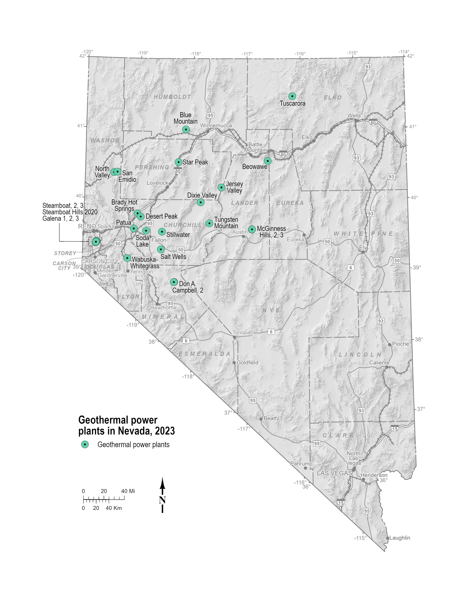

{: .note-title }
> Test Version Notice
>
> This is a test version of the web book. The content is incomplete and it is currently in the testing stage.

# Geothermal Playbook
{: .text-center .text-red-300 .fs-10 }

# Introduction
The "Geothermal Developers' Playbook" is a comprehensive guide for the exploration and assessment of conventional hydrothermal systems (hidden and non-hidden) in the Great Basin Region (GBR). The playbook covers everything from data acquisition to advanced assessment and permitting processes, integrating tools such as play fairway analysis, 3D modeling, machine learning, value-of-information analysis, and conceptual models along with practical case studies.

# Playbook Purpose
- **Framework for exploration and assessment:** Provide a structured approach for exploring and assessing conventional hydrothermal systems in the Great Basin Region.
- **Integration of advanced tools:** Utilize advanced tools like play fairway analysis, 3D modeling, and machine learning to enhance exploration efficiency.
- **Streamline exploration workflows:** Improve decision-making and streamline exploration workflows.
- **Optimize resource allocation:** Enhance the allocation of resources for geothermal exploration.
- **Practical methodologies and case studies:** Offer practical methodologies and real-world case studies for developers.
- **Support progression:** Aid in progressing through the permitting and assessment stages effectively.
